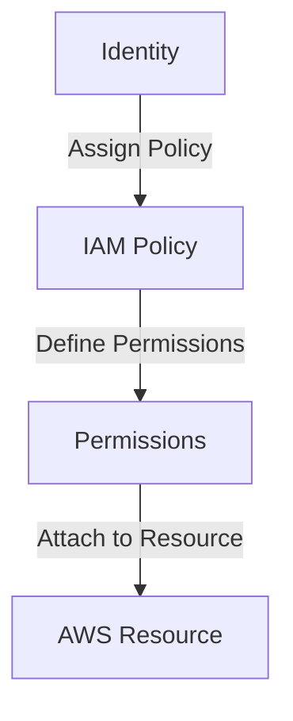
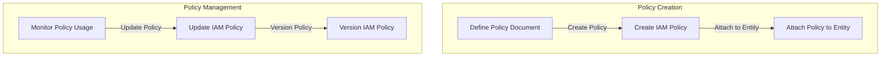
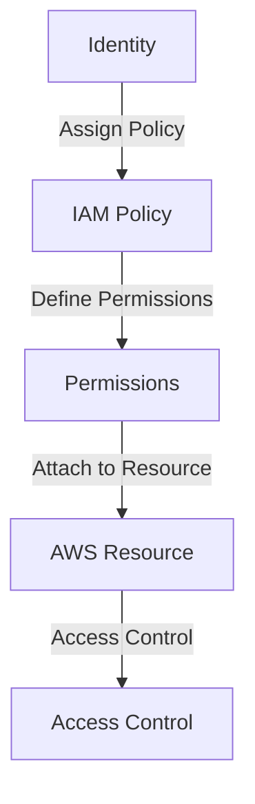

The concept of least privilege authorization is a critical aspect of cloud security, and AWS IAM policies are a powerful tool for implementing this principle. In this article, we will delve into the world of AWS IAM policies, exploring how to create and manage policies that follow the least privilege principle, ensuring your AWS resources are secure and protected.

## Table of Contents
1. [Introduction to AWS IAM Policies](#introduction-to-aws-iam-policies)
2. [Understanding Least Privilege Authorization](#understanding-least-privilege-authorization)
3. [Creating and Managing IAM Policies](#creating-and-managing-iam-policies)
4. [Best Practices for IAM Policy Management](#best-practices-for-iam-policy-management)
5. [Visualizing IAM Policy Architecture](#visualizing-iam-policy-architecture)

## Introduction to AWS IAM Policies

AWS IAM (Identity and Access Management) policies are used to define permissions for AWS resources. These policies can be attached to users, groups, or roles, controlling what actions can be performed on AWS resources. With IAM policies, you can implement fine-grained access control, ensuring that only authorized entities can access and manage your AWS resources.

## Understanding Least Privilege Authorization

The principle of least privilege authorization states that an entity should only have the minimum permissions necessary to perform its tasks. This approach reduces the risk of unauthorized access and minimizes the attack surface. In the context of AWS IAM policies, least privilege authorization means creating policies that grant only the necessary permissions for a specific task or role.

## Creating and Managing IAM Policies

Creating and managing IAM policies involves several steps, including defining policy documents, attaching policies to entities, and monitoring policy usage. You can use the AWS Management Console, AWS CLI, or SDKs to create and manage IAM policies. It's essential to follow best practices, such as using versioning and tracking changes to your policies.

## Best Practices for IAM Policy Management
> **Tip:** Use IAM policy simulator to test and validate your policies before attaching them to entities.
> **Warning:** Avoid using wildcard (*) permissions, as they can grant excessive access to your AWS resources.
> **Note:** Regularly review and update your IAM policies to ensure they align with your organization's security requirements.

| Best Practice | Description |
| --- | --- |
| Use least privilege principle | Grant only necessary permissions to entities |
| Monitor policy usage | Track and analyze policy usage to identify potential issues |
| Version policies | Use versioning to track changes to your policies |

## Visualizing IAM Policy Architecture

Visualizing your IAM policy architecture can help you better understand the relationships between policies, entities, and resources. You can use diagrams and flowcharts to illustrate the flow of permissions and identify potential security risks.

## Visual Insights Gallery
## Visual Insights Gallery

## Summary/Conclusion
In conclusion, AWS IAM policies are a powerful tool for implementing least privilege authorization in your AWS environment. By creating and managing policies that follow the principle of least privilege, you can reduce the risk of unauthorized access and minimize the attack surface. Remember to follow best practices, such as using versioning and tracking changes to your policies, and regularly review and update your IAM policies to ensure they align with your organization's security requirements.

## FAQ
1. **What is least privilege authorization?**
Least privilege authorization is the principle of granting only the minimum permissions necessary for an entity to perform its tasks.
2. **How do I create an IAM policy?**
You can create an IAM policy using the AWS Management Console, AWS CLI, or SDKs.
3. **What is IAM policy versioning?**
IAM policy versioning is a feature that allows you to track changes to your policies and maintain a history of previous versions.
4. **Why is it important to monitor policy usage?**
Monitoring policy usage helps you identify potential security risks and ensure that your policies are aligned with your organization's security requirements.