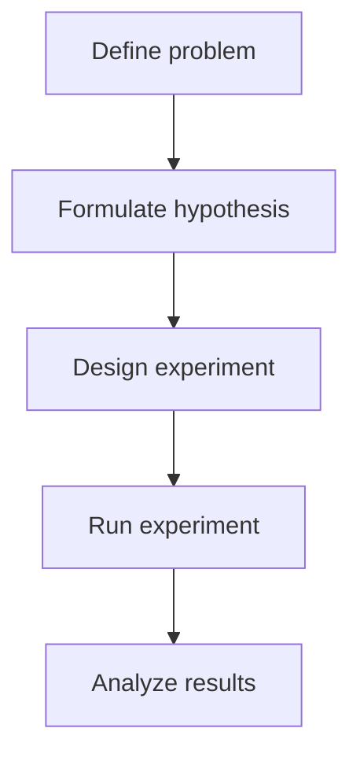
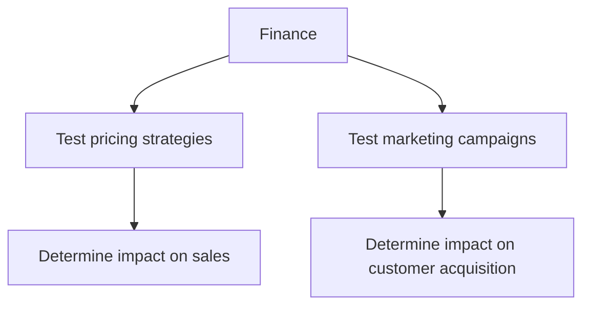

A/B testing, also known as split testing, is a method of comparing two or more versions of a product, webpage, or application to determine which one performs better. In the context of growth experiments, A/B testing is crucial for making data-driven decisions that drive business growth. In this article, we will delve into the world of A/B testing, exploring the principles, methodologies, and best practices for running scientifically valid growth experiments.

## Introduction to A/B Testing

A/B testing involves dividing a sample of users into two or more groups, with each group receiving a different version of the product or webpage. The goal is to measure the difference in behavior between the groups and determine which version performs better. A/B testing can be applied to various aspects of a product or webpage, including user interface, content, pricing, and more.

## Principles of A/B Testing
To run scientifically valid A/B tests, it's essential to understand the underlying principles. These include:
* **Random sampling**: Ensure that the sample of users is randomly selected to avoid bias.
* **Control group**: Establish a control group that receives the original version of the product or webpage.
* **Treatment group**: Create a treatment group that receives the modified version of the product or webpage.
* **Statistical significance**: Determine the statistical significance of the results to ensure that the differences between the groups are not due to chance.

```markdown
| Principle | Description |
| --- | --- |
| Random sampling | Ensure that the sample of users is randomly selected |
| Control group | Establish a control group that receives the original version |
| Treatment group | Create a treatment group that receives the modified version |
| Statistical significance | Determine the statistical significance of the results |
```

## Methodology for A/B Testing
The A/B testing methodology involves several steps:
1. **Define the problem**: Identify the problem or opportunity that you want to address through A/B testing.
2. **Formulate a hypothesis**: Develop a hypothesis about how the changes will impact user behavior.
3. **Design the experiment**: Create a design for the experiment, including the control and treatment groups.
4. **Run the experiment**: Launch the experiment and collect data.
5. **Analyze the results**: Analyze the results and determine the statistical significance.



## Best Practices for A/B Testing
To ensure the validity and reliability of A/B tests, follow these best practices:
* **Keep it simple**: Avoid complex experiments with multiple variables.
* **Use a large sample size**: Ensure that the sample size is sufficient to detect statistically significant differences.
* **Run the experiment for a sufficient duration**: Allow the experiment to run for a sufficient duration to capture representative data.
* **Avoid bias**: Minimize bias by using random sampling and ensuring that the control and treatment groups are similar.

> **Note:** A/B testing is not a one-time activity, but rather an ongoing process that requires continuous iteration and refinement.

## Common Pitfalls in A/B Testing
When running A/B tests, it's essential to avoid common pitfalls, such as:
* **Insufficient sample size**: Failing to collect sufficient data to detect statistically significant differences.
* **Lack of randomization**: Failing to randomize the sample, leading to biased results.
* **Multiple testing**: Running multiple tests simultaneously, leading to false positives.

> **Warning:** Avoid making changes to the product or webpage during the experiment, as this can impact the validity of the results.

## Real-World Examples of A/B Testing
A/B testing has been successfully applied in various industries, including e-commerce, finance, and healthcare. For example:
* **E-commerce**: An online retailer might test different product pricing strategies to determine which one leads to higher sales.
* **Finance**: A bank might test different marketing campaigns to determine which one leads to higher customer acquisition.



## Visual Insights Gallery
## Visual Insights Gallery


## Summary and Conclusion
A/B testing is a powerful tool for making data-driven decisions that drive business growth. By understanding the principles, methodology, and best practices for A/B testing, you can run scientifically valid growth experiments that inform product development, marketing strategies, and business decisions. Remember to avoid common pitfalls and keep the experiment simple, with a large sample size and sufficient duration.

## FAQ
* **What is A/B testing?**: A/B testing is a method of comparing two or more versions of a product, webpage, or application to determine which one performs better.
* **What are the principles of A/B testing?**: The principles of A/B testing include random sampling, control group, treatment group, and statistical significance.
* **How do I design an A/B test?**: To design an A/B test, define the problem, formulate a hypothesis, design the experiment, run the experiment, and analyze the results.