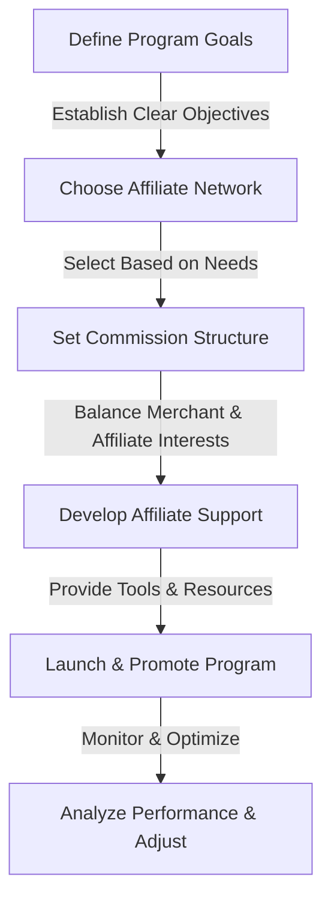
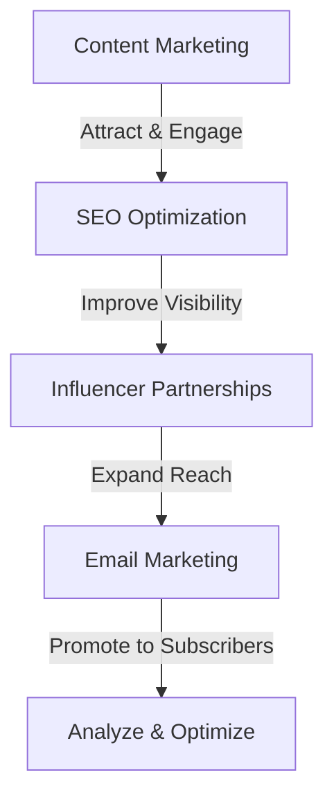

In the ever-evolving landscape of digital marketing, affiliate marketing has emerged as a powerful strategy for businesses to expand their reach and boost sales. At its core, affiliate marketing involves a partnership between a business and an affiliate who earns commissions by promoting the business's products or services. A well-structured affiliate program can be a game-changer, offering a win-win scenario for both the business and the affiliate. In this article, we'll delve into the world of affiliate marketing, exploring the benefits, key components, and strategies for setting up a successful referral program.

## Table of Contents
1. [Introduction to Affiliate Marketing](#introduction-to-affiliate-marketing)
2. [Benefits of Affiliate Marketing](#benefits-of-affiliate-marketing)
3. [Key Components of a Successful Affiliate Program](#key-components-of-a-successful-affiliate-program)
4. [Setting Up a Win-Win Referral Program](#setting-up-a-win-win-referral-program)
5. [Strategies for Success](#strategies-for-success)
6. [Visual Insights Gallery](#visual-insights-gallery)
7. [Conclusion](#conclusion)
8. [FAQ](#faq)

## Introduction to Affiliate Marketing
Affiliate marketing is a form of online marketing that involves a partnership between a business (often referred to as the merchant) and an affiliate (an individual or company). The affiliate earns a commission for each sale, referral, or click generated through their unique affiliate link. This performance-based marketing model allows businesses to reach new audiences and affiliates to monetize their online presence.


## Benefits of Affiliate Marketing
The benefits of affiliate marketing are multifaceted, offering advantages for both the merchant and the affiliate. For merchants, affiliate marketing provides an opportunity to increase brand awareness, drive sales, and expand their customer base without the upfront costs associated with traditional marketing methods. Affiliates, on the other hand, can monetize their website, social media, or content creation skills, earning revenue through commissions.

> **Note:** Affiliate marketing is particularly beneficial for small businesses and startups, as it allows them to compete with larger corporations on a more level playing field.

## Key Components of a Successful Affiliate Program
A successful affiliate program consists of several key components:
- **Merchant:** The business offering products or services.
- **Affiliate Network:** Acts as an intermediary between the merchant and the affiliate, managing the program and tracking commissions.
- **Affiliate:** Promotes the merchant's products or services.
- **Commission Structure:** Defines how affiliates are compensated for their efforts.

```markdown
| Component | Description |
| --- | --- |
| Merchant | Offers products or services |
| Affiliate Network | Manages the program and tracks commissions |
| Affiliate | Promotes the merchant's offerings |
| Commission Structure | Defines affiliate compensation |
```

## Setting Up a Win-Win Referral Program
Setting up a win-win referral program requires careful consideration of several factors, including the commission structure, affiliate support, and program tracking. A win-win program ensures that both the merchant and the affiliate benefit from the partnership, fostering long-term relationships and continuous growth.



## Strategies for Success
To ensure the success of an affiliate program, consider the following strategies:
- **Content Marketing:** Create valuable, relevant content that attracts and engages the target audience.
- **SEO Optimization:** Optimize affiliate links and content for search engines to improve visibility.
- **Influencer Partnerships:** Collaborate with influencers in your niche to expand reach.
- **Email Marketing:** Utilize email campaigns to promote products and offers to subscribers.



## Visual Insights Gallery


## Conclusion
Affiliate marketing offers a powerful way for businesses to grow their customer base and for affiliates to monetize their online presence. By understanding the benefits, key components, and strategies for setting up a successful affiliate program, both merchants and affiliates can create a win-win scenario that fosters growth and profitability. Whether you're a seasoned marketer or just starting out, affiliate marketing is an opportunity worth exploring.

## FAQ
1. **Q: What is affiliate marketing?**
   - A: Affiliate marketing is a form of online marketing that involves a partnership between a business and an affiliate who earns commissions by promoting the business's products or services.
2. **Q: How do I choose the right affiliate network?**
   - A: Consider factors such as commission rates, network reputation, and the types of products or services offered when selecting an affiliate network.
3. **Q: What is the most effective way to promote affiliate links?**
   - A: Utilize a combination of content marketing, SEO optimization, influencer partnerships, and email marketing to effectively promote affiliate links and attract potential customers.