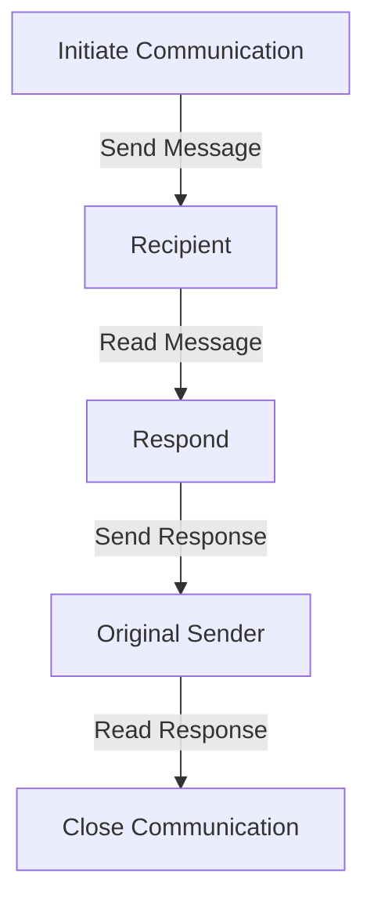
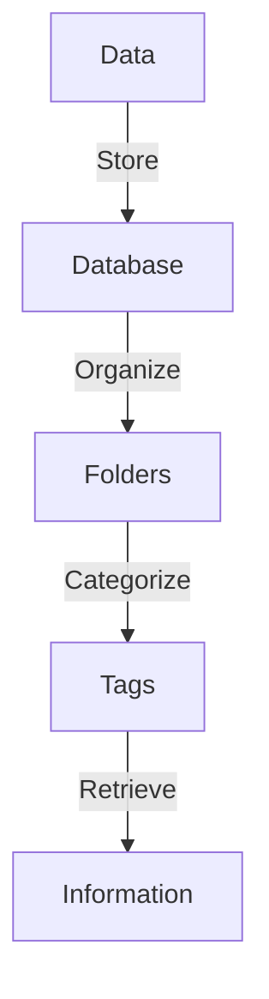

As the world becomes increasingly interconnected, distributed teams have become the norm. However, effective communication is crucial to the success of these teams. In this article, we will explore the best practices for asynchronous communication in distributed teams.

## Introduction to Asynchronous Communication
Asynchronous communication refers to the exchange of information between team members without the need for real-time interaction. This type of communication is particularly useful for distributed teams, where members may be located in different time zones or have varying work schedules. 


## Benefits of Asynchronous Communication
Asynchronous communication offers several benefits, including:
* Increased flexibility: Team members can respond to messages at their convenience, allowing for a better work-life balance.
* Reduced distractions: Asynchronous communication minimizes interruptions, enabling team members to focus on their tasks.
* Improved documentation: Asynchronous communication often involves written messages, which can be easily documented and referenced later.

## Best Practices for Asynchronous Communication
To ensure effective asynchronous communication, follow these best practices:
### 1. Establish Clear Communication Channels
Define clear communication channels, such as email, instant messaging, or project management tools, to avoid confusion and ensure that team members know where to find information.
### 2. Set Clear Expectations
Establish clear expectations for response times, communication protocols, and message formats to avoid misunderstandings.
### 3. Use Clear and Concise Language
Use clear and concise language in messages to avoid misinterpretation and ensure that team members understand the information being conveyed.

```markdown
# Example of clear and concise language
* Use bullet points to break up large blocks of text
* Avoid using jargon or technical terms that may be unfamiliar to team members
* Use active voice instead of passive voice
```

## Asynchronous Communication Flow
The following Mermaid.js diagram illustrates the flow of asynchronous communication:


## Data Organization and Storage
To ensure that information is easily accessible and retrievable, it's essential to organize and store data effectively. The following Mermaid.js diagram illustrates a data organization and storage architecture:


## Tools for Asynchronous Communication
Several tools are available to facilitate asynchronous communication, including:
| Tool | Description |
| --- | --- |
| Email | A traditional method of asynchronous communication |
| Instant Messaging | A platform for real-time and asynchronous communication |
| Project Management Tools | A platform for managing projects and facilitating asynchronous communication |

> **Tip:** Choose a tool that aligns with your team's needs and preferences to ensure effective asynchronous communication.

## Common Challenges and Solutions
Asynchronous communication can pose several challenges, including:
* **Delayed responses**: Establish clear expectations for response times to avoid delays.
* **Misinterpretation**: Use clear and concise language to avoid misinterpretation.
* **Information overload**: Use tools and techniques to organize and prioritize information.

> **Warning:** Asynchronous communication can lead to information overload if not managed effectively. Establish clear protocols for managing information to avoid overwhelm.

## Visual Insights Gallery
## Visual Insights Gallery


## Summary and Conclusion
Asynchronous communication is a crucial aspect of distributed teams. By following best practices, using the right tools, and addressing common challenges, teams can ensure effective asynchronous communication and achieve their goals. Remember to establish clear communication channels, set clear expectations, and use clear and concise language to facilitate successful asynchronous communication.

## FAQ
Q: What is asynchronous communication?
A: Asynchronous communication refers to the exchange of information between team members without the need for real-time interaction.
Q: What are the benefits of asynchronous communication?
A: Asynchronous communication offers several benefits, including increased flexibility, reduced distractions, and improved documentation.
Q: How can I ensure effective asynchronous communication?
A: Establish clear communication channels, set clear expectations, and use clear and concise language to facilitate successful asynchronous communication.