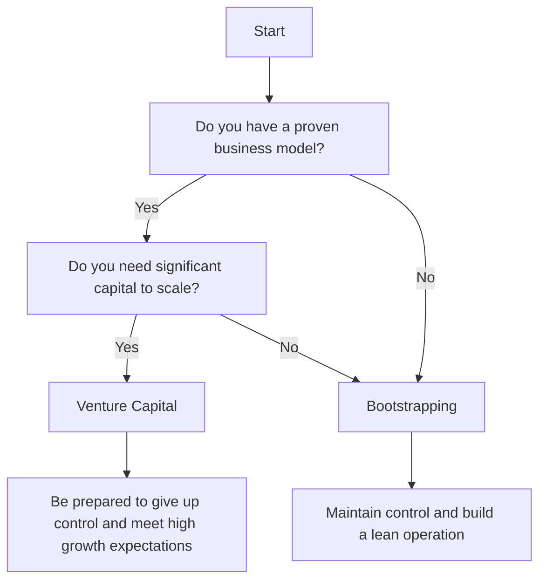

In the world of entrepreneurship, one of the most critical decisions founders face is how to fund their venture. Two popular options are bootstrapping and venture capital. While both methods have their advantages and disadvantages, choosing the right path can make all the difference in the success of your startup. In this article, we will delve into the world of bootstrapping and venture capital, exploring the pros and cons of each, and providing guidance on how to make an informed decision.

## Introduction to Bootstrapping
Bootstrapping involves funding your startup using your own savings, revenue, or cost-cutting measures. This approach allows you to maintain control over your business and avoid debt. 


### Benefits of Bootstrapping
The benefits of bootstrapping are numerous. For one, it allows you to maintain control over your business, making decisions without external pressure. Additionally, bootstrapping helps you develop a lean and efficient operation, as you are forced to be frugal with your resources. This approach also helps you build a strong foundation, as you are not relying on external funding to drive growth.

### Challenges of Bootstrapping
However, bootstrapping also comes with its challenges. For one, it can be difficult to scale your business quickly, as you are limited by your own resources. Additionally, bootstrapping can be stressful, as you are shouldering the entire financial burden of your startup.

## Introduction to Venture Capital
Venture capital, on the other hand, involves securing funding from external investors in exchange for equity in your business. This approach provides access to significant capital, allowing you to scale your business quickly.


### Benefits of Venture Capital
The benefits of venture capital are substantial. For one, it provides access to significant capital, allowing you to hire top talent, invest in marketing, and drive growth. Additionally, venture capital firms often bring valuable expertise and connections to the table, helping you navigate the complexities of your industry.

### Challenges of Venture Capital
However, venture capital also comes with its challenges. For one, you are giving up control over your business, as investors will have a say in key decisions. Additionally, venture capital firms often have high expectations for growth, which can be stressful and pressure-filled.

## Flowchart: Bootstrapping vs Venture Capital


## Architecture: Bootstrapping vs Venture Capital
```mermaid
flowchart TD
    subgraph Bootstrapping
        id7["Founder"] --> id8["Self-Funding"]
        id8 --> id9["Lean Operation"]
        id9 --> id10["Slow and Steady Growth"]
    end
    subgraph Venture Capital
        id11["Founder"] --> id12["External Investors"]
        id12 --> id13["Significant Capital"]
        id13 --> id14["Rapid Growth"]
    end
    id7 -.->> id11
    id10 -.->> id14
```

> **Note:** When deciding between bootstrapping and venture capital, it's essential to consider your business model, growth expectations, and personal preferences.

## Comparison of Bootstrapping and Venture Capital
|  | Bootstrapping | Venture Capital |
| --- | --- | --- |
| Control | Maintain control | Give up control |
| Funding | Limited to personal savings and revenue | Access to significant capital |
| Growth | Slow and steady | Rapid |
| Stress | High | High |
| Expectations | Low | High |

> **Tip:** Consider starting with bootstrapping and then seeking venture capital once you have a proven business model and significant growth potential.

## Real-World Examples
Several successful companies have taken the bootstrapping route, including Mailchimp and GitHub. On the other hand, companies like Uber and Airbnb have relied on venture capital to drive growth.

## Visual Insights Gallery
## Visual Insights Gallery


## Summary
In conclusion, choosing between bootstrapping and venture capital depends on your business model, growth expectations, and personal preferences. While bootstrapping provides control and a lean operation, venture capital offers access to significant capital and expertise. By understanding the pros and cons of each approach, you can make an informed decision and set your startup up for success.

## FAQ
1. What is bootstrapping?
Bootstrapping involves funding your startup using your own savings, revenue, or cost-cutting measures.
2. What is venture capital?
Venture capital involves securing funding from external investors in exchange for equity in your business.
3. How do I decide between bootstrapping and venture capital?
Consider your business model, growth expectations, and personal preferences when deciding between bootstrapping and venture capital.
4. What are the benefits of bootstrapping?
The benefits of bootstrapping include maintaining control, building a lean operation, and developing a strong foundation.
5. What are the benefits of venture capital?
The benefits of venture capital include access to significant capital, expertise, and connections.