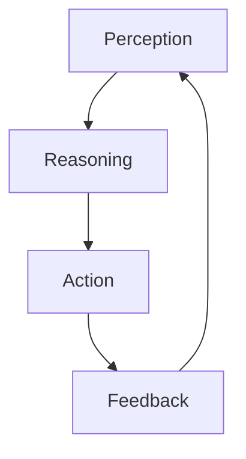
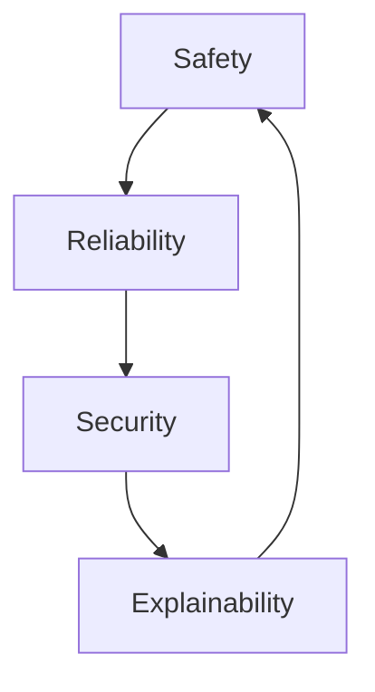

In the realm of artificial intelligence, the development of autonomous agents has been a long-standing goal. These agents are designed to perform tasks independently, making decisions based on their environment and the data they receive. With the advent of LangChain and Autogen, we are now closer than ever to creating sophisticated autonomous AI agents. In this article, we will delve into the world of LangChain and Autogen, exploring their capabilities, applications, and the future of autonomous AI agents.

## Introduction to LangChain
LangChain is a powerful framework that enables the creation of autonomous AI agents. It provides a comprehensive set of tools and libraries that facilitate the development of agents that can understand, reason, and act upon their environment. LangChain is built on top of large language models (LLMs), which are trained on vast amounts of text data and can generate human-like language.


## Introduction to Autogen
Autogen is a cutting-edge technology that allows for the automated generation of code. It uses machine learning algorithms to analyze the requirements of a project and generate the necessary code to meet those requirements. Autogen can be used in conjunction with LangChain to create autonomous AI agents that can adapt and evolve over time.


## Building Autonomous AI Agents
To build an autonomous AI agent using LangChain and Autogen, we need to follow a series of steps. First, we need to define the requirements of the agent, including its goals, constraints, and environment. Next, we use Autogen to generate the necessary code to meet those requirements. Finally, we use LangChain to train and deploy the agent.
```python
# Example code for building an autonomous AI agent
import langchain
from autogen import generate_code

# Define the requirements of the agent
requirements = {
    "goals": ["navigate to target"],
    "constraints": ["avoid obstacles"],
    "environment": ["indoor"]
}

# Generate the necessary code using Autogen
code = generate_code(requirements)

# Train and deploy the agent using LangChain
agent = langchain.Agent(code)
agent.train()
agent.deploy()
```
> **Note:** The above code snippet is a simplified example and may not represent the actual code used in building an autonomous AI agent.

## Architecture of Autonomous AI Agents
The architecture of an autonomous AI agent typically consists of several components, including perception, reasoning, and action. The perception component is responsible for gathering data from the environment, while the reasoning component uses that data to make decisions. The action component is responsible for executing those decisions.

> **Tip:** The architecture of an autonomous AI agent can vary depending on the specific application and requirements.

## Applications of Autonomous AI Agents
Autonomous AI agents have a wide range of applications, including robotics, healthcare, and finance. In robotics, autonomous AI agents can be used to navigate and manipulate objects in complex environments. In healthcare, autonomous AI agents can be used to diagnose and treat diseases. In finance, autonomous AI agents can be used to analyze and predict market trends.


## Challenges and Limitations
While autonomous AI agents have the potential to revolutionize many industries, there are also challenges and limitations to their development and deployment. One of the main challenges is ensuring the safety and reliability of autonomous AI agents, particularly in high-stakes applications such as healthcare and finance.

> **Warning:** The development and deployment of autonomous AI agents require careful consideration of their potential risks and limitations.

## Visual Insights Gallery
## Visual Insights Gallery
The following images provide a visual representation of the concepts and technologies discussed in this article.


## Summary and Conclusion
In conclusion, building autonomous AI agents with LangChain and Autogen is a complex task that requires careful consideration of several factors, including the requirements of the agent, the architecture of the agent, and the potential risks and limitations of the agent. However, with the right tools and technologies, autonomous AI agents have the potential to revolutionize many industries and improve our daily lives.

## FAQ
1. **What is LangChain?**
LangChain is a framework that enables the creation of autonomous AI agents.
2. **What is Autogen?**
Autogen is a technology that allows for the automated generation of code.
3. **What are the applications of autonomous AI agents?**
Autonomous AI agents have a wide range of applications, including robotics, healthcare, and finance.
4. **What are the challenges and limitations of autonomous AI agents?**
The challenges and limitations of autonomous AI agents include ensuring their safety and reliability, particularly in high-stakes applications.