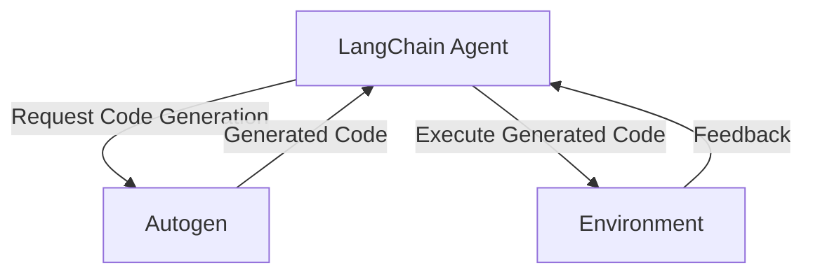
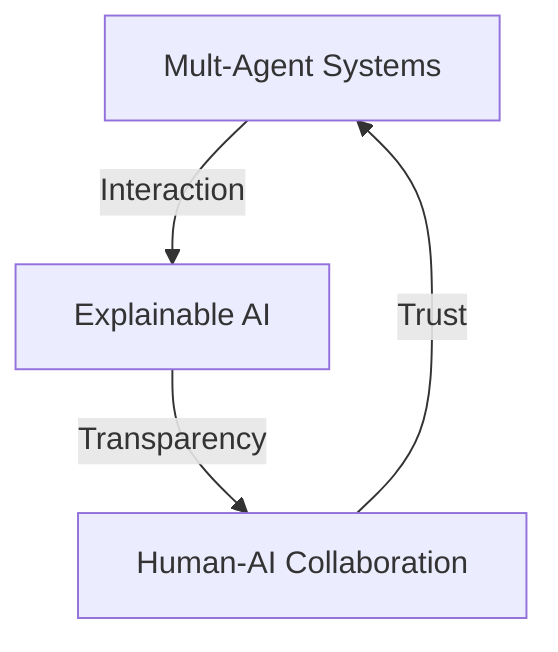

## Part 2: Advanced Architectures and Edge Cases in Building Autonomous AI Agents with LangChain and Autogen
Building on the foundations established in the first article, this follow-up delves into the advanced architectures and edge cases encountered when constructing autonomous AI agents with LangChain and Autogen. We will explore real-world case studies, discuss new trends in the field, and provide a deeper dive into the technical aspects of these technologies.

### Advanced LangChain Architectures
LangChain's flexibility allows for the creation of complex architectures tailored to specific applications. One such architecture is the hierarchical LangChain model, where multiple layers of LangChain agents interact to achieve a common goal.

### Autogen Integration with LangChain
The integration of Autogen with LangChain enables the dynamic generation of code for autonomous AI agents. This allows agents to adapt to changing environments and learn from experience.

### Edge Cases and Challenges
When building autonomous AI agents, several edge cases and challenges arise. These include ensuring the agent's safety, handling uncertain or incomplete data, and addressing potential biases in the training data.

### Real-World Case Studies
Several companies have successfully implemented autonomous AI agents using LangChain and Autogen. For example, a leading robotics firm used LangChain to develop an autonomous navigation system, while a financial services company employed Autogen to create a trading bot.

### New Trends in Autonomous AI Agents
The field of autonomous AI agents is rapidly evolving, with new trends emerging in areas such as multi-agent systems, explainable AI, and human-AI collaboration.

## Advanced Technical Considerations
When building autonomous AI agents, several advanced technical considerations must be taken into account. These include ensuring the scalability and reliability of the agent, implementing robust security measures, and addressing potential regulatory compliance issues.

## Visual Insights Gallery
The following images provide a deeper look into the advanced architectures and edge cases encountered when building autonomous AI agents with LangChain and Autogen:
* 
* 
* 