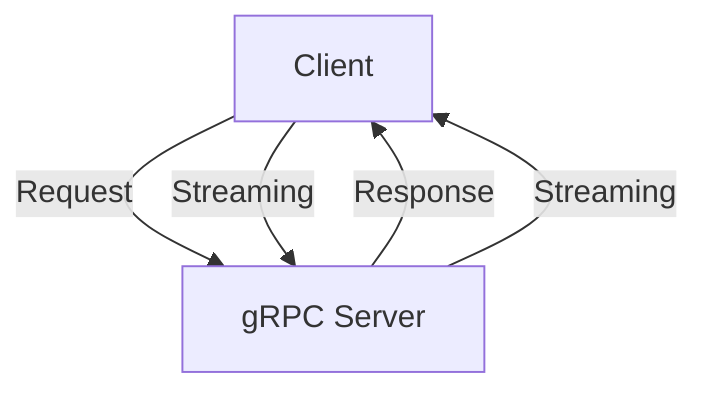
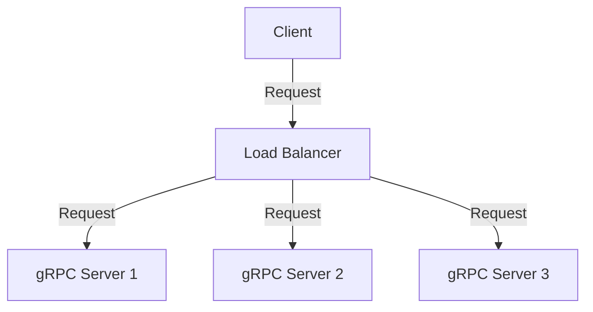

# Building Scalable Microservices with Node.js and gRPC

In the world of software development, microservices have become a popular architectural pattern for building large-scale applications. By breaking down an application into smaller, independent services, developers can increase flexibility, scalability, and maintainability. In this article, we will explore how to build scalable microservices using Node.js and gRPC, a high-performance RPC framework.

## Table of Contents
1. [Introduction to Microservices](#introduction-to-microservices)
2. [Introduction to gRPC](#introduction-to-grpc)
3. [Building Microservices with Node.js and gRPC](#building-microservices-with-nodejs-and-grpc)
4. [Scalability and Performance Optimization](#scalability-and-performance-optimization)
5. [Security and Authentication](#security-and-authentication)

## Introduction to Microservices

Microservices are a software development technique that structures an application as a collection of small, independent services. Each service is responsible for a specific business capability and can be developed, tested, and deployed independently of other services. This approach allows developers to work on different services simultaneously, reducing the overall development time and increasing the application's scalability.

### Benefits of Microservices
| Benefit | Description |
| --- | --- |
| Increased Scalability | Microservices allow developers to scale individual services independently, reducing the risk of cascading failures. |
| Improved Flexibility | Microservices enable developers to use different programming languages, frameworks, and databases for each service. |
| Enhanced Maintainability | Microservices make it easier to update and maintain individual services without affecting the entire application. |

## Introduction to gRPC

gRPC is a high-performance RPC framework that allows developers to build scalable and efficient APIs. It uses protocol buffers (protobuf) to define the service interface and data structures, enabling efficient serialization and deserialization of data. gRPC supports multiple programming languages, including Node.js, and provides features like bi-directional streaming, deadlines, and cancellation.

### gRPC Architecture

This diagram shows the basic architecture of a gRPC system, with a client sending requests to a gRPC server and receiving responses.

## Building Microservices with Node.js and gRPC

To build microservices with Node.js and gRPC, you need to define the service interface using protobuf, generate the gRPC stubs, and implement the service logic. Here's an example of a simple gRPC service in Node.js:
```javascript
// greeter.proto
syntax = "proto3";

package greeter;

service Greeter {
  rpc SayHello (HelloRequest) returns (HelloReply) {}
}

message HelloRequest {
  string name = 1;
}

message HelloReply {
  string message = 1;
}
```

```javascript
// greeter.js
const grpc = require('@grpc/grpc-js');
const protoLoader = require('@grpc/proto-loader');

const packageDefinition = protoLoader.loadSync('greeter.proto', {
  keepCase: true,
  longs: String,
  enums: String,
  defaults: true,
  oneofs: true,
});

const greeter = grpc.loadPackageDefinition(packageDefinition).greeter;

const server = new grpc.Server();
server.addService(greeter.Greeter.service, {
  sayHello: (call, callback) => {
    callback(null, { message: `Hello, ${call.request.name}!` });
  },
});

server.bindAsync('0.0.0.0:50051', grpc.ServerCredentials.createInsecure(), () => {
  server.start();
  console.log('gRPC server started on port 50051');
});
```
This example defines a simple Greeter service with a SayHello method, generates the gRPC stubs, and implements the service logic.

## Scalability and Performance Optimization

To optimize the scalability and performance of your microservices, you can use techniques like load balancing, caching, and connection pooling. gRPC provides built-in support for these techniques, making it easier to build high-performance APIs.

### Load Balancing

This diagram shows a load balancer distributing incoming requests across multiple gRPC servers.

## Security and Authentication

gRPC provides several security features, including SSL/TLS encryption, authentication, and authorization. You can use these features to secure your microservices and protect sensitive data.

### Authentication
```javascript
// authentication.js
const grpc = require('@grpc/grpc-js');

const credentials = grpc.credentials.createSsl();
const channel = grpc.createChannel('localhost:50051', credentials);
```
This example shows how to create an SSL/TLS channel with authentication.

## Visual Insights Gallery
## Visual Insights Gallery


## Summary/Conclusion
Building scalable microservices with Node.js and gRPC requires a deep understanding of the underlying technologies and architectures. By following the guidelines and best practices outlined in this article, you can create high-performance, secure, and scalable APIs that meet the needs of your application.

## FAQ
Q: What is gRPC and how does it work?
A: gRPC is a high-performance RPC framework that uses protocol buffers to define the service interface and data structures. It provides features like bi-directional streaming, deadlines, and cancellation, making it suitable for building scalable and efficient APIs.
Q: How do I implement authentication and authorization in gRPC?
A: gRPC provides several security features, including SSL/TLS encryption, authentication, and authorization. You can use these features to secure your microservices and protect sensitive data.
Q: What are the benefits of using microservices architecture?
A: Microservices architecture provides several benefits, including increased scalability, improved flexibility, and enhanced maintainability. It allows developers to work on different services simultaneously, reducing the overall development time and increasing the application's scalability.