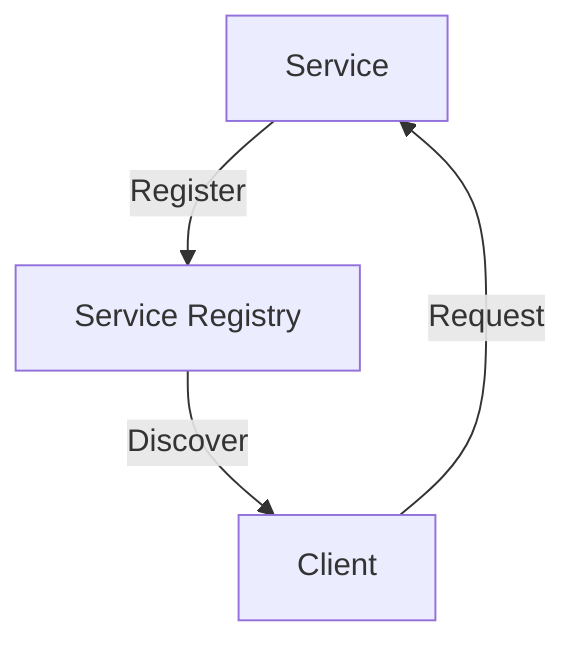
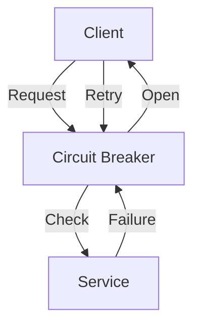
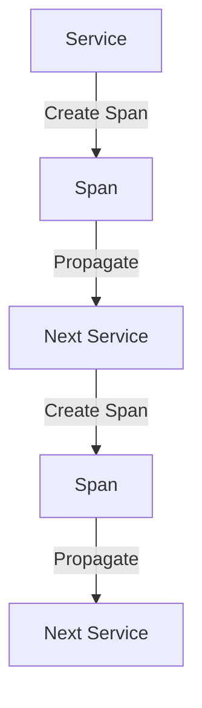

# Part 2: Advanced Microservices Architecture with Node.js and gRPC

In the first part of this series, we explored the basics of building scalable microservices using Node.js and gRPC. In this article, we will dive deeper into advanced edge-cases and architecture, discussing topics such as service discovery, circuit breakers, and distributed tracing.

## Table of Contents
1. [Service Discovery and Registration](#service-discovery-and-registration)
2. [Implementing Circuit Breakers](#implementing-circuit-breakers)
3. [Distributed Tracing with OpenTelemetry](#distributed-tracing-with-opentelemetry)
4. [Advanced gRPC Features](#advanced-grpc-features)
5. [Case Studies and Real-World Examples](#case-studies-and-real-world-examples)

## Service Discovery and Registration

Service discovery is the process of automatically detecting and registering available services in a microservices architecture. This is crucial for scalability and flexibility, as it allows services to be added or removed dynamically without affecting the overall system. We can use tools like etcd or Consul to implement service discovery and registration.

## Implementing Circuit Breakers

Circuit breakers are a design pattern that prevents cascading failures in a microservices architecture. They work by detecting when a service is not responding and preventing further requests from being sent to it. This gives the service time to recover and prevents the failure from cascading to other services. We can use libraries like `opossum` to implement circuit breakers in our Node.js services.

## Distributed Tracing with OpenTelemetry

Distributed tracing is the process of tracking the flow of requests across multiple services in a microservices architecture. This is crucial for debugging and monitoring, as it allows us to understand the flow of requests and identify performance bottlenecks. We can use OpenTelemetry to implement distributed tracing in our Node.js services.

## Advanced gRPC Features

gRPC provides a number of advanced features that can be used to build scalable and performant microservices. These include streaming, deadlines, and cancellation. We can use these features to build services that are highly available and responsive.

## Case Studies and Real-World Examples

In this section, we will explore real-world examples of microservices architectures built using Node.js and gRPC. These will include examples from companies like Netflix, Uber, and Google.

## Visual Insights Gallery
### Image 1: Microservices Architecture

### Image 2: gRPC Request Flow

### Image 3: Distributed Tracing
