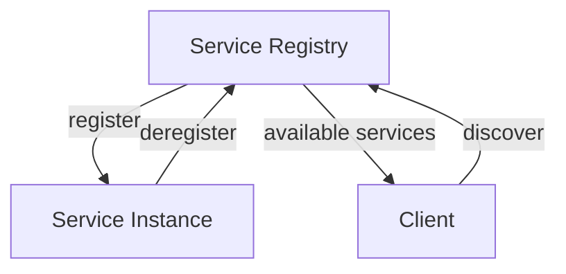
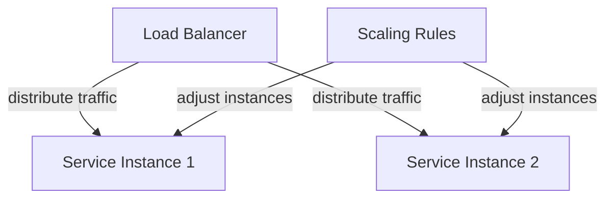
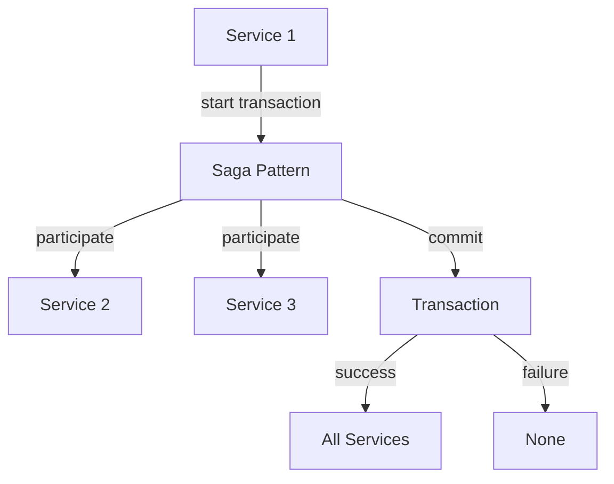
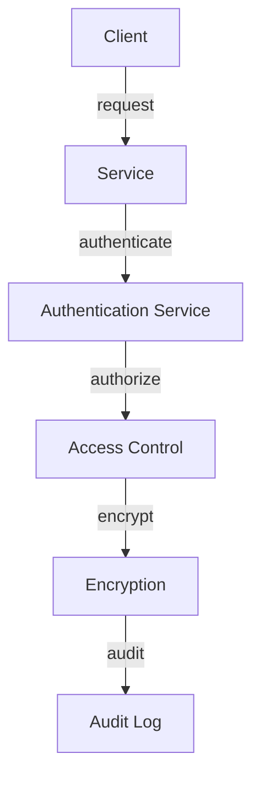
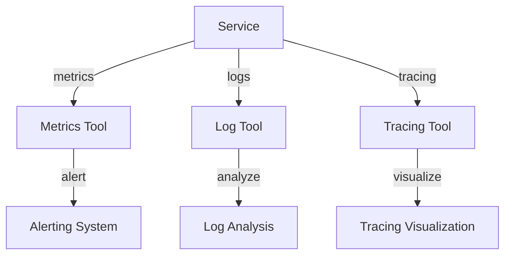

# Advanced Microservices Architecture with Node.js and gRPC

In the previous article, we introduced the concept of microservices and explored how to build scalable microservices using Node.js and gRPC. In this article, we will delve deeper into the intricacies of building advanced microservices architecture, exploring edge-cases, and discussing real-world case studies.

## Table of Contents
1. [Service Discovery and Registration](#service-discovery-and-registration)
2. [Load Balancing and Scaling](#load-balancing-and-scaling)
3. [Distributed Transactions and Saga Patterns](#distributed-transactions-and-saga-patterns)
4. [Advanced Security and Authentication](#advanced-security-and-authentication)
5. [Monitoring and Logging](#monitoring-and-logging)

## Service Discovery and Registration

Service discovery is a critical component of microservices architecture, allowing services to find and communicate with each other. There are several service discovery patterns, including:

```mermaid
flowchart TD
    A[Service Registry] -->|register| B[Service Instance]
    B -->|deregister| A
    C[Client] -->|discover| A
    A -->|available services| C
```
In this example, services register and deregister themselves with the service registry, and clients discover available services.

## Load Balancing and Scaling

Load balancing and scaling are essential for ensuring high availability and performance in microservices architecture. There are several load balancing algorithms, including round-robin, least connections, and IP hashing. Scaling rules can be based on metrics such as CPU utilization, memory usage, or request latency.

```mermaid
flowchart TD
    A[Load Balancer] -->| distribute traffic| B[Service Instance 1]
    A -->|distribute traffic| C[Service Instance 2]
    D[Scaling Rules] -->|adjust instances| B
    D -->|adjust instances| C
```
In this example, the load balancer distributes traffic across multiple service instances, and scaling rules adjust the number of instances based on demand.

## Distributed Transactions and Saga Patterns

Distributed transactions and saga patterns are used to manage complex business processes that involve multiple services. A saga pattern is a design pattern that manages a distributed transaction, ensuring that either all or none of the services participate in the transaction.

```mermaid
flowchart TD
    A[Service 1] -->|start transaction| B[Saga Pattern]
    B -->|participate| C[Service 2]
    B -->|participate| D[Service 3]
    B -->|commit| E[Transaction]
    E -->|success| F[All Services]
    E -->|failure| G[None]
```
In this example, a saga pattern manages a distributed transaction, ensuring that either all or none of the services participate in the transaction.

## Advanced Security and Authentication

Advanced security and authentication are critical components of microservices architecture, ensuring that services and data are protected from unauthorized access. There are several security measures, including encryption, access control, and auditing.

```mermaid
flowchart TD
    A[Client] -->|request| B[Service]
    B -->|authenticate| C[Authentication Service]
    C -->|authorize| D[Access Control]
    D -->|encrypt| E[Encryption]
    E -->|audit| F[Audit Log]
```
In this example, advanced security measures, including encryption, access control, and auditing, are used to protect services and data.

## Monitoring and Logging

Monitoring and logging are essential for ensuring the health and performance of microservices architecture. There are several monitoring and logging tools, including metrics, logs, and tracing.

```mermaid
flowchart TD
    A[Service] -->|metrics| B[Metrics Tool]
    A -->|logs| C[Log Tool]
    A -->|tracing| D[Tracing Tool]
    B -->|alert| E[Alerting System]
    C -->|analyze| F[Log Analysis]
    D -->|visualize| G[Tracing Visualization]
```
In this example, monitoring and logging tools, including metrics, logs, and tracing, are used to ensure the health and performance of microservices architecture.

## Visual Insights Gallery
Here are some additional visual insights into advanced microservices architecture:
- [Microservices Architecture Diagram](https://picsum.photos/seed/microservices-architecture-diagram/800/400)
- [Service Registry Diagram](https://picsum.photos/seed/service-registry-diagram/800/400)
- [Load Balancing and Scaling Diagram](https://picsum.photos/seed/load-balancing-and-scaling-diagram/800/400)