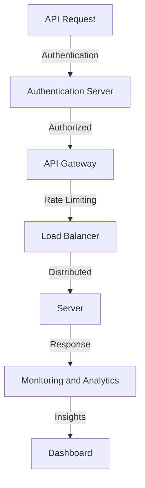
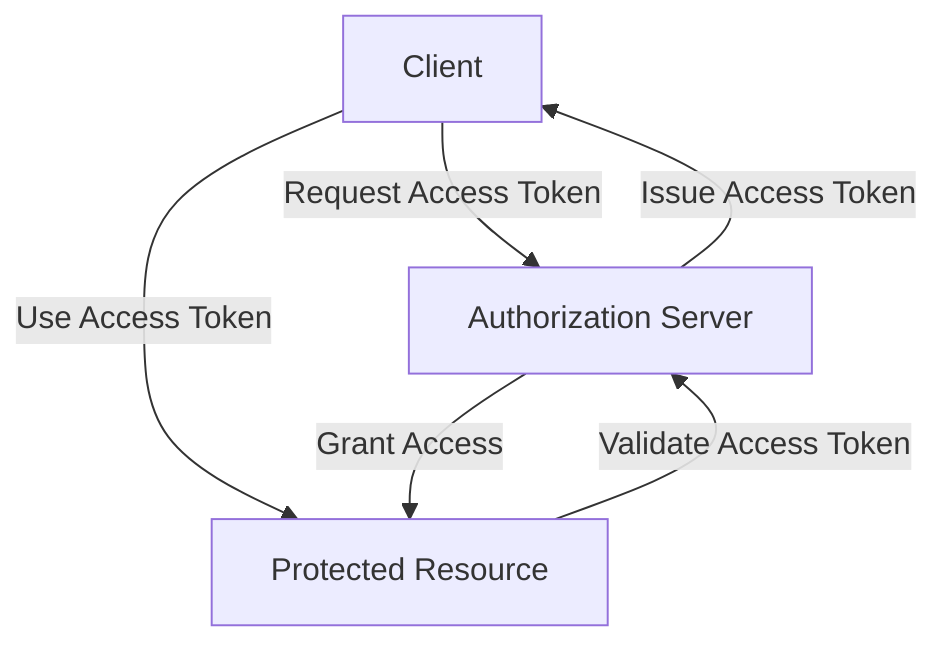

In today's digital landscape, APIs have become the backbone of modern applications, facilitating communication between different services and systems. However, this increased reliance on APIs also introduces new security risks, making it essential to implement robust API security measures. In this article, we will delve into the world of custom API security, providing a step-by-step guide on designing and implementing a secure API architecture.

## Table of Contents
1. [Introduction to API Security](#introduction-to-api-security)
2. [API Security Threats and Vulnerabilities](#api-security-threats-and-vulnerabilities)
3. [Designing a Custom API Security Architecture](#designing-a-custom-api-security-architecture)
4. [Implementing OAuth 2.0 for Secure Authentication](#implementing-oauth-20-for-secure-authentication)
5. [API Gateway and Load Balancer Configuration](#api-gateway-and-load-balancer-configuration)
6. [Monitoring and Analytics for API Security](#monitoring-and-analytics-for-api-security)

## Introduction to API Security

API security refers to the practices and protocols used to protect APIs from unauthorized access, use, and exploitation. With the rise of API-based architectures, ensuring the security of these interfaces has become a critical concern. A well-designed API security strategy can help prevent data breaches, protect sensitive information, and maintain the integrity of your applications.

## API Security Threats and Vulnerabilities
APIs are vulnerable to various threats, including:
* Unauthorized access and data breaches
* SQL injection and cross-site scripting (XSS) attacks
* Denial-of-Service (DoS) and Distributed Denial-of-Service (DDoS) attacks
* Man-in-the-Middle (MitM) attacks and eavesdropping
To mitigate these risks, it's essential to implement robust security measures, such as encryption, authentication, and access control.

```markdown
### API Security Threats Table
| Threat | Description | Mitigation |
| --- | --- | --- |
| Unauthorized Access | Access to sensitive data without permission | Authentication and Authorization |
| SQL Injection | Injection of malicious SQL code | Input validation and sanitization |
| Cross-Site Scripting (XSS) | Injection of malicious code into web pages | Input validation and sanitization |
```

## Designing a Custom API Security Architecture

A custom API security architecture should include the following components:
* API Gateway: Acts as an entry point for API requests, providing authentication, rate limiting, and caching.
* Load Balancer: Distributes incoming traffic across multiple servers, ensuring high availability and scalability.
* Authentication Server: Handles user authentication and authorization, using protocols such as OAuth 2.0.
* Monitoring and Analytics: Provides real-time insights into API performance, security, and usage.



## Implementing OAuth 2.0 for Secure Authentication
OAuth 2.0 is an industry-standard protocol for secure authentication and authorization. It provides a framework for clients to access protected resources on behalf of a resource owner.



## API Gateway and Load Balancer Configuration
The API Gateway and Load Balancer play critical roles in ensuring the security and scalability of your API.

> **Note:** Configure the API Gateway to handle authentication, rate limiting, and caching. Use a Load Balancer to distribute incoming traffic across multiple servers, ensuring high availability and scalability.

## Monitoring and Analytics for API Security
Monitoring and analytics are essential for detecting security threats and optimizing API performance.

> **Tip:** Use tools like API monitoring software and security information and event management (SIEM) systems to gain real-time insights into API security and performance.

## Visual Insights Gallery
## Visual Insights Gallery


## Summary/Conclusion
Building a custom API security architecture requires a deep understanding of API security threats, vulnerabilities, and mitigation strategies. By following the steps outlined in this guide, you can design and implement a robust API security strategy that protects your applications and data from unauthorized access and exploitation.

## FAQ Section
1. **What is API security?**
API security refers to the practices and protocols used to protect APIs from unauthorized access, use, and exploitation.
2. **What are the common API security threats?**
Common API security threats include unauthorized access, SQL injection, cross-site scripting (XSS), denial-of-service (DoS), and man-in-the-middle (MitM) attacks.
3. **How do I implement OAuth 2.0 for secure authentication?**
Implementing OAuth 2.0 involves setting up an authorization server, registering clients, and handling access token requests and validation.
4. **What is the role of an API Gateway in API security?**
An API Gateway acts as an entry point for API requests, providing authentication, rate limiting, and caching.
5. **How do I monitor and analyze API security?**
Use tools like API monitoring software and security information and event management (SIEM) systems to gain real-time insights into API security and performance.