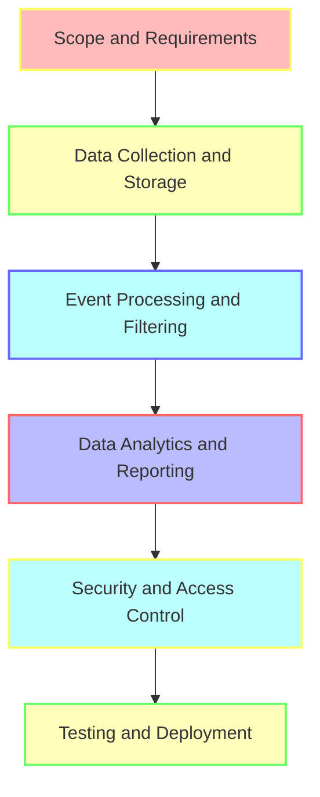

A comprehensive audit trail is essential for any financial organization to ensure compliance, security, and transparency. In this article, we will delve into the step-by-step process of building a custom audit trail, providing a deep dive into the architecture, patterns, and strategies involved.

## Table of Contents
1. [Introduction to Audit Trails](#introduction-to-audit-trails)
2. [Benefits of a Custom Audit Trail](#benefits-of-a-custom-audit-trail)
3. [Architecture Overview](#architecture-overview)
4. [Designing the Audit Trail](#designing-the-audit-trail)
5. [Implementing the Audit Trail](#implementing-the-audit-trail)
6. [Testing and Deployment](#testing-and-deployment)
7. [Visual Insights Gallery](#visual-insights-gallery)
8. [Summary/Conclusion](#summaryconclusion)
9. [FAQ Section](#faq-section)

## Introduction to Audit Trails
An audit trail is a record of all changes made to a system, application, or data. It provides a chronological sequence of events, allowing organizations to track and monitor all activities. A custom audit trail is tailored to meet the specific needs of an organization, providing a higher level of security, compliance, and transparency.

## Benefits of a Custom Audit Trail
A custom audit trail offers several benefits, including:
* Improved security and compliance
* Enhanced transparency and accountability
* Real-time monitoring and tracking
* Customizable to meet specific organizational needs
> **Tip:** A custom audit trail can be integrated with existing systems and applications, providing a seamless and efficient experience.

## Architecture Overview
The architecture of a custom audit trail involves several components, including:
* Data collection and storage
* Event processing and filtering
* Data analytics and reporting
* Security and access control

## Designing the Audit Trail
Designing a custom audit trail involves several steps, including:
* Identifying the scope and requirements
* Defining the data collection and storage process
* Developing the event processing and filtering mechanism
* Creating the data analytics and reporting framework

## Implementing the Audit Trail
Implementing a custom audit trail involves several steps, including:
* Developing the data collection and storage mechanism
* Creating the event processing and filtering framework
* Building the data analytics and reporting system
* Integrating the security and access control components
> **Warning:** Implementing a custom audit trail requires careful planning and execution to ensure security, compliance, and transparency.

## Testing and Deployment
Testing and deployment of a custom audit trail involves several steps, including:
* Unit testing and integration testing
* System testing and acceptance testing
* Deployment and configuration
* Maintenance and support
> **Note:** Testing and deployment of a custom audit trail requires careful planning and execution to ensure smooth and efficient operation.

## Visual Insights Gallery
Here are some visual insights into building a custom audit trail:

## Summary/Conclusion
Building a custom audit trail is a complex process that requires careful planning, design, implementation, testing, and deployment. A custom audit trail provides a higher level of security, compliance, and transparency, and is essential for any financial organization. By following the steps outlined in this article, organizations can create a comprehensive and effective custom audit trail.

## FAQ Section
Q: What is an audit trail?
A: An audit trail is a record of all changes made to a system, application, or data.
Q: Why is a custom audit trail important?
A: A custom audit trail provides a higher level of security, compliance, and transparency.
Q: How do I implement a custom audit trail?
A: Implementing a custom audit trail involves several steps, including designing, developing, testing, and deploying the audit trail.
Q: What are the benefits of a custom audit trail?
A: The benefits of a custom audit trail include improved security, compliance, and transparency, as well as real-time monitoring and tracking.