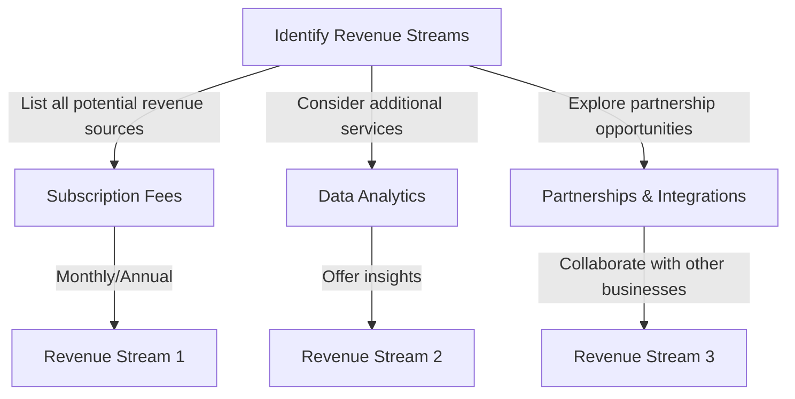
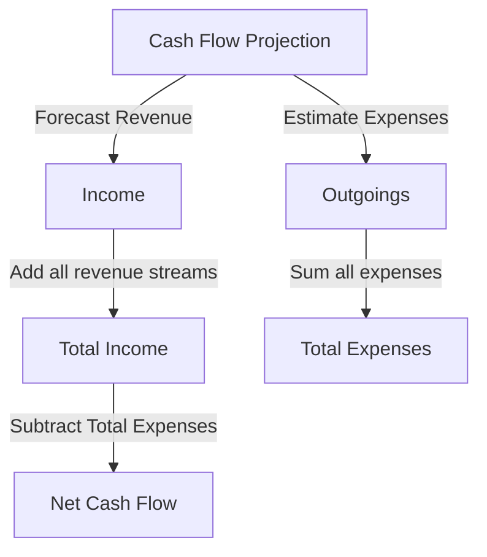

A well-structured cash flow is essential for the financial health and sustainability of any business, particularly for SaaS companies where revenue streams can be complex and unpredictable. In this article, we will delve into the step-by-step process of building a custom cash flow architecture tailored to the unique needs of your SaaS startup.

## Introduction to Cash Flow Architecture

Understanding the basics of cash flow and its importance in SaaS businesses is crucial. Cash flow refers to the movement of money into or out of a business, and a positive cash flow indicates that a company has more money coming in than going out. For SaaS companies, managing cash flow effectively is vital due to the subscription-based nature of their revenue model, which can lead to variability in cash inflows.

## Identifying Revenue Streams

The first step in building a custom cash flow architecture is to identify all potential revenue streams. For a SaaS company, this typically includes:
- Monthly/Annual Subscription Fees
- Upselling/Cross-selling Opportunities
- Data Analytics Services (if applicable)
- Partnerships and Integrations

## Assessing Expenses

After identifying revenue streams, the next critical step is to assess all expenses. This includes:
- Operational Costs (Server Maintenance, Staff Salaries, etc.)
- Marketing and Advertising Expenses
- Research and Development Costs
- Miscellaneous (Office Rent, Utilities, etc.)

> **Note:** Accurately accounting for all expenses is crucial for maintaining a healthy cash flow. Underestimating expenses can lead to cash flow shortages.

## Creating a Cash Flow Projection

With revenue streams and expenses identified, the next step is to create a cash flow projection. This involves forecasting income and expenses over a specific period, typically monthly or quarterly, to predict the company's future cash position.

## Implementing Cash Flow Management Strategies

Implementing effective cash flow management strategies is vital for maintaining a positive cash flow. This can include:
- Invoicing promptly and offering incentives for early payments
- Negotiating with suppliers for better payment terms
- Maintaining an emergency fund to cover unexpected expenses

> **Tip:** Regularly review and adjust your cash flow projection to reflect changes in your business, such as new revenue streams or unexpected expenses.

## Visual Insights Gallery
## Visual Insights Gallery

## Summary/Conclusion
Building a custom cash flow architecture for your SaaS startup requires a deep understanding of your revenue streams, expenses, and the ability to create accurate cash flow projections. By following the steps outlined in this guide and continuously monitoring and adjusting your cash flow management strategies, you can ensure the financial stability and growth of your business.

## FAQ
- Q: Why is cash flow management crucial for SaaS companies?
  A: Cash flow management is crucial for SaaS companies due to the variability in cash inflows from subscription-based models, making it essential to manage finances effectively to ensure sustainability.
- Q: How often should I review my cash flow projection?
  A: It's recommended to review your cash flow projection regularly, ideally monthly or quarterly, to reflect changes in your business and make necessary adjustments.
- Q: What are some common cash flow mistakes SaaS startups make?
  A: Common mistakes include underestimating expenses, not invoicing promptly, and failing to maintain an emergency fund.