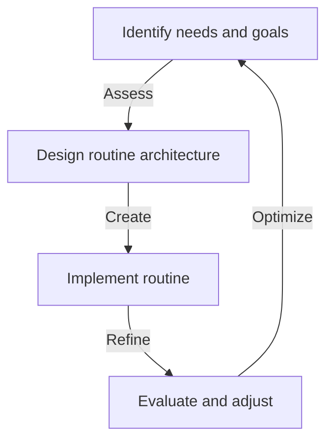
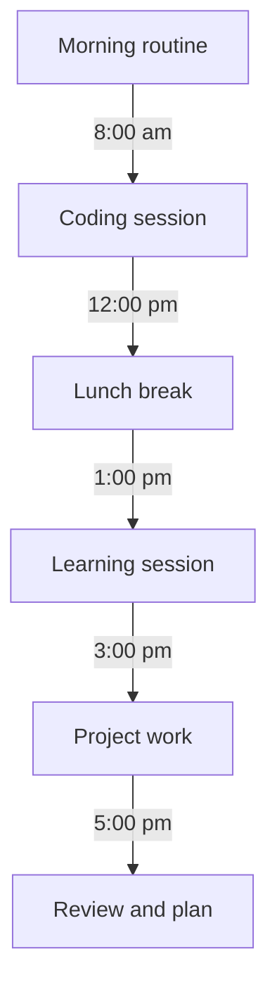

A well-structured developer routine is crucial for maximizing productivity and achieving success in the competitive world of software development. In this article, we will delve into the step-by-step process of creating a personalized routine that caters to your unique needs and goals.

## Table of Contents
1. [Introduction to Developer Routines](#introduction-to-developer-routines)
2. [Assessing Your Needs and Goals](#assessing-your-needs-and-goals)
3. [Designing Your Routine Architecture](#designing-your-routine-architecture)
4. [Implementing and Refining Your Routine](#implementing-and-refining-your-routine)
5. [Visual Insights Gallery](#visual-insights-gallery)
6. [Summary and Conclusion](#summary-and-conclusion)
7. [FAQ](#faq)

## Introduction to Developer Routines

A developer routine is a personalized schedule that outlines your daily, weekly, and monthly tasks, allowing you to prioritize your work, manage your time effectively, and maintain a healthy work-life balance. A well-crafted routine helps you stay focused, avoid distractions, and make the most out of your time.

## Assessing Your Needs and Goals
To create a custom developer routine, you need to assess your needs and goals. This involves identifying your strengths, weaknesses, and areas of improvement. Consider the following factors:
- **Work schedule**: What are your working hours, and how many hours do you dedicate to coding each day?
- **Project deadlines**: What are your short-term and long-term project goals, and how can you allocate your time to meet these deadlines?
- **Learning objectives**: What new skills or technologies do you want to learn, and how can you incorporate learning into your routine?
- **Self-care**: How can you prioritize your physical and mental well-being, and what activities can you include in your routine to maintain a healthy lifestyle?

## Designing Your Routine Architecture

Once you have assessed your needs and goals, you can start designing your routine architecture. This involves creating a visual representation of your daily, weekly, and monthly tasks. You can use a flowchart or a mind map to illustrate your routine and identify potential bottlenecks or areas for improvement.

## Implementing and Refining Your Routine
Implementing your routine involves putting your plan into action and tracking your progress. You can use various tools, such as calendars, to-do lists, or project management software, to stay organized and focused. Refining your routine involves regularly evaluating your progress, identifying areas for improvement, and making adjustments as needed.

## Visual Insights Gallery
## Visual Insights Gallery

## Summary and Conclusion
Building a custom developer routine is a personalized process that requires careful assessment, design, and implementation. By following the steps outlined in this guide, you can create a routine that suits your unique needs and goals, helping you stay focused, productive, and successful in your career.

## FAQ
> **Q: What is the most important aspect of a developer routine?**
> A: The most important aspect of a developer routine is prioritizing your tasks and managing your time effectively.
> **Q: How often should I review and adjust my routine?**
> A: You should regularly review and adjust your routine to ensure it remains aligned with your goals and needs.
> **Q: What tools can I use to implement and refine my routine?**
> A: You can use various tools, such as calendars, to-do lists, or project management software, to stay organized and focused.