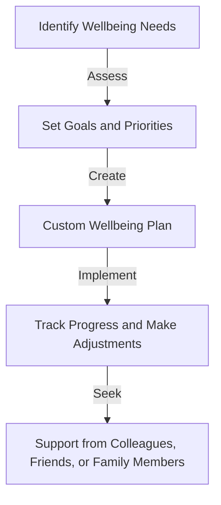
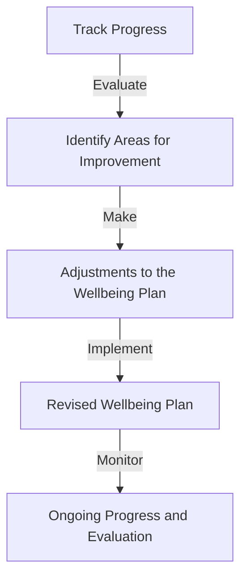

Developers are the backbone of the tech industry, and their wellbeing is crucial for delivering high-quality products and maintaining a healthy work-life balance. In this article, we will delve into the world of custom developer wellbeing and provide a step-by-step architecture guide to help you create a tailored wellbeing plan.

## Introduction to Developer Wellbeing

Developer wellbeing encompasses various aspects of a developer's life, including physical health, mental health, and productivity. A custom developer wellbeing plan takes into account the unique needs and challenges of each individual, providing a personalized approach to maintaining wellbeing.

### Benefits of Custom Developer Wellbeing
| Benefit | Description |
| --- | --- |
| Improved Mental Health | Reduced stress, anxiety, and burnout |
| Increased Productivity | Enhanced focus, motivation, and efficiency |
| Better Work-Life Balance | Healthier boundaries between work and personal life |

## Assessing Wellbeing Needs

To create a custom developer wellbeing plan, you need to assess your wellbeing needs. This involves identifying areas of strength and weakness, as well as setting goals and priorities.

> **Tip:** Use a wellbeing assessment template or tool to help you evaluate your needs and create a personalized plan.

## Designing a Custom Wellbeing Plan
```markdown
### Example Wellbeing Plan
- **Physical Health**: 30 minutes of exercise, 3 times a week
- **Mental Health**: 1 hour of meditation, 2 times a week
- **Productivity**: 8 hours of focused work, with regular breaks
```
A custom wellbeing plan should include strategies for maintaining physical health, mental health, and productivity. This may involve setting goals, creating habits, and seeking support from colleagues, friends, or family members.

## Implementing a Custom Wellbeing Plan

Implementing a custom wellbeing plan requires commitment, discipline, and flexibility. It's essential to track progress, make adjustments, and seek support when needed.



## Monitoring and Evaluating Progress

Regular monitoring and evaluation are crucial for ensuring the effectiveness of a custom wellbeing plan. This involves tracking progress, identifying areas for improvement, and making adjustments as needed.



## Visual Insights Gallery
## Visual Insights Gallery


## Summary and Conclusion
Building a custom developer wellbeing plan is a personalized and ongoing process. By assessing wellbeing needs, designing a custom plan, implementing strategies, and monitoring progress, developers can maintain their physical health, mental health, and productivity.

## FAQ
1. **What is a custom developer wellbeing plan?**
A custom developer wellbeing plan is a personalized approach to maintaining physical health, mental health, and productivity.
2. **How do I create a custom wellbeing plan?**
To create a custom wellbeing plan, assess your wellbeing needs, set goals and priorities, and design a plan that includes strategies for maintaining physical health, mental health, and productivity.
3. **Why is it essential to monitor and evaluate progress?**
Regular monitoring and evaluation are crucial for ensuring the effectiveness of a custom wellbeing plan and making adjustments as needed.