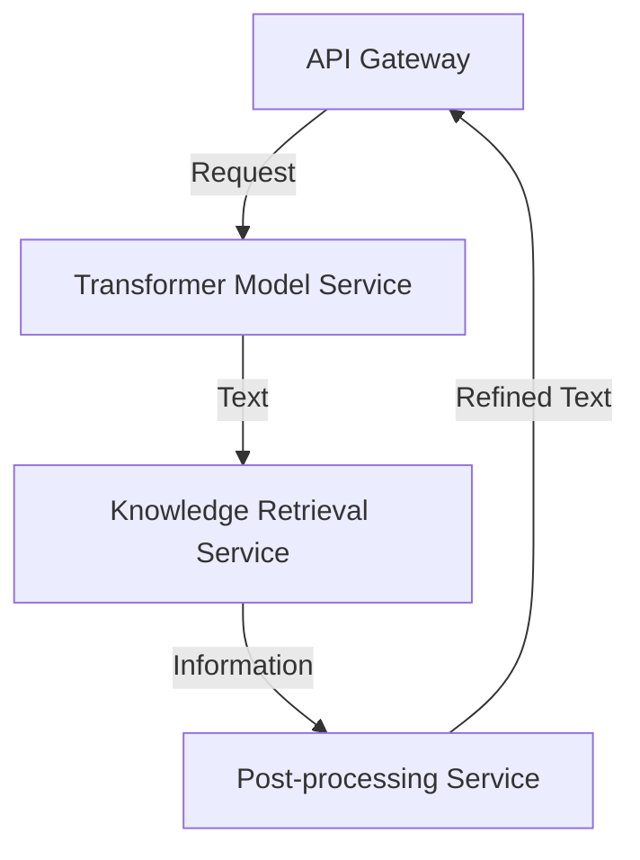
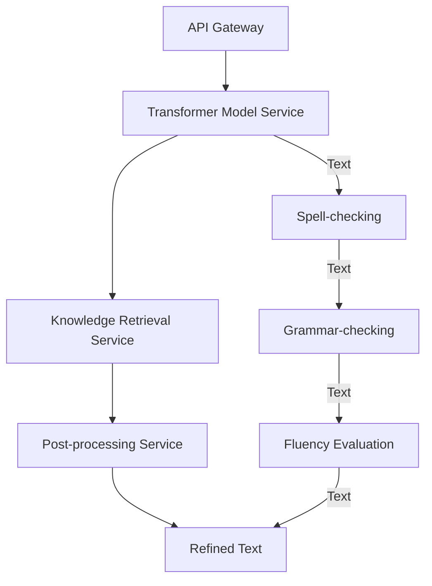

A comprehensive guide to designing and implementing a custom Large Language Model (LLM) inference architecture, covering the key components, technologies, and best practices involved.

## Introduction to Custom LLM Inference
Building a custom LLM inference architecture requires a deep understanding of the underlying technologies, including transformer models, knowledge retrieval, and software engineering. In this article, we will delve into the step-by-step process of designing and implementing a custom LLM inference architecture, highlighting the key components, technologies, and best practices involved.


## Understanding LLM Inference
LLM inference involves generating text based on a given input prompt. This process typically involves the following components:
* **Transformer Model**: A deep learning model that generates text based on the input prompt.
* **Knowledge Retrieval**: A system that retrieves relevant information from a knowledge base to inform the generated text.
* **Post-processing**: A series of steps that refine the generated text, including spell-checking, grammar-checking, and fluency evaluation.

```markdown
### LLM Inference Components
| Component | Description |
| --- | --- |
| Transformer Model | Deep learning model that generates text |
| Knowledge Retrieval | System that retrieves relevant information |
| Post-processing | Refines generated text |
```

## Designing the Architecture
The architecture of a custom LLM inference system involves several key components, including:
* **API Gateway**: Handles incoming requests and routes them to the appropriate component.
* **Transformer Model Service**: Hosts the transformer model and generates text based on input prompts.
* **Knowledge Retrieval Service**: Retrieves relevant information from a knowledge base.
* **Post-processing Service**: Refines generated text.



## Implementing the Architecture
Implementing the architecture involves several steps, including:
* **Setting up the API Gateway**: Configuring the API gateway to handle incoming requests and route them to the appropriate component.
* **Deploying the Transformer Model Service**: Deploying the transformer model service and configuring it to generate text based on input prompts.
* **Implementing Knowledge Retrieval**: Implementing the knowledge retrieval service and configuring it to retrieve relevant information from a knowledge base.
* **Configuring Post-processing**: Configuring the post-processing service to refine generated text.



## Best Practices and Considerations
When building a custom LLM inference architecture, there are several best practices and considerations to keep in mind, including:
* **Scalability**: Designing the architecture to scale with increasing traffic and demand.
* **Security**: Ensuring the security and integrity of the system and its components.
* **Maintainability**: Designing the architecture to be maintainable and easy to update.

> **Note:** When designing and implementing a custom LLM inference architecture, it is essential to consider the specific use case and requirements of the system.

> **Warning:** Failing to consider scalability, security, and maintainability can result in a system that is difficult to maintain and scale.

> **Tip:** Using cloud-based services and containerization can help simplify the deployment and management of the architecture.

## Visual Insights Gallery
The following images provide a visual representation of the key components and technologies involved in building a custom LLM inference architecture.


## Summary and Conclusion
Building a custom LLM inference architecture requires a deep understanding of the underlying technologies and components involved. By following the step-by-step guide outlined in this article, developers can design and implement a custom LLM inference architecture that meets their specific use case and requirements.

## FAQ
* **Q: What is LLM inference?**
A: LLM inference involves generating text based on a given input prompt.
* **Q: What are the key components of a custom LLM inference architecture?**
A: The key components include the transformer model, knowledge retrieval, and post-processing.
* **Q: How can I ensure the scalability and security of my custom LLM inference architecture?**
A: By designing the architecture to scale with increasing traffic and demand, and ensuring the security and integrity of the system and its components.