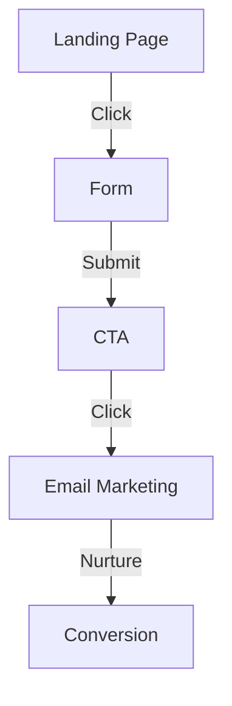
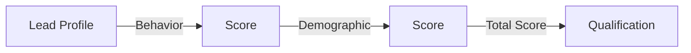

In today's competitive market, lead generation is crucial for businesses to thrive. A well-structured lead generation system can help you target the right audience, increase conversions, and ultimately drive revenue. In this article, we will delve into the world of custom lead generation and provide a step-by-step guide on how to build a robust architecture.

## Table of Contents
1. [Introduction to Lead Generation](#introduction-to-lead-generation)
2. [Understanding Your Target Audience](#understanding-your-target-audience)
3. [Building a Custom Lead Generation Architecture](#building-a-custom-lead-generation-architecture)
4. [Implementing a Lead Scoring System](#implementing-a-lead-scoring-system)
5. [Visual Insights Gallery](#visual-insights-gallery)
6. [Summary and Conclusion](#summary-and-conclusion)
7. [FAQ](#faq)

## Introduction to Lead Generation
Lead generation is the process of attracting and converting strangers into potential customers. It involves creating awareness about your product or service and nurturing leads through the sales funnel. A custom lead generation system allows you to tailor your approach to your specific business needs and target audience.


## Understanding Your Target Audience
To build an effective lead generation system, you need to understand your target audience. This includes identifying their pain points, interests, and behaviors. You can use tools like customer surveys, social media listening, and analytics to gather data about your target audience.
```markdown
| Demographic | Description |
| --- | --- |
| Age | 25-45 |
| Location | Urban |
| Interests | Technology, innovation |
```
> **Note:** Understanding your target audience is crucial for creating personalized content and experiences that resonate with them.

## Building a Custom Lead Generation Architecture
A custom lead generation architecture involves multiple components, including:
* **Landing Pages**: Dedicated pages for capturing leads
* **Forms**: For collecting user information
* **CTAs**: Calls-to-action to prompt users to take action
* **Email Marketing**: For nurturing leads through the sales funnel

> **Tip:** Use A/B testing to optimize your landing pages and forms for better conversion rates.

## Implementing a Lead Scoring System
A lead scoring system helps you qualify leads based on their behavior and demographic data. You can assign points to leads based on their actions, such as filling out a form or attending a webinar.

> **Warning:** Be careful not to over-qualify leads, as this can lead to missed opportunities.

## Visual Insights Gallery
Here are some visual insights to help you better understand the lead generation process:


## Summary and Conclusion
Building a custom lead generation architecture requires a deep understanding of your target audience and a well-structured approach. By following the steps outlined in this guide, you can create a robust lead generation system that drives conversions and revenue. Remember to continuously monitor and optimize your system to ensure maximum ROI.

## FAQ
Q: What is lead generation?
A: Lead generation is the process of attracting and converting strangers into potential customers.
Q: How do I understand my target audience?
A: You can use tools like customer surveys, social media listening, and analytics to gather data about your target audience.
Q: What is a lead scoring system?
A: A lead scoring system helps you qualify leads based on their behavior and demographic data.