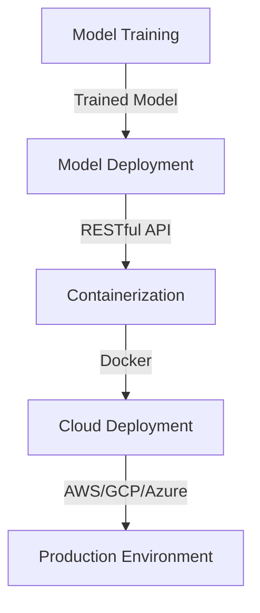
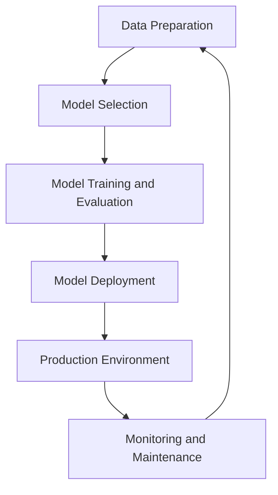

A custom machine learning model can help businesses make data-driven decisions and stay ahead of the competition. In this article, we will delve into the step-by-step architecture guide for building a custom machine learning model.

## Table of Contents
1. [Introduction to Machine Learning](#introduction-to-machine-learning)
2. [Data Preparation](#data-preparation)
3. [Model Selection](#model-selection)
4. [Model Training and Evaluation](#model-training-and-evaluation)
5. [Model Deployment](#model-deployment)
6. [Visual Insights Gallery](#visual-insights-gallery)
7. [Summary/Conclusion](#summary/conclusion)
8. [FAQ](#faq)

## Introduction to Machine Learning
Machine learning is a subset of artificial intelligence that involves training algorithms to learn from data and make predictions or decisions. The process of building a custom machine learning model involves several steps, including data preparation, model selection, model training and evaluation, and model deployment.


## Data Preparation
Data preparation is a critical step in building a custom machine learning model. This step involves collecting, cleaning, and preprocessing the data. The goal of data preparation is to create a high-quality dataset that can be used to train and evaluate the model.
```python
# Import necessary libraries
import pandas as pd
import numpy as np

# Load the dataset
df = pd.read_csv('data.csv')

# Handle missing values
df.fillna(df.mean(), inplace=True)

# Encode categorical variables
df['category'] = pd.Categorical(df['category']).codes
```
> **Tip:** Data preparation is a time-consuming process, but it is essential to ensure that the model is trained on high-quality data.

## Model Selection
Model selection involves choosing the most suitable algorithm for the problem at hand. There are several factors to consider when selecting a model, including the type of problem, the size and complexity of the dataset, and the computational resources available.
```markdown
| Model | Description | Use Case |
| --- | --- | --- |
| Linear Regression | Linear relationship between features and target | Predicting continuous outcomes |
| Decision Tree | Tree-based model for classification and regression | Handling categorical features |
| Random Forest | Ensemble model for classification and regression | Handling high-dimensional datasets |
```
> **Note:** The choice of model depends on the specific problem and dataset.

## Model Training and Evaluation
Model training and evaluation involve training the selected model on the prepared dataset and evaluating its performance using metrics such as accuracy, precision, and recall.
```python
# Import necessary libraries
from sklearn.model_selection import train_test_split
from sklearn.metrics import accuracy_score

# Split the dataset into training and testing sets
X_train, X_test, y_train, y_test = train_test_split(df.drop('target', axis=1), df['target'], test_size=0.2, random_state=42)

# Train the model
model = DecisionTreeClassifier()
model.fit(X_train, y_train)

# Evaluate the model
y_pred = model.predict(X_test)
print('Accuracy:', accuracy_score(y_test, y_pred))
```
> **Warning:** Overfitting and underfitting are common issues in machine learning. Regularization techniques and cross-validation can help prevent these issues.

## Model Deployment
Model deployment involves deploying the trained model in a production environment. This step involves creating a RESTful API, containerizing the model, and deploying it to a cloud platform.

> **Interview:** "Model deployment is a critical step in the machine learning pipeline. It requires collaboration between data scientists, engineers, and DevOps teams to ensure that the model is deployed correctly and scalable."

## Model Architecture
The following diagram illustrates the architecture of a custom machine learning model:

## Visual Insights Gallery
The following images provide visual insights into the machine learning pipeline:


## Summary/Conclusion
Building a custom machine learning model requires a deep understanding of the machine learning pipeline, including data preparation, model selection, model training and evaluation, and model deployment. By following the steps outlined in this article, data scientists and engineers can build and deploy custom machine learning models that drive business value.

## FAQ
1. What is machine learning?
Machine learning is a subset of artificial intelligence that involves training algorithms to learn from data and make predictions or decisions.
2. What is the most important step in building a custom machine learning model?
Data preparation is the most important step in building a custom machine learning model, as it ensures that the model is trained on high-quality data.
3. What is the difference between overfitting and underfitting?
Overfitting occurs when a model is too complex and fits the training data too closely, while underfitting occurs when a model is too simple and fails to capture the underlying patterns in the data.