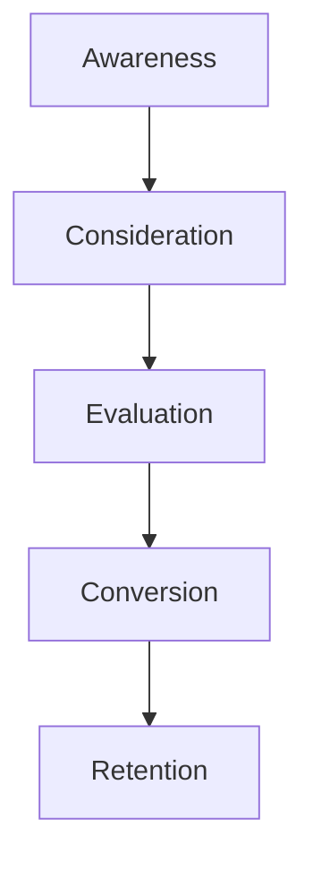
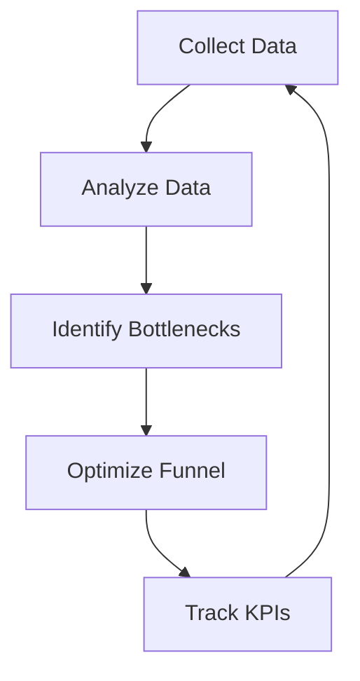

A well-designed marketing funnel is crucial for businesses to attract, engage, and convert potential customers. In this article, we will delve into the architecture of a custom marketing funnel, providing a step-by-step guide on how to build one that suits your business needs.

## Table of Contents
1. [Introduction to Marketing Funnels](#introduction-to-marketing-funnels)
2. [Understanding Your Target Audience](#understanding-your-target-audience)
3. [Mapping the Customer Journey](#mapping-the-customer-journey)
4. [Building the Marketing Funnel Architecture](#building-the-marketing-funnel-architecture)
5. [Implementing and Optimizing the Funnel](#implementing-and-optimizing-the-funnel)
6. [Visual Insights Gallery](#visual-insights-gallery)
7. [Summary and Conclusion](#summary-and-conclusion)
8. [FAQ](#faq)

## Introduction to Marketing Funnels
A marketing funnel is a visual representation of the customer journey, from the initial awareness stage to the final conversion stage. It is a strategic model that helps businesses understand their customers' behavior, preferences, and pain points. 

## Understanding Your Target Audience
To build an effective marketing funnel, it is essential to have a deep understanding of your target audience. This includes their demographics, interests, behaviors, and pain points. 
> **Tip:** Conduct market research and analyze customer data to create buyer personas that accurately represent your target audience.

## Mapping the Customer Journey
The customer journey is a critical component of the marketing funnel. It involves mapping out the various stages that a customer goes through, from awareness to conversion. 

This journey helps businesses identify the touchpoints and interactions that customers have with their brand, allowing them to create targeted marketing strategies.

## Building the Marketing Funnel Architecture
The marketing funnel architecture consists of several layers, each with its own unique characteristics and objectives. 

The layers include:
* **Top-of-Funnel (TOFU):** Awareness and education
* **Middle-of-Funnel (MOFU):** Consideration and evaluation
* **Bottom-of-Funnel (BOFU):** Conversion and retention

## Implementing and Optimizing the Funnel
Once the marketing funnel architecture is in place, it is essential to implement and optimize it regularly. This involves tracking key performance indicators (KPIs), analyzing customer data, and making data-driven decisions to improve the funnel's efficiency.

This continuous optimization process helps businesses refine their marketing strategies, improve customer engagement, and increase conversions.

## Visual Insights Gallery
## Visual Insights Gallery
The following images provide a visual representation of the marketing funnel and its various components.

## Summary and Conclusion
Building a custom marketing funnel requires a deep understanding of the customer journey, target audience, and marketing funnel architecture. By following the step-by-step guide outlined in this article, businesses can create an effective marketing funnel that drives engagement, conversions, and revenue growth.

## FAQ
* **Q: What is a marketing funnel?**
A: A marketing funnel is a visual representation of the customer journey, from awareness to conversion.
* **Q: How do I build a marketing funnel?**
A: To build a marketing funnel, you need to understand your target audience, map the customer journey, and create a funnel architecture that includes TOFU, MOFU, and BOFU layers.
* **Q: How do I optimize my marketing funnel?**
A: To optimize your marketing funnel, you need to track KPIs, analyze customer data, and make data-driven decisions to improve the funnel's efficiency.