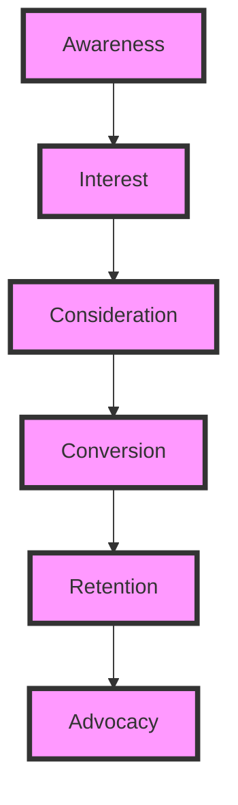
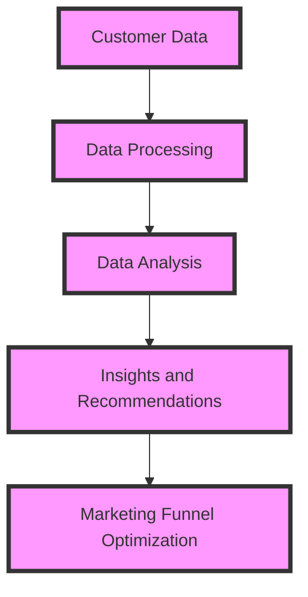

## Part 2: Advanced Marketing Funnel Architecture - Edge Cases and Deeper Dive
Building on the foundational knowledge from our previous article, "Building a Custom Marketing Funnel: Step-by-Step Architecture Guide," this follow-up delves into the advanced aspects of marketing funnel design. We will explore edge cases, deeper architectural considerations, and real-world examples to further enhance your understanding and implementation of effective marketing funnels.

### Introduction to Advanced Marketing Funnels
Advanced marketing funnels involve intricate strategies and technologies to maximize conversion rates and customer retention. This includes leveraging AI for personalized marketing, utilizing multi-channel funnels, and implementing advanced analytics for real-time optimization.

### Handling Edge Cases in Marketing Funnels
Edge cases in marketing funnels refer to unusual or unexpected customer behaviors that don't fit the typical funnel model. These can include:
- **Non-linear customer journeys:** Customers may not follow the traditional path from awareness to conversion.
- **Repeated interactions:** Customers may interact with your brand multiple times before converting.
- **Multi-product purchases:** Customers may purchase multiple products or services in a single transaction.

To handle these edge cases, marketers must adopt flexible and adaptive funnel designs that can accommodate a variety of customer behaviors.

### Advanced Funnel Architecture
Advanced funnel architecture involves integrating multiple channels and touchpoints to create a seamless customer experience. This can include:

This diagram illustrates a basic customer journey, but in advanced marketing funnels, each stage can be further segmented and personalized based on customer data and behavior.

### Implementing Personalization in Marketing Funnels
Personalization is key to advanced marketing funnels. By leveraging customer data and AI, businesses can create personalized experiences that cater to individual customer preferences and behaviors.

### Real-World Case Studies
Several businesses have successfully implemented advanced marketing funnels to improve their customer engagement and conversion rates. For example:
- **Amazon:** Uses AI-powered recommendation engines to personalize product suggestions based on customer browsing and purchase history.
- **Netflix:** Employs advanced analytics to recommend content based on viewer preferences and watching habits.

### Deeper Dive into Funnel Optimization
Optimizing marketing funnels involves continuous monitoring and analysis of customer behavior and funnel performance. This can be achieved through:
- **A/B Testing:** Comparing different versions of marketing materials to determine which ones perform better.
- **Heatmap Analysis:** Visualizing customer interactions with websites and landing pages to identify areas of improvement.
- **Customer Feedback:** Collecting and incorporating customer feedback to refine the marketing funnel and improve customer satisfaction.

### Advanced Analytics for Marketing Funnels
Advanced analytics play a crucial role in optimizing marketing funnels. By leveraging tools like Google Analytics and marketing automation software, businesses can gain insights into customer behavior, track key performance indicators (KPIs), and make data-driven decisions to improve funnel efficiency.

This diagram illustrates the process of using customer data to optimize marketing funnels, which is a key aspect of advanced marketing funnel architecture.

## Visual Insights Gallery
Here are some visual insights into advanced marketing funnel architecture:
- [Marketing Funnel Optimization Strategies](https://picsum.photos/seed/marketing-funnel-optimization-strategies/800/400)
- [Personalization in Marketing Funnels](https://picsum.photos/seed/personalization-in-marketing-funnels/800/400)
- [Advanced Analytics for Marketing Funnels](https://picsum.photos/seed/advanced-analytics-for-marketing-funnels/800/400)