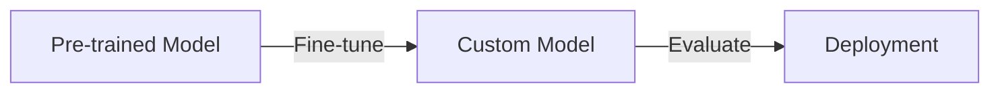
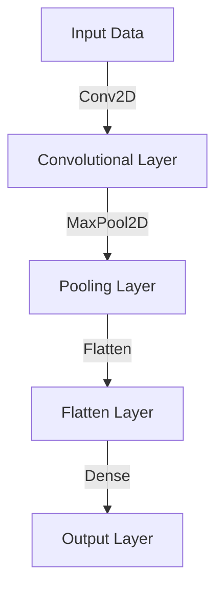
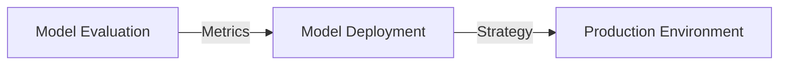

A comprehensive guide to fine-tuning custom models for AI and machine learning applications, covering the architecture, patterns, and strategies for achieving optimal results. 

In the realm of artificial intelligence and machine learning, fine-tuning custom models has become an essential step in achieving high-performance results. With the increasing demand for tailored solutions, understanding the intricacies of model fine-tuning is crucial for developers and data scientists. This article will delve into the step-by-step architecture guide for building and fine-tuning custom models, providing a deep dive into the world of AI and machine learning.

## Table of Contents
1. [Introduction to Model Fine-tuning](#introduction-to-model-fine-tuning)
2. [Preparing the Dataset](#preparing-the-dataset)
3. [Building the Model Architecture](#building-the-model-architecture)
4. [Fine-tuning the Model](#fine-tuning-the-model)
5. [Evaluating and Deploying the Model](#evaluating-and-deploying-the-model)

## Introduction to Model Fine-tuning
Fine-tuning a custom model involves adjusting the parameters of a pre-trained model to fit a specific task or dataset. This technique has gained popularity due to its ability to leverage the knowledge gained by the pre-trained model, reducing the need for extensive training data and computational resources. 

To illustrate the concept of model fine-tuning, let's consider a scenario where we want to build a custom language model for a specific industry. We can start with a pre-trained language model and fine-tune it on a dataset specific to that industry, allowing the model to learn the nuances and terminology of the industry.

## Preparing the Dataset
Preparing a high-quality dataset is essential for fine-tuning a custom model. The dataset should be relevant to the task at hand and should contain a sufficient amount of data to allow the model to learn effectively. 

Some key considerations when preparing the dataset include:

* Data quality: Ensuring that the data is accurate, complete, and consistent.
* Data quantity: Having a sufficient amount of data to allow the model to learn effectively.
* Data diversity: Ensuring that the data is diverse and representative of the task at hand.

| Dataset Characteristics | Description |
| --- | --- |
| Size | The number of samples in the dataset |
| Quality | The accuracy and consistency of the data |
| Diversity | The variety of data in the dataset |

## Building the Model Architecture
The model architecture plays a crucial role in the fine-tuning process. The architecture should be designed to take into account the specific requirements of the task at hand, including the type of data, the complexity of the task, and the computational resources available. 

Some popular model architectures for fine-tuning include:

* Convolutional Neural Networks (CNNs) for image classification tasks
* Recurrent Neural Networks (RNNs) for sequence-to-sequence tasks
* Transformers for natural language processing tasks

## Fine-tuning the Model
Fine-tuning the model involves adjusting the parameters of the pre-trained model to fit the specific task at hand. This can be done using various optimization algorithms and techniques, including stochastic gradient descent (SGD), Adam, and RMSprop. 

Some key considerations when fine-tuning the model include:

* Learning rate: The step size of each iteration
* Batch size: The number of samples in each batch
* Number of epochs: The number of times the model sees the data

> **Note:** Fine-tuning the model requires careful tuning of hyperparameters to achieve optimal results.

## Evaluating and Deploying the Model
Evaluating and deploying the model is the final step in the fine-tuning process. The model should be evaluated on a test dataset to ensure that it is performing well on unseen data. 

Some key considerations when evaluating and deploying the model include:

* Evaluation metrics: The metrics used to evaluate the model's performance
* Deployment strategy: The strategy used to deploy the model in a production environment

## Visual Insights Gallery

## Summary/Conclusion
Fine-tuning a custom model is a complex process that requires careful consideration of various factors, including dataset preparation, model architecture, and hyperparameter tuning. By following the step-by-step guide outlined in this article, developers and data scientists can build and fine-tune custom models that achieve high-performance results.

## FAQ
Q: What is model fine-tuning?
A: Model fine-tuning involves adjusting the parameters of a pre-trained model to fit a specific task or dataset.
Q: What are the key considerations when preparing a dataset for fine-tuning?
A: The key considerations include data quality, data quantity, and data diversity.
Q: What are the popular model architectures for fine-tuning?
A: The popular model architectures include CNNs, RNNs, and Transformers.