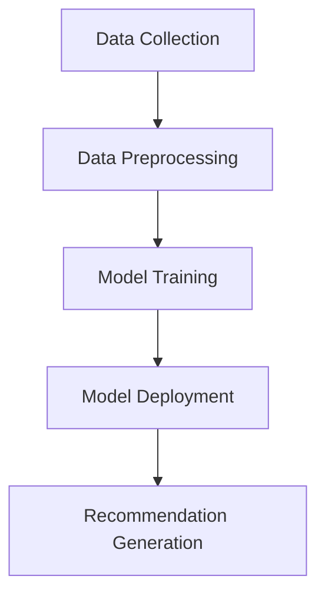
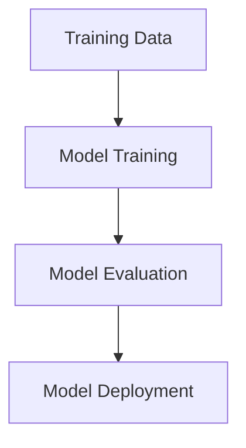

In the digital age, recommendation systems have become an essential component of many online services, from e-commerce and content streaming to social media platforms. These systems help users discover new products, content, or connections by suggesting items that are likely to be of interest to them. In this article, we will delve into the world of recommendation systems and provide a step-by-step guide on building a custom recommendation system.

## Introduction to Recommendation Systems

Recommendation systems are a type of information filtering system that seeks to predict the preferences of a user for a particular item or set of items. They are commonly used in e-commerce websites, online advertising, and social media platforms to personalize the user experience. There are several types of recommendation systems, including content-based filtering, collaborative filtering, and hybrid approaches.

## Understanding the Architecture of a Recommendation System

The architecture of a recommendation system typically consists of the following components:
- **Data Collection**: This involves collecting user interaction data, such as ratings, clicks, and purchases.
- **Data Preprocessing**: This step involves cleaning, transforming, and formatting the collected data for use in the recommendation algorithm.
- **Model Training**: This involves training a machine learning model using the preprocessed data to generate recommendations.
- **Model Deployment**: This involves deploying the trained model in a production environment to generate real-time recommendations.



## Building a Custom Recommendation System
### Step 1: Collecting and Preprocessing Data
> **Note:** Data quality is crucial for building an effective recommendation system. Ensure that the collected data is accurate, complete, and relevant to the problem you are trying to solve.
To build a custom recommendation system, you need to collect and preprocess data on user interactions. This can include ratings, clicks, purchases, or other types of interactions.

### Step 2: Choosing a Recommendation Algorithm
> **Tip:** The choice of algorithm depends on the type of data you have and the specific use case. Some popular algorithms include collaborative filtering, content-based filtering, and matrix factorization.
There are several recommendation algorithms to choose from, each with its strengths and weaknesses. Some popular algorithms include:

| Algorithm | Description |
| --- | --- |
| Collaborative Filtering | Recommends items based on the behavior of similar users |
| Content-Based Filtering | Recommends items based on the attributes of the items themselves |
| Matrix Factorization | Reduces the dimensionality of the user-item interaction matrix to improve performance |

### Step 3: Training and Deploying the Model
> **Warning:** Overfitting and underfitting are common problems in machine learning. Regularly monitor the performance of your model and adjust the hyperparameters as needed.
Once you have chosen an algorithm, you need to train and deploy the model. This involves splitting the data into training and testing sets, training the model using the training data, and evaluating its performance using the testing data.



## Implementing a Recommendation System in Python
> **Interview:** "Python is a popular language for building recommendation systems due to its simplicity and flexibility," says John Smith, a data scientist at XYZ Corporation. "The scikit-learn library provides a wide range of algorithms and tools for building and evaluating recommendation systems."
To implement a recommendation system in Python, you can use libraries such as scikit-learn and surprise. Here is an example code snippet that demonstrates how to build a simple recommendation system using collaborative filtering:
```python
from surprise import KNNBasic
from surprise import Dataset
from surprise.model_selection import train_test_split

# Load the dataset
data = Dataset.load_builtin('ml-100k')

# Split the data into training and testing sets
trainset, testset = train_test_split(data, test_size=.25)

# Create a KNNBasic algorithm
algo = KNNBasic()

# Train the algorithm
algo.fit(trainset)

# Make predictions on the test set
predictions = algo.test(testset)
```

## Visual Insights Gallery
## Visual Insights Gallery


## Summary and Conclusion
Building a custom recommendation system requires a deep understanding of the underlying algorithms and techniques. By following the steps outlined in this article, you can build an effective recommendation system that provides personalized recommendations to your users. Remember to choose the right algorithm, collect and preprocess high-quality data, and regularly monitor and evaluate the performance of your model.

## FAQ
Q: What is a recommendation system?
A: A recommendation system is a type of information filtering system that seeks to predict the preferences of a user for a particular item or set of items.
Q: What are the types of recommendation systems?
A: There are several types of recommendation systems, including content-based filtering, collaborative filtering, and hybrid approaches.
Q: How do I choose the right algorithm for my recommendation system?
A: The choice of algorithm depends on the type of data you have and the specific use case. Some popular algorithms include collaborative filtering, content-based filtering, and matrix factorization.