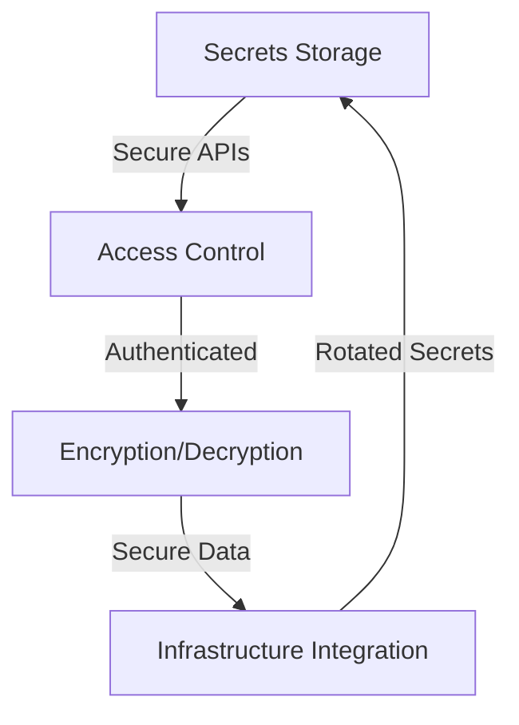
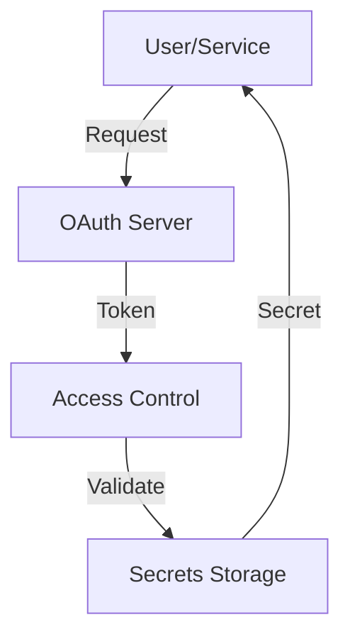
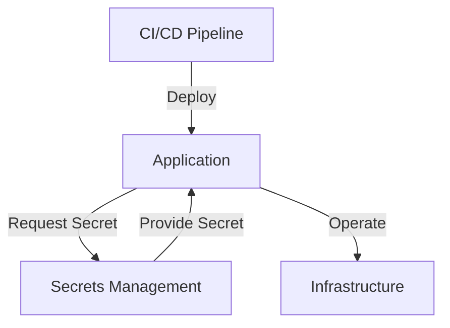

In the realm of cybersecurity, secrets management stands as a critical pillar, ensuring that sensitive information such as encryption keys, OAuth tokens, and database credentials are protected from unauthorized access. As organizations grow and their infrastructure becomes more complex, managing secrets efficiently becomes a daunting task. This article delves into the intricacies of building a custom secrets management system, tailored to meet the unique needs of your organization.

## Table of Contents
1. [Introduction to Secrets Management](#introduction-to-secrets-management)
2. [Architecture Overview](#architecture-overview)
3. [Designing the Secrets Storage](#designing-the-secrets-storage)
4. [Implementing Access Control and Authentication](#implementing-access-control-and-authentication)
5. [Encryption and Key Management](#encryption-and-key-management)
6. [Integrating with Existing Infrastructure](#integrating-with-existing-infrastructure)
7. [Visual Insights Gallery](#visual-insights-gallery)
8. [Summary/Conclusion](#summary/conclusion)
9. [FAQ Section](#faq-section)

## Introduction to Secrets Management
Secrets management involves the secure storage, distribution, and rotation of sensitive data. Effective management is crucial for preventing data breaches and ensuring compliance with regulatory standards. 

> **Tip:** When planning your secrets management strategy, consider the principles of least privilege and separation of duties to minimize the attack surface.

## Architecture Overview
A robust secrets management system should include components for secure storage, access control, encryption, and integration with existing infrastructure. The following Mermaid.js diagram illustrates a high-level architecture:

## Designing the Secrets Storage
The core of any secrets management system is the secure storage of sensitive data. Consider using a Hardware Security Module (HSM) or a trusted cloud service like AWS Key Management Service (KMS) or Google Cloud Key Management Service (KMS).

> **Note:** Ensure that your storage solution supports secure key rotation and revocation.

## Implementing Access Control and Authentication
Access to secrets should be strictly controlled, with authentication mechanisms in place to verify the identity of users or services requesting access. OAuth and OpenID Connect are popular standards for authentication.

## Encryption and Key Management
All secrets should be encrypted both in transit and at rest. Utilize a key management system to securely generate, distribute, and rotate encryption keys.

> **Warning:** Poor key management practices can lead to significant security vulnerabilities.

## Integrating with Existing Infrastructure
To maximize the effectiveness of your secrets management system, integrate it seamlessly with your existing infrastructure, including CI/CD pipelines and applications.

## Visual Insights Gallery
The following images provide additional insights into the components and considerations of a custom secrets management system:

## Summary/Conclusion
Building a custom secrets management system requires careful planning, considering factors such as secure storage, access control, encryption, and integration with existing infrastructure. By following the step-by-step guide and architecture outlined in this article, organizations can enhance their cybersecurity posture and protect sensitive information.

## FAQ Section
1. **Q: What are the key components of a secrets management system?**
   - A: Secure storage, access control, encryption, and integration with existing infrastructure.
2. **Q: Why is key rotation important?**
   - A: To minimize the impact of a potential security breach by regularly changing encryption keys.
3. **Q: How can I ensure compliance with regulatory standards?**
   - A: Implement a secrets management system that adheres to industry standards and best practices, and regularly audit your system for compliance.