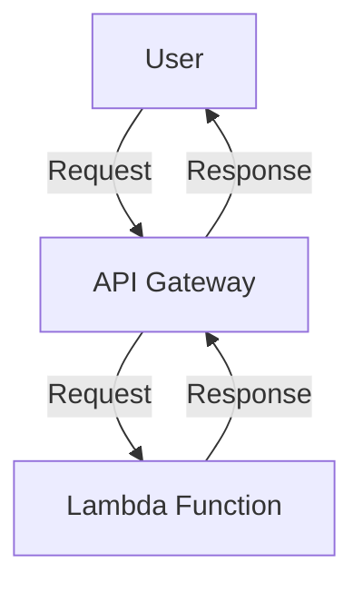
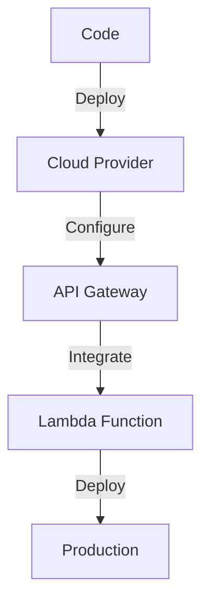

A serverless architecture is a cloud computing model where the cloud provider manages the infrastructure, and the user only pays for the compute resources consumed. In this article, we will delve into the world of serverless architecture and provide a step-by-step guide on how to build a custom serverless architecture.

## Introduction to Serverless Architecture
Serverless architecture has gained popularity in recent years due to its cost-effectiveness, scalability, and reduced administrative burden. The core concept of serverless architecture is to offload the management of infrastructure to the cloud provider, allowing developers to focus on writing code and delivering value to their customers.


## Benefits of Serverless Architecture
The benefits of serverless architecture include:
* Reduced administrative burden
* Cost-effectiveness
* Scalability
* Improved reliability
* Enhanced security

```markdown
| Benefit | Description |
| --- | --- |
| Reduced administrative burden | The cloud provider manages the infrastructure, reducing the administrative burden on the user. |
| Cost-effectiveness | The user only pays for the compute resources consumed, making it a cost-effective option. |
| Scalability | Serverless architecture can scale automatically to handle changes in workload. |
| Improved reliability | The cloud provider manages the infrastructure, ensuring high uptime and reliability. |
| Enhanced security | The cloud provider manages the security of the infrastructure, ensuring that it is secure and up-to-date. |
```

## Step-by-Step Guide to Building a Custom Serverless Architecture
Building a custom serverless architecture requires careful planning and execution. Here is a step-by-step guide to help you get started:
### Step 1: Define the Requirements
The first step is to define the requirements of your serverless architecture. This includes identifying the use cases, defining the functional and non-functional requirements, and determining the scalability and performance needs.


### Step 2: Choose the Cloud Provider
The next step is to choose a cloud provider that meets your requirements. The major cloud providers include Amazon Web Services (AWS), Microsoft Azure, and Google Cloud Platform (GCP).
```markdown
| Cloud Provider | Features |
| --- | --- |
| AWS | Lambda, API Gateway, S3, DynamoDB |
| Azure | Functions, API Management, Blob Storage, Cosmos DB |
| GCP | Cloud Functions, Cloud Endpoints, Cloud Storage, Cloud Firestore |
```

### Step 3: Design the Architecture
Once you have chosen a cloud provider, the next step is to design the architecture. This includes identifying the components, defining the interactions between them, and determining the data flow.


### Step 4: Implement the Architecture
The next step is to implement the architecture. This includes writing the code, configuring the cloud provider, and deploying the application.


### Step 5: Monitor and Optimize
The final step is to monitor and optimize the architecture. This includes monitoring the performance, identifying bottlenecks, and optimizing the code and configuration.
> **Tip:** Use monitoring tools such as CloudWatch or Stackdriver to monitor the performance of your serverless architecture.

## Real-World Example: E-commerce Application
A real-world example of a serverless architecture is an e-commerce application. The application can be designed to use a serverless architecture, with the cloud provider managing the infrastructure and the user only paying for the compute resources consumed.


## Visual Insights Gallery
## Visual Insights Gallery
Here are some additional visual insights to help you understand serverless architecture:


## Summary/Conclusion
In conclusion, building a custom serverless architecture requires careful planning and execution. By following the step-by-step guide outlined in this article, you can design and implement a serverless architecture that meets your requirements and provides a cost-effective, scalable, and reliable solution.

## FAQ
* Q: What is serverless architecture?
A: Serverless architecture is a cloud computing model where the cloud provider manages the infrastructure, and the user only pays for the compute resources consumed.
* Q: What are the benefits of serverless architecture?
A: The benefits of serverless architecture include reduced administrative burden, cost-effectiveness, scalability, improved reliability, and enhanced security.
* Q: How do I choose a cloud provider?
A: When choosing a cloud provider, consider factors such as features, pricing, and support. The major cloud providers include AWS, Azure, and GCP.