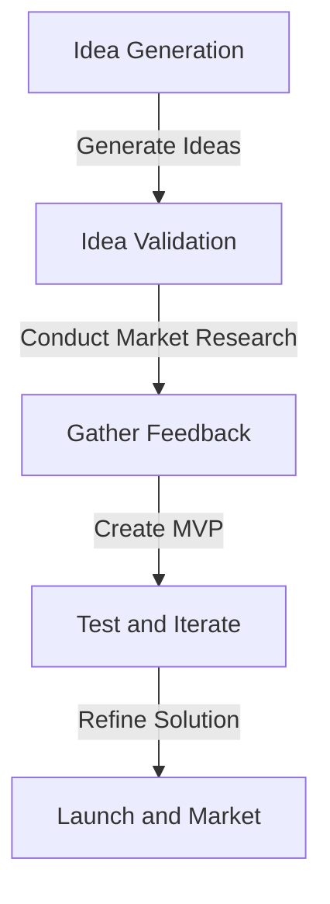
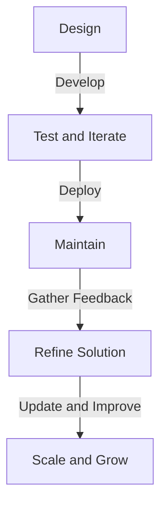

A micro-SaaS (Software as a Service) is a small, focused software solution that solves a specific problem for a niche audience. In this article, we will delve into the process of building a micro-SaaS, from idea generation to launching a profitable product.

## Table of Contents
1. [Introduction to Micro-SaaS](#introduction-to-micro-saas)
2. [Generating Ideas for Your Micro-SaaS](#generating-ideas-for-your-micro-saas)
3. [Validating Your Idea](#validating-your-idea)
4. [Building Your Micro-SaaS](#building-your-micro-saas)
5. [Launching and Marketing Your Micro-SaaS](#launching-and-marketing-your-micro-saas)
6. [Visual Insights Gallery](#visual-insights-gallery)
7. [Conclusion](#conclusion)
8. [FAQ](#faq)

## Introduction to Micro-SaaS

Micro-SaaS solutions are designed to be small, agile, and highly focused on solving a specific problem for a niche audience. They are often bootstrapped and can be developed by a single person or a small team. The key characteristics of a micro-SaaS include:
* A small, targeted market
* A specific, well-defined problem to solve
* A simple, intuitive solution
* A low-cost, efficient development process
* A focus on customer support and feedback

> **Note:** Micro-SaaS solutions are ideal for solopreneurs or small teams who want to create a profitable software product without requiring a large amount of funding or resources.

## Generating Ideas for Your Micro-SaaS

To generate ideas for your micro-SaaS, you can start by identifying problems or pain points in your own industry or niche. You can also research online communities, forums, and social media to see what problems people are discussing and trying to solve. Some other ways to generate ideas include:
* Conducting surveys or interviews with potential customers
* Analyzing industry trends and opportunities
* Brainstorming with friends, family, or colleagues
* Using online tools and resources, such as idea generation software or innovation platforms

```markdown
| Idea Generation Method | Description |
| --- | --- |
| Online Research | Research online communities, forums, and social media to identify problems and pain points |
| Surveys and Interviews | Conduct surveys or interviews with potential customers to gather feedback and ideas |
| Brainstorming | Brainstorm with friends, family, or colleagues to generate ideas and solutions |
| Industry Trends | Analyze industry trends and opportunities to identify potential areas for innovation |
```

## Validating Your Idea

Once you have generated some ideas for your micro-SaaS, you need to validate them to ensure that they are viable and have potential for success. You can validate your idea by:
* Conducting market research and analysis
* Gathering feedback from potential customers
* Creating a minimum viable product (MVP) or prototype
* Testing and iterating on your solution



## Building Your Micro-SaaS

Once you have validated your idea, you can start building your micro-SaaS. This involves:
* Designing and developing your solution
* Creating a user interface and user experience
* Testing and iterating on your solution
* Deploying and maintaining your solution



## Launching and Marketing Your Micro-SaaS

After building your micro-SaaS, you need to launch and market it to attract customers and generate revenue. This involves:
* Creating a marketing strategy and plan
* Building a website and online presence
* Developing a sales funnel and conversion process
* Using social media and content marketing to promote your solution

> **Tip:** Focus on providing value and solving problems for your customers, rather than just trying to make a sale.

## Visual Insights Gallery
## Visual Insights Gallery


## Conclusion
Building a micro-SaaS requires a deep understanding of your target market, a well-defined problem to solve, and a simple, intuitive solution. By following the steps outlined in this article, you can generate ideas, validate your concept, build and launch your micro-SaaS, and create a profitable software product.

## FAQ
Q: What is a micro-SaaS?
A: A micro-SaaS is a small, focused software solution that solves a specific problem for a niche audience.
Q: How do I generate ideas for my micro-SaaS?
A: You can generate ideas by conducting online research, surveys, and interviews, brainstorming with friends and family, and analyzing industry trends and opportunities.
Q: What is the most important thing to focus on when building a micro-SaaS?
A: The most important thing to focus on is providing value and solving problems for your customers.