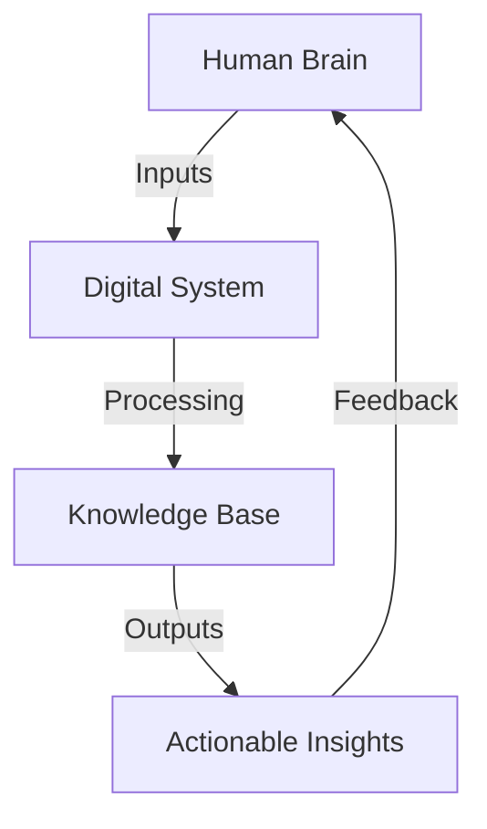
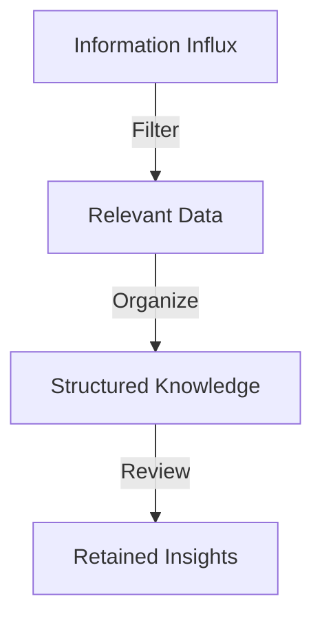

# Building a Second Brain: My System for Knowledge Discovery
[IMAGE: A futuristic illustration of a human brain with a digital overlay, representing the intersection of human intelligence and artificial intelligence]
As we navigate the complexities of the digital age, it's becoming increasingly clear that our ability to process, retain, and apply knowledge is the key to unlocking success. In this article, we'll delve into the concept of building a "second brain" – a personalized system for knowledge discovery that amplifies your cognitive abilities and streamlines your learning process.

## Table of Contents
1. [Introduction to the Second Brain Concept](#introduction-to-the-second-brain-concept)
2. [The Architecture of a Second Brain](#the-architecture-of-a-second-brain)
3. [Implementing the Second Brain System](#implementing-the-second-brain-system)
4. [Strategies for Effective Knowledge Management](#strategies-for-effective-knowledge-management)
5. [Visual Insights Gallery](#visual-insights-gallery)

## Introduction to the Second Brain Concept
[IMAGE: A diagram illustrating the relationship between the human brain and a digital knowledge management system]
The idea of a "second brain" is rooted in the notion that our biological brains have limitations when it comes to processing and retaining information. By creating a digital counterpart, we can offload mental clutter, enhance our memory, and focus on high-level thinking. This concept is not about replacing human intelligence but about augmenting it with technology to achieve more efficient knowledge discovery and application.

## The Architecture of a Second Brain

[IMAGE: A high-level architecture diagram of a second brain system, showcasing the flow of information from human input to digital processing and back to human application]
A well-designed second brain system consists of several key components:
- **Input Mechanisms**: Tools and strategies for capturing information from various sources.
- **Digital Repository**: A centralized platform for storing and organizing knowledge.
- **Processing and Analysis**: Methods for extracting insights and meaning from the collected data.
- **Output and Application**: Channels for applying the gained knowledge in real-world scenarios.

## Implementing the Second Brain System
[IMAGE: A screenshot of a note-taking app with tags, folders, and search functionality, demonstrating a practical implementation of a digital knowledge base]
To start building your second brain, consider the following steps:
1. **Choose a Digital Tool**: Select a note-taking or knowledge management app that fits your workflow and preferences.
2. **Establish a Capture Protocol**: Develop a habit of consistently capturing information from books, articles, conversations, and experiences.
3. **Organize and Tag**: Implement a tagging system to categorize and connect related pieces of information.
4. **Regular Review and Reflection**: Schedule time to review, reflect, and refine your knowledge base.

## Strategies for Effective Knowledge Management
### Note-taking Techniques
[IMAGE: An illustration comparing different note-taking methods, such as the Cornell method, mind mapping, and outline notation]
Effective note-taking is crucial for a second brain system. Experiment with different techniques to find what works best for you.

### Information Overload Management

[IMAGE: A flowchart depicting the process of managing information overload, from filtering and organizing to reviewing and retaining]
To combat information overload, focus on filtering out irrelevant data, organizing what's left, and regularly reviewing your knowledge base to reinforce retention.

### Collaboration and Knowledge Sharing
[IMAGE: A group of professionals engaged in a discussion, surrounded by digital screens and whiteboards, highlighting the importance of collaboration in knowledge discovery]
Don't underestimate the value of sharing knowledge and collaborating with others. This not only helps in validating your insights but also exposes you to new perspectives and ideas.

## Visual Insights Gallery
[IMAGE: A futuristic library with virtual reality interfaces and AI-powered research assistants, symbolizing the future of knowledge discovery]
[IMAGE: A mind map representing the interconnectedness of different disciplines and how a second brain system can facilitate interdisciplinary learning]
[IMAGE: A dashboard showing analytics and insights from a personal knowledge management system, demonstrating the potential for data-driven decision making]

## Summary/Conclusion
Building a second brain is about creating a symbiotic relationship between your human capabilities and digital tools to enhance knowledge discovery and application. By understanding the architecture, implementing the system, and employing effective strategies, you can significantly boost your productivity and efficiency in the pursuit of knowledge.

## FAQ
- **Q: What is the primary goal of building a second brain?**
  A: The primary goal is to create a system that augments human intelligence, allowing for more efficient processing, retention, and application of knowledge.
- **Q: How do I choose the right digital tool for my second brain?**
  A: Consider your workflow, preferences, and the features you need. Experiment with different tools until you find the one that best fits your requirements.
- **Q: Is building a second brain suitable for everyone?**
  A: Yes, the concept and benefits of a second brain can be adapted to suit various learning styles and professional needs, making it accessible to a wide range of individuals.