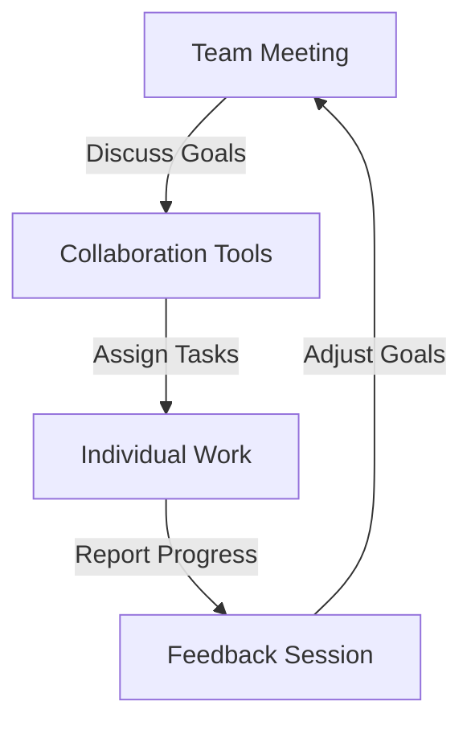
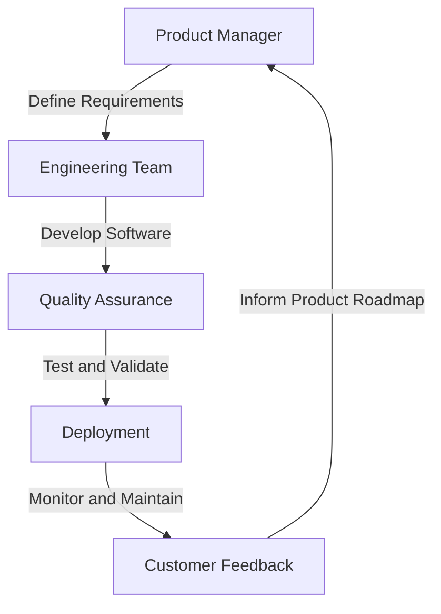

As the world becomes increasingly interconnected, the notion of a traditional office setup is becoming less relevant. With the rise of remote work, companies are now looking to build high-performing remote engineering teams that can deliver exceptional results. In this article, we will explore the key strategies and best practices for building and managing a remote engineering team.

## Introduction to Remote Engineering Teams

Remote engineering teams offer a plethora of benefits, including increased flexibility, reduced costs, and access to a global talent pool. However, managing a remote team can be challenging, especially when it comes to communication, collaboration, and productivity. To overcome these challenges, it's essential to establish a solid foundation for your remote team.

## Building a Remote Engineering Team
### Hiring the Right Talent
When building a remote engineering team, it's crucial to hire the right talent. This involves looking beyond geographical boundaries and focusing on skills, experience, and cultural fit. Some key considerations when hiring remote engineers include:
* Technical skills and expertise
* Communication and collaboration skills
* Time zone and availability
* Cultural fit and values alignment

### Onboarding Remote Engineers
Once you've hired the right talent, it's essential to provide a comprehensive onboarding process. This includes:
* Virtual introductions and team meetings
* Access to necessary tools and resources
* Clear communication of expectations and goals
* Regular check-ins and feedback sessions

## Managing a Remote Engineering Team
### Communication and Collaboration
Effective communication and collaboration are critical to the success of a remote engineering team. Some strategies for facilitating communication and collaboration include:
* Regular team meetings and stand-ups
* Use of collaboration tools such as Slack, Trello, and GitHub
* Encouraging open and transparent communication
* Establishing clear goals and expectations

### Performance Management and Feedback
Performance management and feedback are essential for the growth and development of remote engineers. Some strategies for providing feedback and managing performance include:
* Regular check-ins and progress updates
* Use of performance management tools such as 15Five and Lattice
* Encouraging self-reflection and self-improvement
* Providing opportunities for growth and development

## Architecture for Remote Engineering Teams

## Tools and Resources for Remote Engineering Teams
Some essential tools and resources for remote engineering teams include:
| Tool | Description |
| --- | --- |
| Slack | Communication and collaboration platform |
| GitHub | Version control and code management |
| Trello | Project management and task assignment |
| Zoom | Video conferencing and virtual meetings |

> **Tip:** When selecting tools and resources for your remote engineering team, consider factors such as ease of use, scalability, and integration with existing systems.

## Visual Insights Gallery
## Visual Insights Gallery

## Summary and Conclusion
Building high-performing remote engineering teams requires careful planning, effective communication, and a solid foundation for collaboration and productivity. By following the strategies and best practices outlined in this article, you can establish a successful remote engineering team that delivers exceptional results.

## FAQ
Q: What are the benefits of building a remote engineering team?
A: The benefits of building a remote engineering team include increased flexibility, reduced costs, and access to a global talent pool.
Q: How do I hire the right talent for my remote engineering team?
A: When hiring remote engineers, focus on skills, experience, and cultural fit, and consider factors such as time zone and availability.
Q: What tools and resources are essential for remote engineering teams?
A: Essential tools and resources for remote engineering teams include communication and collaboration platforms, version control and code management tools, and project management and task assignment tools.