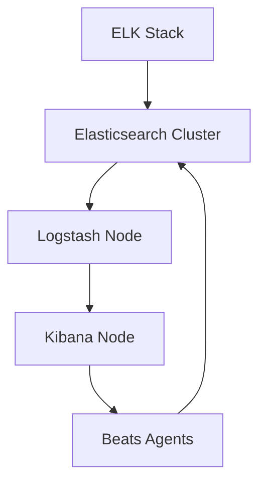
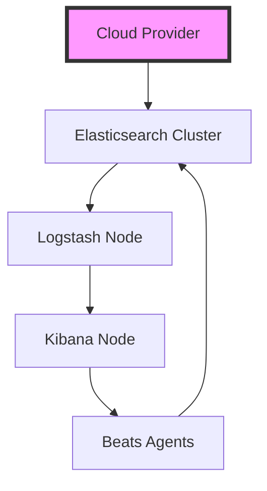

In today's fast-paced and complex software development landscape, logging has become an essential component of any application's infrastructure. A well-implemented logging system can provide valuable insights into an application's performance, help identify and debug issues, and even inform business decisions. One popular logging solution is the ELK Stack (Elasticsearch, Logstash, Kibana), which offers a powerful and scalable way to collect, process, and visualize log data. In this article, we will explore the process of setting up the ELK Stack in a production environment, leveraging cloud-based infrastructure and modern deployment tools.

## Table of Contents
1. [Introduction to the ELK Stack](#introduction-to-the-elk-stack)
2. [Architecture Overview](#architecture-overview)
3. [Setting up the ELK Stack](#setting-up-the-elk-stack)
4. [Deploying the ELK Stack to the Cloud](#deploying-the-elk-stack-to-the-cloud)
5. [Configuring Logstash and Beats](#configuring-logstash-and-beats)
6. [Visualizing Log Data with Kibana](#visualizing-log-data-with-kibana)

## Introduction to the ELK Stack
The ELK Stack is a collection of three open-source projects: Elasticsearch, Logstash, and Kibana. Elasticsearch is a search and analytics engine that stores and indexes log data. Logstash is a data processing pipeline that collects, transforms, and sends log data to Elasticsearch. Kibana is a visualization tool that provides a user-friendly interface for exploring and analyzing log data.


## Architecture Overview
The ELK Stack can be deployed in a variety of architectures, from simple single-node setups to complex distributed clusters. In a production environment, it's common to deploy the ELK Stack as a distributed cluster, with multiple nodes for each component.


## Setting up the ELK Stack
To set up the ELK Stack, you'll need to install and configure each component. This can be done manually, but it's often more efficient to use a deployment tool like Terraform or Ansible.
```terraform
provider "aws" {
  region = "us-west-2"
}

resource "aws_instance" "elasticsearch" {
  ami           = "ami-0c94855ba95c71c99"
  instance_type = "t2.micro"
}

resource "aws_instance" "logstash" {
  ami           = "ami-0c94855ba95c71c99"
  instance_type = "t2.micro"
}

resource "aws_instance" "kibana" {
  ami           = "ami-0c94855ba95c71c99"
  instance_type = "t2.micro"
}
```
> **Note:** This is a simplified example and you should adjust the instance types and AMIs according to your specific needs.

## Deploying the ELK Stack to the Cloud
Once you've set up the ELK Stack, you can deploy it to a cloud provider like AWS or Google Cloud. This provides a scalable and highly available infrastructure for your logging system.


## Configuring Logstash and Beats
Logstash and Beats are responsible for collecting and processing log data. You'll need to configure them to send log data to your Elasticsearch cluster.
```json
input {
  beats {
    port: 5044
  }
}

filter {
  grok {
    match => { "message" => "%{GREEDYDATA:message}" }
  }
}

output {
  elasticsearch {
    hosts => "https://elasticsearch:9200"
    index => "logs"
  }
}
```
> **Tip:** You can use the `grok` filter to parse log messages and extract relevant information.

## Visualizing Log Data with Kibana
Kibana provides a user-friendly interface for exploring and analyzing log data. You can create visualizations, dashboards, and alerts to help you understand and respond to log data.


## Visual Insights Gallery
### Log Data Visualization

### Elasticsearch Cluster

### Kibana Dashboard


## Summary/Conclusion
In this article, we've explored the process of setting up the ELK Stack in a production environment. We've covered the architecture, deployment, and configuration of the ELK Stack, as well as visualizing log data with Kibana. By following these steps, you can create a powerful and scalable logging system that provides valuable insights into your application's performance.

## FAQ
1. **What is the ELK Stack?**
The ELK Stack is a collection of three open-source projects: Elasticsearch, Logstash, and Kibana.
2. **How do I deploy the ELK Stack to the cloud?**
You can deploy the ELK Stack to a cloud provider like AWS or Google Cloud using a deployment tool like Terraform or Ansible.
3. **How do I configure Logstash and Beats?**
You can configure Logstash and Beats by creating input, filter, and output configurations that send log data to your Elasticsearch cluster.