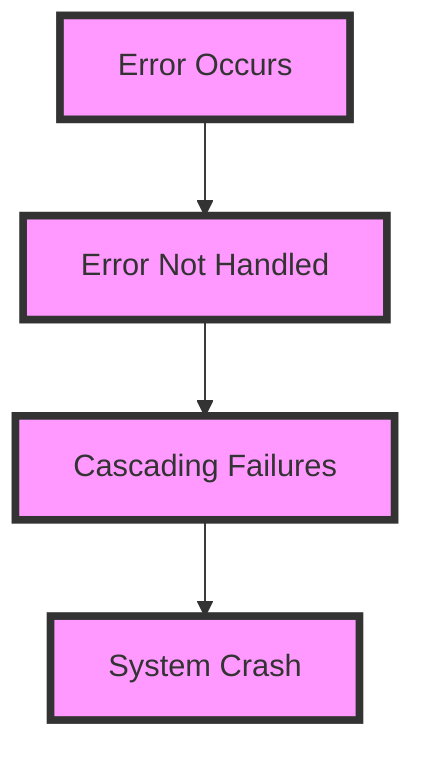
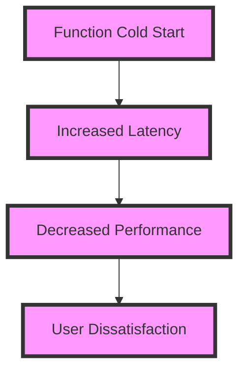
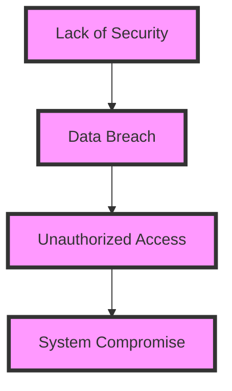

Asynchronous serverless architecture has become increasingly popular due to its scalability, cost-effectiveness, and ability to handle large volumes of requests. However, as with any complex system, there are common mistakes that can lead to performance issues, increased latency, and even system crashes. In this article, we will delve into the most common mistakes made in asynchronous serverless architecture and provide actionable advice on how to avoid them.

## Table of Contents
1. [Introduction to Asynchronous Serverless Architecture](#introduction-to-asynchronous-serverless-architecture)
2. [Mistake 1: Inadequate Error Handling](#mistake-1-inadequate-error-handling)
3. [Mistake 2: Insufficient Monitoring and Logging](#mistake-2-insufficient-monitoring-and-logging)
4. [Mistake 3: Poor Function Cold Start Management](#mistake-3-poor-function-cold-start-management)
5. [Mistake 4: Inefficient Data Processing and Storage](#mistake-4-inefficient-data-processing-and-storage)
6. [Mistake 5: Lack of Security and Authentication](#mistake-5-lack-of-security-and-authentication)
7. [Best Practices for Asynchronous Serverless Architecture](#best-practices-for-asynchronous-serverless-architecture)

## Introduction to Asynchronous Serverless Architecture
Asynchronous serverless architecture is a design pattern that allows for the decoupling of application components, enabling them to operate independently and asynchronously. This approach provides numerous benefits, including improved scalability, reduced latency, and increased fault tolerance.

## Mistake 1: Inadequate Error Handling
Inadequate error handling is a common mistake in asynchronous serverless architecture. When errors occur, they can propagate quickly, causing cascading failures and making it difficult to diagnose and debug issues.

To avoid this mistake, it's essential to implement robust error handling mechanisms, such as try-catch blocks, error callbacks, and retry mechanisms.

## Mistake 2: Insufficient Monitoring and Logging
Insufficient monitoring and logging can make it challenging to identify and debug issues in asynchronous serverless architecture.

> **Tip:** Implement comprehensive monitoring and logging tools, such as AWS CloudWatch or Google Cloud Logging, to gain visibility into your system's performance and behavior.

## Mistake 3: Poor Function Cold Start Management
Poor function cold start management can lead to increased latency and decreased performance in asynchronous serverless architecture.

To avoid this mistake, implement strategies such as function warming, caching, or using a keep-alive mechanism to minimize cold starts.

## Mistake 4: Inefficient Data Processing and Storage
Inefficient data processing and storage can lead to increased costs, decreased performance, and data loss in asynchronous serverless architecture.

> **Warning:** Avoid using inefficient data processing and storage mechanisms, such as processing large datasets in memory or using slow storage solutions.

## Mistake 5: Lack of Security and Authentication
Lack of security and authentication can expose your asynchronous serverless architecture to security risks, such as data breaches or unauthorized access.

To avoid this mistake, implement robust security and authentication mechanisms, such as encryption, access controls, and identity management.

## Best Practices for Asynchronous Serverless Architecture
To avoid common mistakes in asynchronous serverless architecture, follow these best practices:
* Implement robust error handling mechanisms
* Monitor and log your system comprehensively
* Manage function cold starts effectively
* Optimize data processing and storage
* Ensure security and authentication

## Visual Insights Gallery

## Summary/Conclusion
Asynchronous serverless architecture offers numerous benefits, but common mistakes can lead to performance issues, increased latency, and even system crashes. By following the best practices outlined in this article and avoiding common mistakes, you can design and implement a scalable, efficient, and secure asynchronous serverless architecture that meets your needs.

## FAQ
Q: What is asynchronous serverless architecture?
A: Asynchronous serverless architecture is a design pattern that allows for the decoupling of application components, enabling them to operate independently and asynchronously.
Q: How can I avoid common mistakes in asynchronous serverless architecture?
A: Implement robust error handling mechanisms, monitor and log your system comprehensively, manage function cold starts effectively, optimize data processing and storage, and ensure security and authentication.
Q: What are the benefits of asynchronous serverless architecture?
A: Asynchronous serverless architecture offers numerous benefits, including improved scalability, reduced latency, and increased fault tolerance.