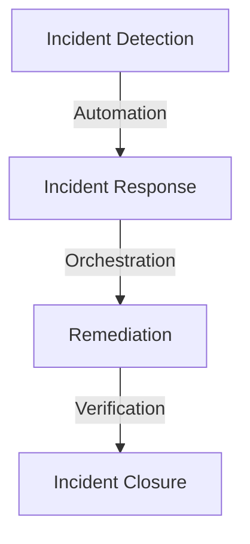

Automated incident response is a crucial aspect of modern cybersecurity, enabling organizations to swiftly respond to and mitigate the impact of security incidents. However, the implementation and execution of automated incident response systems can be complex and prone to errors. In this article, we will explore common mistakes made in automated incident response and provide actionable advice on how to avoid them.

## Introduction to Automated Incident Response

Automated incident response refers to the use of technology and predefined processes to detect, respond to, and manage security incidents. The primary goal of automated incident response is to minimize the time and effort required to respond to incidents, thereby reducing the potential impact on the organization. However, to achieve this goal, it is essential to avoid common mistakes that can undermine the effectiveness of automated incident response systems.

## Mistake 1: Inadequate Planning and Testing
> **Warning:** Inadequate planning and testing can lead to automated incident response systems that are ineffective or even counterproductive.
Inadequate planning and testing are common mistakes made in automated incident response. Organizations often fail to develop comprehensive incident response plans, test their systems regularly, and update their plans to reflect changing threats and vulnerabilities. To avoid this mistake, it is essential to develop a thorough incident response plan, test it regularly, and update it as needed.

```markdown
### Incident Response Plan Checklist
* Define incident response scope and objectives
* Identify incident response team members and their roles
* Develop incident response procedures
* Test incident response plan regularly
* Update incident response plan as needed
```

## Mistake 2: Insufficient Visibility and Monitoring

Insufficient visibility and monitoring are significant mistakes made in automated incident response. Organizations often fail to implement adequate monitoring and logging mechanisms, making it difficult to detect and respond to security incidents. To avoid this mistake, it is essential to implement comprehensive monitoring and logging mechanisms, including network traffic monitoring, system logging, and security information and event management (SIEM) systems.


## Mistake 3: Inadequate Automation and Orchestration
> **Tip:** Implementing automation and orchestration tools can help streamline incident response processes and reduce the risk of human error.
Inadequate automation and orchestration are common mistakes made in automated incident response. Organizations often fail to implement automation and orchestration tools, making it difficult to respond to security incidents quickly and effectively. To avoid this mistake, it is essential to implement automation and orchestration tools, such as security orchestration, automation, and response (SOAR) systems.



## Mistake 4: Lack of Continuous Improvement

Lack of continuous improvement is a significant mistake made in automated incident response. Organizations often fail to review and update their incident response plans and systems regularly, making it difficult to adapt to changing threats and vulnerabilities. To avoid this mistake, it is essential to implement a continuous improvement process, including regular reviews and updates of incident response plans and systems.

## Visual Insights Gallery
## Visual Insights Gallery


## Summary and Conclusion
Automated incident response is a critical aspect of modern cybersecurity, enabling organizations to respond swiftly and effectively to security incidents. However, common mistakes made in automated incident response can undermine its effectiveness. By avoiding mistakes such as inadequate planning and testing, insufficient visibility and monitoring, inadequate automation and orchestration, and lack of continuous improvement, organizations can develop and implement effective automated incident response systems.

## FAQ
* Q: What is automated incident response?
A: Automated incident response refers to the use of technology and predefined processes to detect, respond to, and manage security incidents.
* Q: Why is planning and testing essential in automated incident response?
A: Planning and testing are essential in automated incident response to ensure that incident response systems are effective and efficient.
* Q: What are the benefits of automation and orchestration in incident response?
A: Automation and orchestration can help streamline incident response processes, reduce the risk of human error, and improve the speed and effectiveness of incident response.