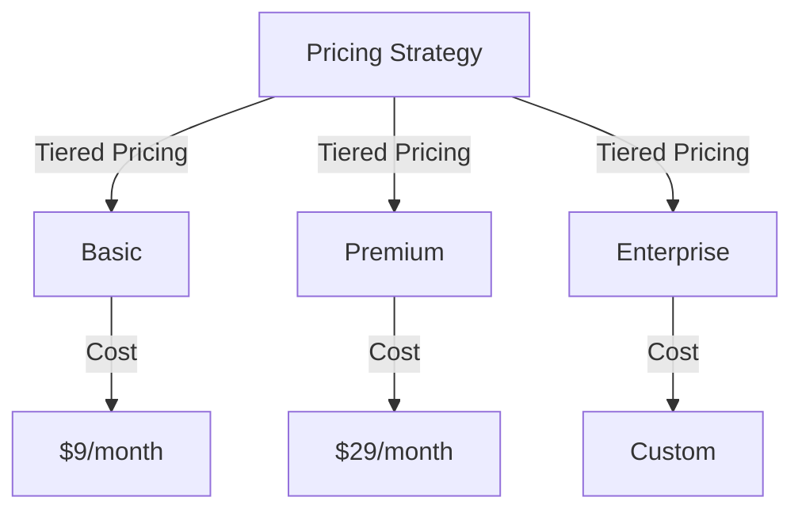
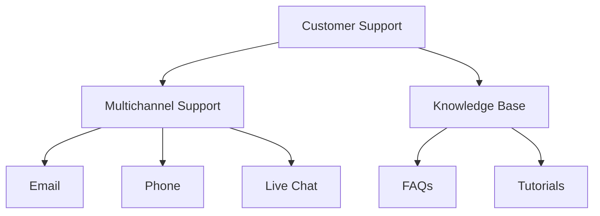

# Common Mistakes in Bootstrapped SaaS Products and How to Avoid Them
Bootstrapping a SaaS product can be a challenging and rewarding experience, but it requires careful planning, execution, and a deep understanding of the market and the product. Many bootstrapped SaaS products fail due to common mistakes that can be avoided with the right strategies and mindset. In this article, we will explore the most common mistakes in bootstrapped SaaS products and provide actionable advice on how to avoid them.

## Understanding the Challenges of Bootstrapping a SaaS Product

Bootstrapping a SaaS product means that the founders are using their own resources, such as savings, revenue from early customers, or loans from friends and family, to fund the business. This approach can be beneficial, as it allows the founders to maintain control and ownership of the company. However, it also means that the founders have limited resources, which can make it difficult to scale the business quickly.

## Lack of Market Validation
One of the most common mistakes in bootstrapped SaaS products is the lack of market validation. Many founders assume that their product will be successful without conducting thorough market research and validation.
```markdown
| **Market Validation** | **Description** |
| --- | --- |
| Customer Interviews | Conduct in-depth interviews with potential customers to understand their needs and pain points. |
| Surveys and Feedback | Collect feedback from potential customers through surveys, focus groups, and online forums. |
| Competitor Analysis | Analyze the competition to understand their strengths, weaknesses, and market share. |
```
To avoid this mistake, founders should conduct thorough market research and validation to ensure that there is a demand for their product.

## Poor Pricing Strategy
Another common mistake in bootstrapped SaaS products is a poor pricing strategy. Many founders struggle to find the right pricing model for their product, which can lead to revenue shortfall and customer acquisition challenges.

To avoid this mistake, founders should develop a pricing strategy that takes into account the value proposition of their product, the competition, and the target customer segment.

## Inadequate Customer Support
Inadequate customer support is another common mistake in bootstrapped SaaS products. Many founders underestimate the importance of customer support, which can lead to high churn rates and negative word-of-mouth.

To avoid this mistake, founders should develop a comprehensive customer support strategy that includes multichannel support, a knowledge base, and a customer success team.

## Failure to Measure and Analyze Key Metrics
Failure to measure and analyze key metrics is another common mistake in bootstrapped SaaS products. Many founders do not track key metrics, such as customer acquisition costs, customer lifetime value, and churn rate, which can make it difficult to make informed decisions.
```markdown
| **Key Metrics** | **Description** |
| --- | --- |
| Customer Acquisition Cost (CAC) | The cost of acquiring a new customer. |
| Customer Lifetime Value (CLV) | The total value of a customer over their lifetime. |
| Churn Rate | The percentage of customers who cancel their subscription. |
```
To avoid this mistake, founders should develop a data-driven approach to decision-making, which includes tracking and analyzing key metrics.

## Visual Insights Gallery
## Visual Insights Gallery


## Summary and Conclusion
Bootstrapping a SaaS product can be a challenging and rewarding experience, but it requires careful planning, execution, and a deep understanding of the market and the product. By avoiding common mistakes, such as lack of market validation, poor pricing strategy, inadequate customer support, and failure to measure and analyze key metrics, founders can increase their chances of success. Remember to stay focused on the customer, develop a comprehensive customer support strategy, and track key metrics to make informed decisions.

## FAQ
1. What is bootstrapping a SaaS product?
Bootstrapping a SaaS product means that the founders are using their own resources, such as savings, revenue from early customers, or loans from friends and family, to fund the business.
2. What are the common mistakes in bootstrapped SaaS products?
The common mistakes in bootstrapped SaaS products include lack of market validation, poor pricing strategy, inadequate customer support, and failure to measure and analyze key metrics.
3. How can founders avoid these mistakes?
Founders can avoid these mistakes by conducting thorough market research and validation, developing a pricing strategy that takes into account the value proposition of their product, providing comprehensive customer support, and tracking key metrics to make informed decisions.