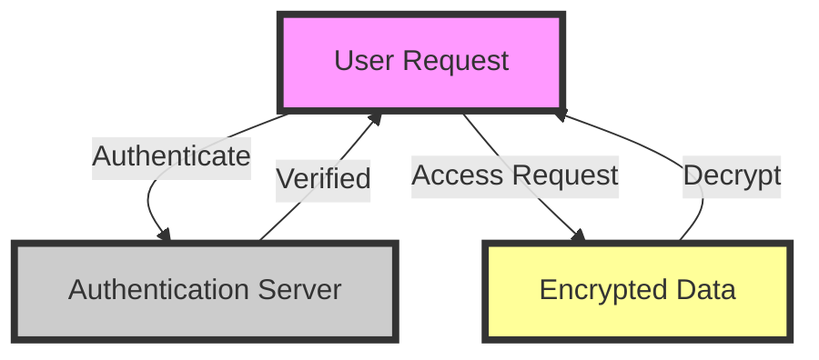
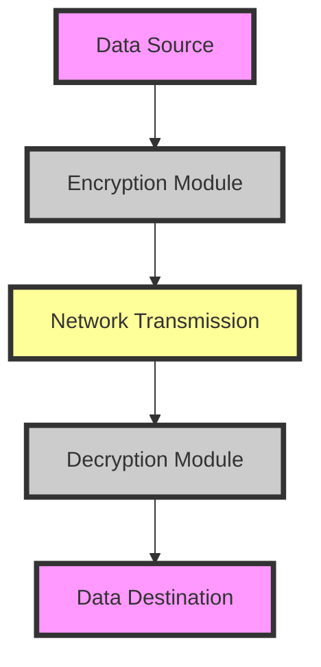

In the realm of cybersecurity, data encryption stands as a stalwart defense against unauthorized access, protecting sensitive information from prying eyes. However, the efficacy of encryption heavily relies on its implementation. Despite its critical importance, cryptographic data encryption is often marred by common mistakes that can undermine its security. This article aims to delve into these pitfalls and provide actionable advice on how to circumvent them, ensuring the robust protection of your data.

## Table of Contents
1. [Introduction to Cryptographic Mistakes](#introduction-to-cryptographic-mistakes)
2. [Using Outdated Encryption Algorithms](#using-outdated-encryption-algorithms)
3. [Inadequate Key Management](#inadequate-key-management)
4. [Insufficient Authentication](#insufficient-authentication)
5. [Architecture and Data Flow](#architecture-and-data-flow)
6. [Visual Insights Gallery](#visual-insights-gallery)
7. [Conclusion and FAQ](#conclusion-and-faq)

## Introduction to Cryptographic Mistakes
> **Note:** The foundation of secure data encryption lies not only in the choice of encryption algorithm but also in the meticulous implementation and ongoing management of the encryption process.

Cryptographic mistakes can lead to severe consequences, including data breaches and legal repercussions. Understanding these mistakes is crucial for any organization or individual seeking to protect their digital assets.


## Using Outdated Encryption Algorithms
Outdated encryption algorithms, such as MD5 and SHA1 for cryptographic purposes, are vulnerable to attacks and should be avoided. Instead, opt for modern and widely accepted algorithms like AES for symmetric encryption and RSA or elliptic curve cryptography for asymmetric encryption.

```plaintext
# Example of using AES encryption in Python
from cryptography.hazmat.primitives import padding
from cryptography.hazmat.primitives.ciphers import Cipher, algorithms, modes
from cryptography.hazmat.backends import default_backend

key = b'\x9b\xa6\x04\x9a\x4a\x9f\x0a\x4a\x9e'
cipher = Cipher(algorithms.AES(key), modes.ECB(), backend=default_backend())
```

## Inadequate Key Management
Inadequate key management is a significant oversight. Keys must be generated securely, stored safely, and rotated regularly to minimize the impact of a potential key compromise.

> **Tip:** Implement a key management system that automates key generation, distribution, and rotation, ensuring that all encryption keys are handled securely and efficiently.


## Insufficient Authentication
Insufficient authentication mechanisms can leave encrypted data vulnerable to unauthorized access. Implementing robust authentication protocols, such as multi-factor authentication, is essential to ensure that only authorized parties can access the encrypted data.



## Architecture and Data Flow
Understanding the architecture and data flow of your encryption system is vital. It helps in identifying potential vulnerabilities and ensures that the encryption is applied at the appropriate points in the data lifecycle.



## Visual Insights Gallery
### Encryption Process Overview

### Key Management Lifecycle

### Cryptographic Protocols Comparison


## Conclusion and FAQ
In conclusion, avoiding common mistakes in cryptographic data encryption requires a deep understanding of encryption algorithms, key management, authentication mechanisms, and the overall architecture of the encryption system. By being vigilant and proactive, individuals and organizations can significantly enhance the security of their data.

### FAQ
1. **What is the most secure encryption algorithm?**
   - The security of an encryption algorithm can depend on various factors, including its implementation and the context in which it is used. However, AES (Advanced Encryption Standard) is widely regarded as secure for symmetric encryption needs.
2. **How often should encryption keys be rotated?**
   - The frequency of key rotation depends on the specific use case and security requirements. As a general practice, keys should be rotated every 60 to 90 days.
3. **What is the importance of authentication in encryption?**
   - Authentication ensures that only authorized parties can access the encrypted data, providing an additional layer of security against unauthorized access.