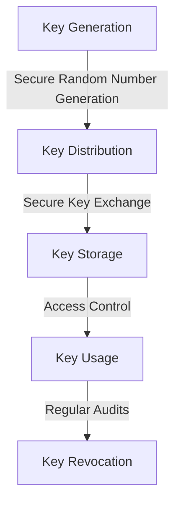

## Introduction to Advanced Cryptographic Concepts
Building on the foundational knowledge of common mistakes in cryptographic data encryption, this article ventures into the advanced realm, exploring edge cases and delving deeper into the architectural aspects of encryption. It is crucial for cybersecurity professionals and developers to understand these nuances to ensure the robust protection of sensitive data.

## Edge Cases in Encryption
Edge cases often represent the most challenging scenarios in encryption, where standard practices may not suffice. These include:

- **Quantum Computing Attacks**: The advent of quantum computing poses a significant threat to current encryption standards. Understanding how quantum computers can potentially break certain types of encryption is vital for future-proofing data security.
- **Side-Channel Attacks**: These attacks target the implementation of encryption algorithms, exploiting information about the implementation, such as timing and power consumption, rather than attacking the algorithm itself.
- **Homomorphic Encryption**: A form of encryption that enables computations to be performed on ciphertext, generating an encrypted result that, when decrypted, matches the result of operations performed on the plaintext.

## Deep Dive into Encryption Architecture
A robust encryption architecture is paramount for secure data protection. This involves not just the selection of appropriate encryption algorithms but also the design of the encryption process, including key management, authentication, and access control.

### Key Management
Key management is a critical component of any encryption system. It involves the generation, distribution, and revocation of cryptographic keys. Poor key management can lead to significant security vulnerabilities.

### Authentication and Access Control
Beyond encryption, ensuring that only authorized parties can access the encrypted data is essential. This involves robust authentication mechanisms and finely granulated access control.

## Case Studies in Advanced Encryption
Real-world scenarios provide valuable insights into the application and challenges of advanced encryption techniques. For instance, the use of homomorphic encryption in healthcare for secure computation on patient data without decrypting it, or the implementation of quantum-resistant algorithms in financial institutions to protect against future threats.

## Best Practices for Implementing Advanced Encryption
- **Stay Updated**: Keep abreast of the latest developments in encryption algorithms and techniques.
- **Regular Audits**: Perform regular security audits to identify and address potential vulnerabilities.
- **Training and Awareness**: Ensure that all stakeholders understand the importance and implementation of advanced encryption techniques.

## Visual Insights Gallery
The following images provide further visual insights into advanced cryptographic data encryption concepts:
- 
- 
- 

## Conclusion and Future Directions
As the cybersecurity landscape evolves, so too must our approaches to cryptographic data encryption. By understanding advanced edge cases and delving deeper into encryption architecture, we can fortify our defenses against emerging threats. The future of data security will depend on our ability to adapt and innovate in the face of technological advancements and new challenges.