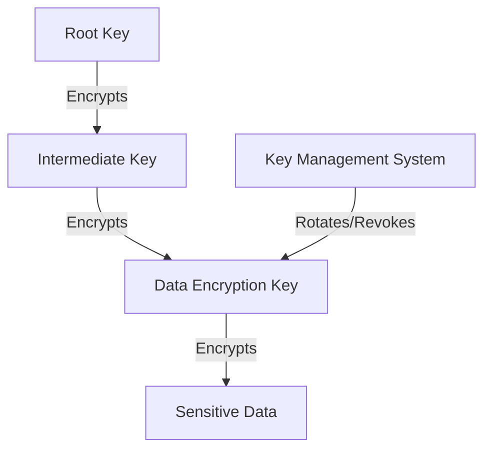
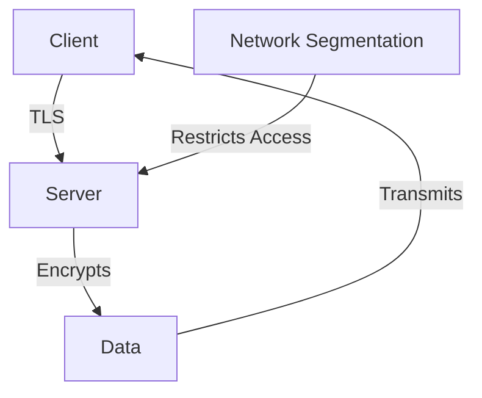

## Introduction to Advanced Cryptographic Mistakes
Beyond the common pitfalls in cryptographic data encryption, there exist more nuanced and complex issues that can compromise the security of sensitive information. This article aims to explore these advanced edge-cases, providing insights into the deeper architectural considerations necessary for robust data protection.

## Advanced Key Management Strategies
Effective key management is crucial for the security of encrypted data. However, as encryption scales, so does the complexity of key management. Advanced strategies include:

* **Hierarchical Key Management:** Implementing a hierarchical structure for keys, where higher-level keys encrypt lower-level keys, can simplify key management and reduce the risk of key compromise.
* **Key Rotation and Revocation:** Regularly rotating and revoking keys can minimize the impact of a key compromise. Automated systems can facilitate this process, ensuring that keys are updated and revoked as necessary.

```mermaid
flowchart TD
    A[Root Key] -->|Encrypts| B[Intermediate Key]
    B -->|Encrypts| C[Data Encryption Key]
    C -->|Encrypts| D[Sensitive Data]
    E[Key Management System] -->|Rotates/Revokes| C
```

## Secure Data Storage Architectures
The architecture of data storage systems can significantly impact the security of encrypted data. Considerations include:

* **Data Segmentation:** Segmenting data into smaller, isolated chunks can reduce the impact of a breach. Each chunk can be encrypted with a unique key, further enhancing security.
* **Redundancy and Backup:** Implementing redundant storage and regular backups can ensure data availability and integrity, even in the event of a security incident.

## Network and Communication Security
The security of encrypted data is not only dependent on the encryption itself but also on the security of the networks and communication protocols used to transmit the data. Considerations include:

* **Secure Communication Protocols:** Using secure communication protocols, such as TLS, can protect data in transit from interception and eavesdropping.
* **Network Segmentation:** Segmenting networks can isolate sensitive data and restrict access to authorized personnel and systems.

```mermaid
flowchart TD
    A[Client] -->|TLS| B[Server]
    B -->|Encrypts| C[Data]
    C -->|Transmits| A
    D[Network Segmentation] -->|Restricts Access| B
```

## Advanced Threat Modeling and Risk Assessment
Threat modeling and risk assessment are critical components of a comprehensive data security strategy. Advanced techniques include:

* **Attack Tree Analysis:** Visualizing potential attack vectors and evaluating their likelihood and impact can help identify vulnerabilities and prioritize mitigation efforts.
* **Risk Matrix Analysis:** Assessing the likelihood and impact of potential risks can inform decision-making and resource allocation.

## Visual Insights Gallery
The following images provide further insights into the advanced cryptographic data encryption mistakes and architectural considerations discussed in this article:
* 
* 
* 

## Conclusion and Future Directions
In conclusion, the security of encrypted data relies on a multifaceted approach that addresses not only the encryption itself but also the underlying architecture, key management, and network security. As the threat landscape continues to evolve, it is essential to stay informed about the latest advancements and best practices in cryptographic data encryption. Future research directions include the development of more efficient and secure encryption algorithms, as well as the integration of artificial intelligence and machine learning techniques to enhance threat detection and response.