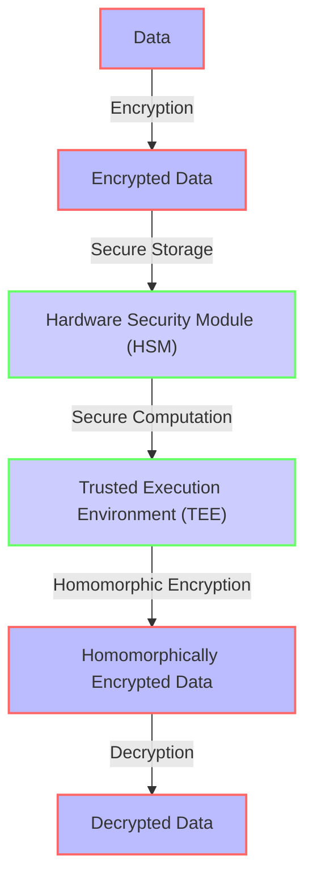

## Introduction to Expert-Level Cryptographic Concepts
Expanding on the advanced knowledge of cryptographic data encryption, this article ascends to the expert level, dissecting intricate edge cases and pioneering novel architectural strategies. It's essential for seasoned cybersecurity professionals and developers to grasp these sophisticated concepts to guarantee the uncompromising security of sensitive data.

## Advanced Edge Cases in Encryption
Beyond standard edge cases, expert-level scenarios demand a profound understanding of encryption's limitations and potential vulnerabilities. These include:

- **Post-Quantum Cryptography**: The imminent threat of quantum computing necessitates the development and implementation of quantum-resistant cryptographic algorithms, ensuring data remains secure in a post-quantum world.
- **Zero-Knowledge Proofs**: A method of verification that enables one party to prove that a statement is true without revealing any information beyond the validity of the statement itself, bolstering privacy and security.
- **Secure Multi-Party Computation**: A protocol allowing multiple parties to jointly perform computations on private data without revealing their individual inputs, facilitating secure collaboration and data analysis.

## Deep Dive into Innovative Encryption Architectures
Pioneering encryption architectures not only fortify data protection but also enable novel applications and use cases. These include:

- **Hardware Security Modules (HSMs)**: Dedicated hardware devices designed to securely store, process, and manage sensitive cryptographic keys and operations, providing an additional layer of security against software-based attacks.
- **Trusted Execution Environments (TEEs)**: Secure areas of a processor that ensure code and data loaded into them are protected with respect to confidentiality and integrity, even from an untrusted operating system.
- **Homomorphic Encryption Schemes**: Advanced forms of homomorphic encryption that enable more complex computations on encrypted data, such as fully homomorphic encryption (FHE) and somewhat homomorphic encryption (SHE).

### Mermaid.js Diagram: Advanced Encryption Architecture

## Real-World Implementations and Case Studies
- **Financial Sector**: Utilization of HSMs and TEEs to secure financial transactions and protect sensitive customer data.
- **Healthcare**: Implementation of secure multi-party computation to enable the sharing and analysis of medical records without compromising patient privacy.
- **Government**: Adoption of post-quantum cryptography to secure classified information and communications against future quantum computing threats.

## Future Directions and Challenges
As the landscape of cryptographic data encryption continues to evolve, professionals must stay abreast of emerging trends, technologies, and threats. This includes the integration of artificial intelligence and machine learning in encryption, the development of more efficient and scalable homomorphic encryption schemes, and the standardization of post-quantum cryptographic algorithms.

## Visual Insights Gallery
The following images provide a visual representation of key concepts discussed in this article:
- 
- 
- 

## Conclusion
Mastering advanced edge cases and innovative architectural designs in cryptographic data encryption is paramount for ensuring the highest level of data security. By understanding and implementing these expert-level concepts, professionals can stay ahead of emerging threats and contribute to the development of a more secure digital landscape.