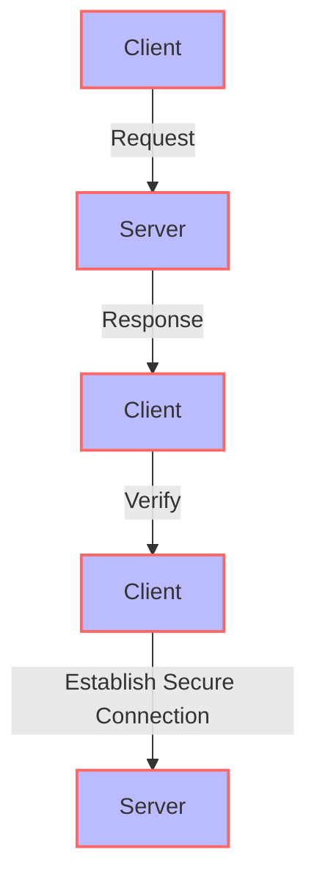

In the realm of cybersecurity, cryptographic threat modeling is a critical process that helps identify, assess, and mitigate potential security risks in systems that rely on cryptography. Despite its importance, many organizations and developers make common mistakes that can compromise the security of their systems. In this article, we will delve into the most common mistakes in cryptographic threat modeling and provide actionable advice on how to avoid them.

## Introduction to Cryptographic Threat Modeling

Cryptographic threat modeling is a systematic approach to identifying and mitigating potential security threats in systems that use cryptography. It involves analyzing the system's architecture, identifying potential vulnerabilities, and developing strategies to mitigate or eliminate them. A well-designed cryptographic threat model can help organizations protect their sensitive data and prevent costly security breaches.

## Common Mistakes in Cryptographic Threat Modeling
### Insufficient Risk Assessment
One of the most common mistakes in cryptographic threat modeling is insufficient risk assessment. Many organizations fail to conduct thorough risk assessments, which can lead to overlooked vulnerabilities and inadequate mitigation strategies.
```markdown
| Risk Factor | Description | Mitigation Strategy |
| --- | --- | --- |
| Data Breach | Unauthorized access to sensitive data | Implement robust access controls and encryption |
| Key Management | Poor key management practices | Implement secure key generation, storage, and rotation |
| Side-Channel Attacks | Attacks that exploit information about the implementation | Implement secure coding practices and use secure protocols |
```
### Inadequate Key Management
Inadequate key management is another common mistake in cryptographic threat modeling. Poor key management practices can lead to weak keys, key leakage, and unauthorized access to sensitive data.

### Insecure Protocol Implementation
Insecure protocol implementation is a common mistake that can compromise the security of cryptographic systems. Many organizations fail to implement secure protocols, such as TLS or IPsec, which can lead to vulnerabilities and security breaches.

## Best Practices for Cryptographic Threat Modeling
### Conduct Thorough Risk Assessments
Conducting thorough risk assessments is critical to identifying potential vulnerabilities and developing effective mitigation strategies.
> **Tip:** Use a risk assessment framework, such as NIST 800-30, to guide your risk assessment process.

### Implement Secure Key Management Practices
Implementing secure key management practices is essential to protecting sensitive data and preventing unauthorized access.
> **Note:** Use a secure key management system, such as a hardware security module (HSM), to generate, store, and rotate keys.

### Use Secure Protocols and Implementations
Using secure protocols and implementations is critical to preventing security breaches and protecting sensitive data.
> **Warning:** Avoid using insecure protocols, such as SSL or RC4, and use secure implementations, such as TLS or IPsec.

## Visual Insights Gallery
## Visual Insights Gallery


## Summary and Conclusion
In conclusion, cryptographic threat modeling is a critical process that helps identify, assess, and mitigate potential security risks in systems that rely on cryptography. By avoiding common mistakes, such as insufficient risk assessment, inadequate key management, and insecure protocol implementation, organizations can protect their sensitive data and prevent costly security breaches. By following best practices, such as conducting thorough risk assessments, implementing secure key management practices, and using secure protocols and implementations, organizations can ensure the security and integrity of their cryptographic systems.

## FAQ
Q: What is cryptographic threat modeling?
A: Cryptographic threat modeling is a systematic approach to identifying and mitigating potential security threats in systems that use cryptography.
Q: What are the common mistakes in cryptographic threat modeling?
A: The common mistakes in cryptographic threat modeling include insufficient risk assessment, inadequate key management, and insecure protocol implementation.
Q: How can organizations avoid common mistakes in cryptographic threat modeling?
A: Organizations can avoid common mistakes by conducting thorough risk assessments, implementing secure key management practices, and using secure protocols and implementations.