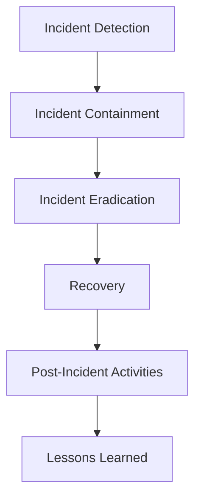
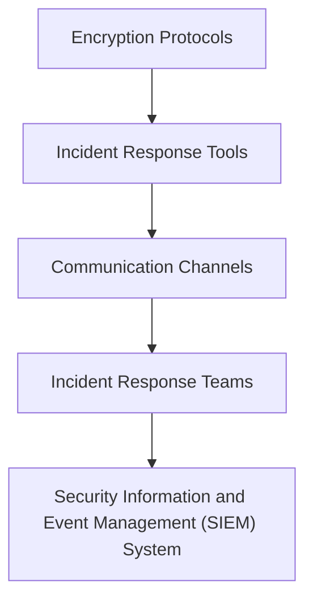

In the realm of cybersecurity, encrypted incident response is a critical component that ensures the confidentiality, integrity, and availability of sensitive data. However, even with the best intentions, organizations can make mistakes that compromise their encrypted incident response strategy. In this article, we will delve into the common mistakes made in encrypted incident response and provide actionable advice on how to avoid them.

## Introduction to Encrypted Incident Response
Encrypted incident response refers to the process of responding to security incidents while ensuring the confidentiality and integrity of sensitive data. This involves using encryption techniques to protect data both in transit and at rest. Effective encrypted incident response requires a deep understanding of encryption protocols, incident response procedures, and the organization's overall security posture.


## Common Mistakes in Encrypted Incident Response
Several common mistakes can compromise an organization's encrypted incident response strategy. These include:
* Inadequate encryption key management
* Insufficient training for incident response teams
* Lack of visibility into encrypted traffic
* Ineffective communication between teams
* Failure to regularly update encryption protocols

### Inadequate Encryption Key Management
Encryption key management is a critical component of encrypted incident response. Poor key management practices can lead to unauthorized access to sensitive data, compromising the entire incident response strategy.
```markdown
| Best Practice | Description |
| --- | --- |
| Use a secure key management system | Implement a secure key management system to generate, distribute, and manage encryption keys |
| Limit access to encryption keys | Restrict access to encryption keys to authorized personnel only |
| Regularly rotate encryption keys | Regularly rotate encryption keys to minimize the impact of a potential key compromise |
```


### Insufficient Training for Incident Response Teams
Incident response teams require specialized training to handle encrypted incidents effectively. Without proper training, teams may not be able to respond quickly and effectively, potentially leading to further damage.
```markdown
> **Tip:** Provide regular training and simulations to incident response teams to ensure they are equipped to handle encrypted incidents.
```
## Incident Response Flow
The incident response flow involves several stages, including detection, containment, eradication, recovery, and post-incident activities. Understanding this flow is critical to developing an effective encrypted incident response strategy.

## Architecture for Encrypted Incident Response
The architecture for encrypted incident response involves several components, including encryption protocols, incident response tools, and communication channels.



## Best Practices for Encrypted Incident Response
To develop an effective encrypted incident response strategy, organizations should follow several best practices, including:
* Implementing a secure key management system
* Providing regular training to incident response teams
* Conducting regular simulations and exercises
* Establishing clear communication channels
* Continuously monitoring and updating encryption protocols

> **Note:** Regularly review and update your encrypted incident response strategy to ensure it remains effective and aligned with your organization's overall security posture.

## Visual Insights Gallery
The following images provide additional insights into encrypted incident response:


## Summary and Conclusion
In conclusion, encrypted incident response is a critical component of an organization's overall security posture. By understanding common mistakes and following best practices, organizations can develop an effective encrypted incident response strategy that ensures the confidentiality, integrity, and availability of sensitive data.

## FAQ
* Q: What is encrypted incident response?
A: Encrypted incident response refers to the process of responding to security incidents while ensuring the confidentiality and integrity of sensitive data.
* Q: What are some common mistakes in encrypted incident response?
A: Common mistakes include inadequate encryption key management, insufficient training for incident response teams, lack of visibility into encrypted traffic, ineffective communication between teams, and failure to regularly update encryption protocols.
* Q: How can organizations develop an effective encrypted incident response strategy?
A: Organizations can develop an effective encrypted incident response strategy by implementing a secure key management system, providing regular training to incident response teams, conducting regular simulations and exercises, establishing clear communication channels, and continuously monitoring and updating encryption protocols.