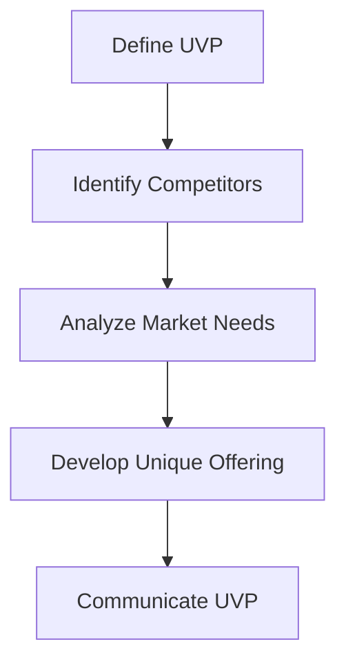
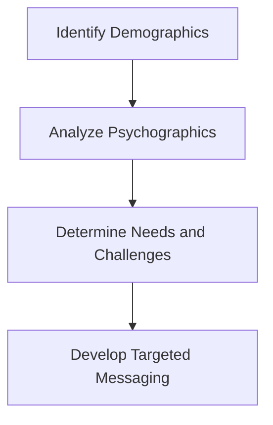

In the competitive landscape of modern business, establishing a strong market position is crucial for the success and longevity of any enterprise. However, numerous organizations, especially startups and SaaS companies, often find themselves struggling to carve out a unique and compelling niche in their respective markets. This struggle frequently stems from common mistakes made during the market positioning process. Understanding these mistakes and knowing how to avoid them is essential for any business aiming to establish a solid foothold in its industry.

## Table of Contents
1. [Introduction to Market Positioning](#introduction-to-market-positioning)
2. [Mistake 1: Lack of Unique Value Proposition (UVP)](#mistake-1-lack-of-unique-value-proposition-uvp)
3. [Mistake 2: Insufficient Market Research](#mistake-2-insufficient-market-research)
4. [Mistake 3: Failure to Define the Target Audience](#mistake-3-failure-to-define-the-target-audience)
5. [Mistake 4: Inconsistent Branding](#mistake-4-inconsistent-branding)
6. [Mistake 5: Not Adapting to Market Changes](#mistake-5-not-adapting-to-market-changes)
7. [Visual Insights Gallery](#visual-insights-gallery)
8. [Summary/Conclusion](#summaryconclusion)
9. [FAQ](#faq)

## Introduction to Market Positioning
Market positioning is the process of creating a unique space for a product or service in the minds of potential customers. It involves differentiating your offering from competitors and communicating its unique value to your target audience. Effective market positioning requires a deep understanding of your market, competitors, and most importantly, your customers.

## Mistake 1: Lack of Unique Value Proposition (UVP)
A Unique Value Proposition (UVP) is what sets your product or service apart from others in the market. It's the reason why customers should choose your offering over competitors. Without a clear UVP, your business risks being seen as just another commodity, leading to price wars and diminished profitability.

## Mistake 2: Insufficient Market Research
Insufficient market research can lead to misunderstandings about your target audience, their needs, and the competitive landscape. This mistake can result in the development of products or services that do not meet market demands, ultimately leading to poor reception and low adoption rates.

> **Tip:** Conduct thorough market research to understand your audience's preferences, behaviors, and pain points. This will help in crafting a market position that resonates with your target market.

## Mistake 3: Failure to Define the Target Audience
Defining your target audience is critical for effective market positioning. Without a clear understanding of who your ideal customer is, you risk creating a message that fails to resonate with anyone. This includes understanding demographics, psychographics, and the specific needs and challenges of your target audience.

## Mistake 4: Inconsistent Branding
Inconsistent branding can confuse your target audience and dilute your market position. It's essential to maintain a consistent tone, visual identity, and message across all platforms and touchpoints. This helps in building trust and reinforcing your unique value proposition.

## Mistake 5: Not Adapting to Market Changes
Markets are dynamic, with trends, technologies, and customer preferences changing rapidly. Failing to adapt to these changes can render your market position obsolete. Continuous monitoring of market trends and adjustments to your positioning strategy are essential for long-term success.

> **Warning:** Complacency can be detrimental. Stay agile and be willing to pivot your market positioning strategy as needed to stay relevant in a changing market.

## Visual Insights Gallery
Below are some visual insights that highlight the importance of effective market positioning:

## Summary/Conclusion
Establishing a strong market position is a critical component of any successful business strategy. By understanding and avoiding common mistakes such as lacking a unique value proposition, insufficient market research, failure to define the target audience, inconsistent branding, and not adapting to market changes, businesses can better navigate their competitive landscapes. Effective market positioning requires continuous effort, adaptability, and a deep understanding of the market and its dynamics.

## FAQ
1. **Q: What is market positioning?**
   - A: Market positioning is the process of creating a unique space for a product or service in the minds of potential customers.
2. **Q: Why is having a Unique Value Proposition (UVP) important?**
   - A: A UVP differentiates your offering from competitors and communicates its unique value to your target audience.
3. **Q: How often should market research be conducted?**
   - A: Market research should be conducted regularly to stay abreast of market changes and customer needs.