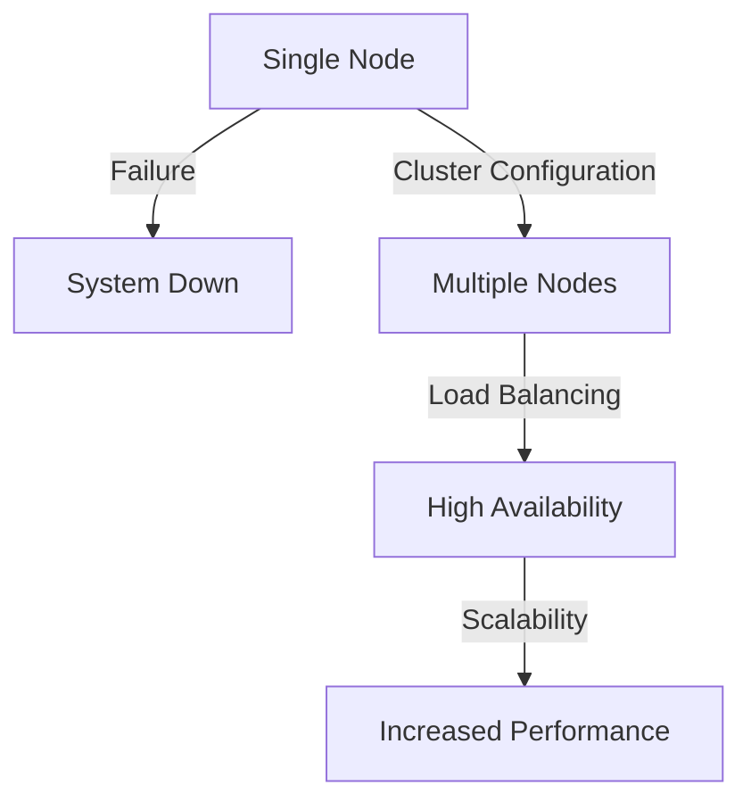
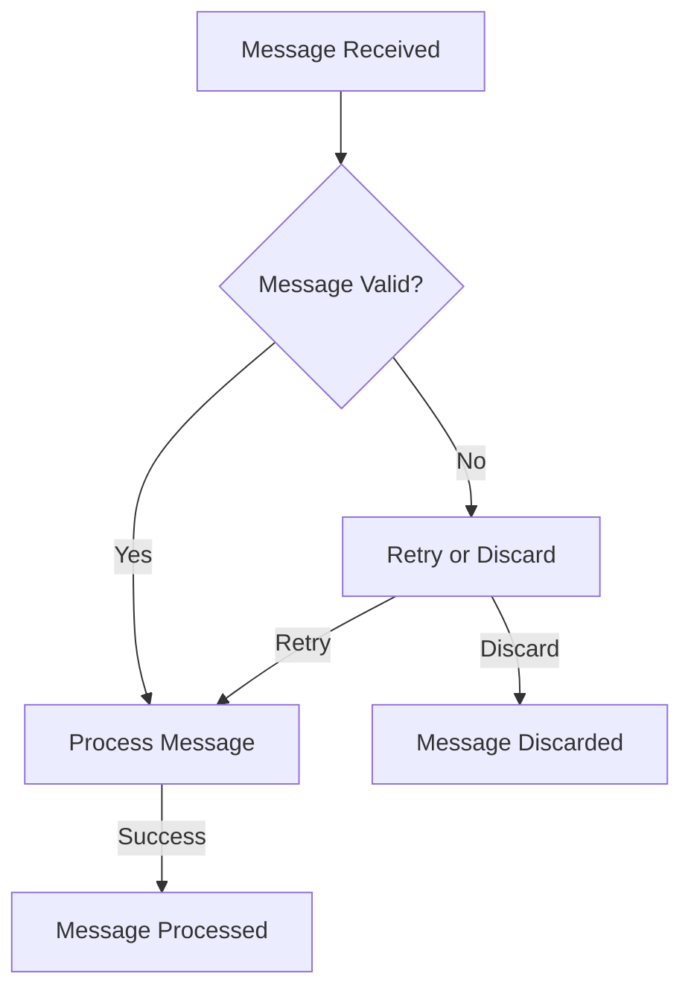

In the realm of software architecture, particularly when dealing with microservices and distributed systems, ensuring the reliability and fault tolerance of message brokers is crucial. Message brokers play a pivotal role in facilitating communication between different services, making their resilience against failures and errors paramount. However, despite their importance, several common mistakes are often made when designing and implementing fault-tolerant message brokers. This article aims to highlight these mistakes and provide actionable advice on how to avoid them, ensuring the development of robust and reliable messaging systems.

## Table of Contents
1. [Introduction to Fault-tolerant Message Brokers](#introduction-to-fault-tolerant-message-brokers)
2. [Mistake 1: Inadequate Cluster Configuration](#mistake-1-inadequate-cluster-configuration)
3. [Mistake 2: Insufficient Monitoring and Logging](#mistake-2-insufficient-monitoring-and-logging)
4. [Mistake 3: Poor Message Handling and Retry Policies](#mistake-3-poor-message-handling-and-retry-policies)
5. [Mistake 4: Lack of Security Measures](#mistake-4-lack-of-security-measures)
6. [Avoiding Common Mistakes: Best Practices](#avoiding-common-mistakes-best-practices)
7. [Visual Insights Gallery](#visual-insights-gallery)
8. [Summary/Conclusion](#summary/conclusion)
9. [FAQ](#faq)

## Introduction to Fault-tolerant Message Brokers

Fault-tolerant message brokers are designed to continue operating even when one or more components fail. This is achieved through various strategies such as clustering, replication, and load balancing. Understanding the principles of fault tolerance is key to designing and implementing effective message brokers.

## Mistake 1: Inadequate Cluster Configuration

One of the most common mistakes is configuring clusters inadequately. This can lead to single points of failure and reduced performance. To avoid this, ensure that your cluster is properly sized and configured for high availability and scalability.

## Mistake 2: Insufficient Monitoring and Logging

Insufficient monitoring and logging can make it difficult to detect and diagnose issues, leading to prolonged downtime and decreased fault tolerance. Implement comprehensive monitoring and logging mechanisms to ensure visibility into your system's operations.

## Mistake 3: Poor Message Handling and Retry Policies

Poor message handling and retry policies can result in message loss or duplication, affecting the reliability of your system. Design robust message handling mechanisms with appropriate retry policies to handle failures gracefully.

## Mistake 4: Lack of Security Measures

Neglecting security measures can expose your message broker to various threats, compromising the integrity and confidentiality of messages. Implement robust security measures, including encryption, authentication, and access control.

> **Note:** Security should be a top priority when designing a fault-tolerant message broker.

## Avoiding Common Mistakes: Best Practices
To avoid the common mistakes outlined above, follow best practices such as:
- Properly configuring clusters for high availability and scalability.
- Implementing comprehensive monitoring and logging.
- Designing robust message handling mechanisms with appropriate retry policies.
- Ensuring robust security measures are in place.

## Visual Insights Gallery
## Visual Insights Gallery

## Summary/Conclusion
Designing a fault-tolerant message broker requires careful consideration of several factors, including cluster configuration, monitoring and logging, message handling, and security. By understanding common mistakes and following best practices, developers can create robust and reliable messaging systems that support the resilience and scalability of microservices and distributed systems.

## FAQ
1. **What is the importance of clustering in fault-tolerant message brokers?**
   - Clustering is crucial for achieving high availability and scalability in message brokers, ensuring that the system remains operational even in the event of node failures.
2. **How does monitoring and logging contribute to fault tolerance?**
   - Comprehensive monitoring and logging enable the quick detection and diagnosis of issues, facilitating prompt action to mitigate failures and minimize downtime.
3. **What are the consequences of poor message handling and retry policies?**
   - Poor message handling and retry policies can lead to message loss, duplication, or prolonged processing times, affecting the reliability and performance of the system.