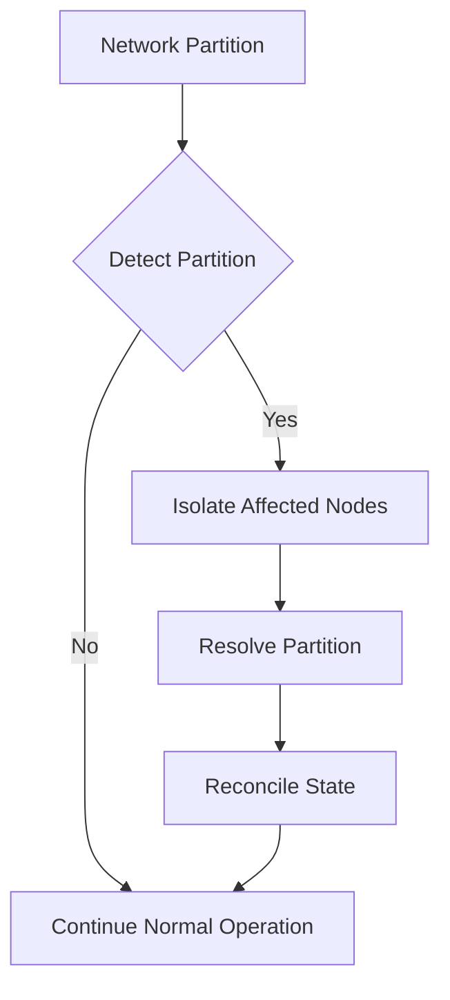

## Part 2: Advanced Edge Cases and Deep Dive into Fault-Tolerant Message Broker Architecture

In the first part of this series, we discussed common mistakes made when designing and implementing fault-tolerant message brokers and provided guidance on how to avoid them. This article will delve deeper into advanced edge cases and explore the deeper architecture of fault-tolerant message brokers, providing insights into how to further enhance the reliability and resilience of messaging systems.

## Deep Dive into Message Broker Architecture
A fault-tolerant message broker architecture typically consists of multiple components, including:
- **Message Producers**: These are the applications or services that send messages to the message broker.
- **Message Broker**: This is the core component responsible for receiving, processing, and forwarding messages to the appropriate destinations.
- **Message Consumers**: These are the applications or services that receive messages from the message broker.

To ensure fault tolerance, message brokers often employ various strategies, such as:
- **Clustering**: Multiple instances of the message broker are grouped together to form a cluster, which can continue to operate even if one or more instances fail.
- **Replication**: Messages are replicated across multiple instances or nodes to ensure that messages are not lost in the event of a failure.
- **Load Balancing**: Incoming messages are distributed across multiple instances or nodes to prevent any single instance from becoming overwhelmed.

## Advanced Edge Cases
### Handling Network Partitions
Network partitions occur when a network failure causes a group of nodes to become isolated from the rest of the system. This can lead to inconsistencies and conflicts when the partition is resolved. To handle network partitions, message brokers can implement strategies such as:

### Implementing Idempotent Message Processing
Idempotent message processing ensures that messages can be safely processed multiple times without causing unintended side effects. This can be achieved through techniques such as:
- **Message deduplication**: Eliminating duplicate messages to prevent multiple processing attempts.
- **Transactional processing**: Ensuring that message processing is transactional, allowing for rollback in case of failures.

## Case Study: Implementing a Fault-Tolerant Message Broker using Apache Kafka
Apache Kafka is a popular messaging system that provides fault-tolerant and scalable messaging capabilities. To implement a fault-tolerant message broker using Apache Kafka, the following components can be used:
- **Kafka Cluster**: A group of Kafka brokers that work together to provide fault-tolerant messaging.
- **Kafka Topics**: Logical channels for messages, which can be replicated across multiple brokers for fault tolerance.
- **Kafka Consumers**: Applications or services that subscribe to Kafka topics to receive messages.

## Best Practices for Implementing Fault-Tolerant Message Brokers
- **Monitor and analyze system performance**: Regularly monitor system performance to identify potential bottlenecks and areas for improvement.
- **Implement automated testing and validation**: Use automated testing and validation to ensure that the system functions correctly under various scenarios.
- **Use industry-standard protocols and APIs**: Leverage industry-standard protocols and APIs to ensure interoperability and compatibility with other systems.

## Visual Insights Gallery
### Architecture Overview

### Clustering and Replication

### Load Balancing and Scalability
