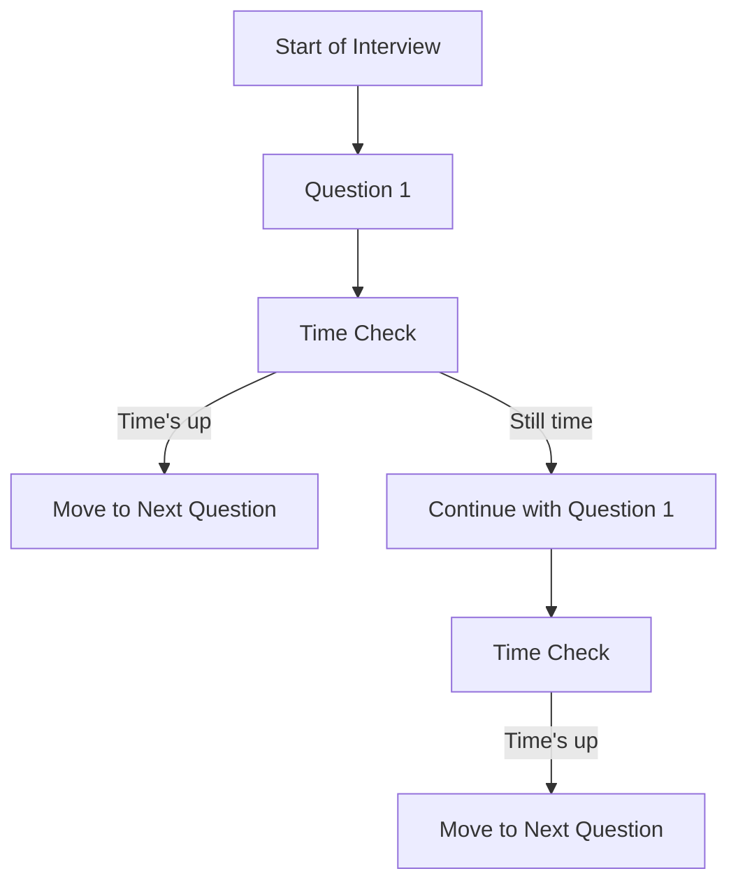
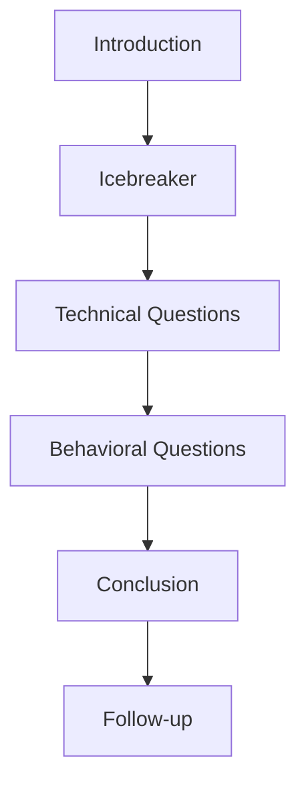

The high-income interview pattern is a crucial step in landing a lucrative job. However, many candidates make mistakes that cost them the opportunity. In this article, we will explore the common mistakes made during high-income interviews and provide actionable tips on how to avoid them.

## Table of Contents
1. [Introduction to High-income Interviews](#introduction-to-high-income-interviews)
2. [Mistake 1: Lack of Preparation](#mistake-1-lack-of-preparation)
3. [Mistake 2: Inability to Showcase Skills](#mistake-2-inability-to-showcase-skills)
4. [Mistake 3: Poor Time Management](#mistake-3-poor-time-management)
5. [Mistake 4: Inadequate Research](#mistake-4-inadequate-research)
6. [Mistake 5: Unprofessional Attitude](#mistake-5-unprofessional-attitude)
7. [Conclusion and Next Steps](#conclusion-and-next-steps)

## Introduction to High-income Interviews
High-income interviews are designed to assess a candidate's technical skills, problem-solving abilities, and cultural fit. These interviews typically involve a series of challenges, such as coding exercises, system design questions, and behavioral assessments.


## Mistake 1: Lack of Preparation
One of the most common mistakes made during high-income interviews is a lack of preparation. Candidates often underestimate the level of difficulty and fail to prepare adequately.
> **Tip:** Start preparing at least 2-3 months in advance. Focus on improving your technical skills, practicing common interview questions, and developing a personal project to showcase your abilities.

## Mistake 2: Inability to Showcase Skills
Many candidates struggle to showcase their skills during high-income interviews. This can be due to a lack of experience, poor communication skills, or an inability to think critically.
```markdown
# Example of a well-structured answer
1. **Introduction**: Briefly introduce the topic and provide context.
2. **Technical Details**: Provide technical details and explain the solution.
3. **Conclusion**: Summarize the key points and reiterate the benefits.
```


## Mistake 3: Poor Time Management
Poor time management is another common mistake made during high-income interviews. Candidates often spend too much time on a single question, leaving insufficient time for other questions.


## Mistake 4: Inadequate Research
Inadequate research is a critical mistake that can make or break an interview. Candidates should research the company, the role, and the industry to demonstrate their interest and knowledge.
> **Interview:** What do you know about our company, and why do you want to work here?

## Mistake 5: Unprofessional Attitude
An unprofessional attitude can be a significant turn-off for interviewers. Candidates should maintain a positive, enthusiastic, and respectful attitude throughout the interview.



## Conclusion and Next Steps
In conclusion, high-income interviews require careful preparation, technical skills, and a professional attitude. By avoiding common mistakes and following the tips outlined in this article, candidates can increase their chances of success.
> **Note:** Remember to stay calm, confident, and enthusiastic during the interview. Practice your responses, and be prepared to ask insightful questions.

## Visual Insights Gallery


## FAQ
Q: What is the most common mistake made during high-income interviews?
A: The most common mistake is a lack of preparation.
Q: How can I improve my technical skills for high-income interviews?
A: Focus on practicing common interview questions, developing a personal project, and improving your problem-solving abilities.
Q: What is the best way to showcase my skills during an interview?
A: Use the STAR method to structure your answers, and provide specific examples of your accomplishments.