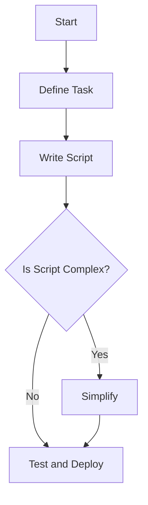
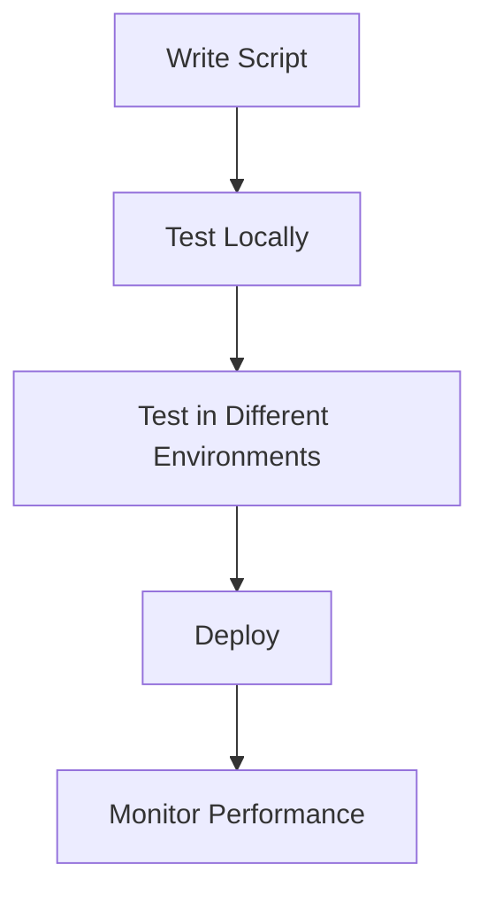

In the pursuit of enhancing productivity and streamlining tasks, many individuals turn to shell automation as a powerful tool. However, despite its potential, beginners often fall into common pitfalls that can hinder the effectiveness of their automation efforts. This article aims to explore these mistakes, provide insights into why they occur, and most importantly, offer practical advice on how to avoid them.

## Introduction to Minimalist Shell Automation
Minimalist shell automation is about simplifying and automating tasks using the least amount of resources and complexity necessary. It involves writing scripts that can perform repetitive tasks, manage files, and interact with the operating system to make workflow more efficient. 


## Understanding the Importance of Automation
Before diving into the common mistakes, it's crucial to understand why automation is important. Automation can significantly reduce the time spent on mundane tasks, allowing for more focus on creative and high-value work. It also helps in reducing errors that can occur due to human fatigue or oversight.
```markdown
| Benefits | Description |
| --- | --- |
| Time Efficiency | Reduces time spent on repetitive tasks |
| Error Reduction | Minimizes errors due to human oversight |
| Increased Productivity | Allows for more focus on high-value tasks |
```
## Identifying Common Mistakes in Shell Automation
Several mistakes can derail the effectiveness of shell automation. These include overcomplicating scripts, not testing scripts thoroughly, and ignoring security best practices.

### Overcomplication
One of the most significant mistakes is overcomplicating scripts. This happens when scripts are made too complex, attempting to solve too many problems at once. 


### Lack of Testing
Another critical mistake is not thoroughly testing scripts before deploying them. This can lead to unexpected behavior or errors once the script is in use.

### Ignoring Security
Ignoring security best practices is a significant oversight. Scripts should be written with security in mind to prevent vulnerabilities.
> **Tip:** Always use secure protocols for remote access and limit the privileges of the user running the script.

## Best Practices for Minimalist Shell Automation
To avoid common mistakes, several best practices can be followed:

### Keep It Simple
- **Simplify Scripts:** Ensure scripts are straightforward and solve one problem at a time.
- **Modularize:** Break down complex tasks into smaller, manageable scripts.

### Test Thoroughly
- **Local Testing:** Test scripts in a controlled environment before deploying.
- **Environment Testing:** Test scripts in different environments to ensure compatibility.

### Prioritize Security
- **Secure Protocols:** Use secure communication protocols.
- **Least Privilege:** Run scripts with the least privileges necessary.

## Implementing Effective Automation
Effective automation involves not just writing scripts but also understanding the workflow and identifying areas where automation can significantly impact productivity.


## Conclusion
Minimalist shell automation is a powerful tool for enhancing productivity and focus. By understanding common mistakes and following best practices, individuals can create effective and secure automation scripts. Remember, the key to successful automation is simplicity, thorough testing, and a keen eye on security.

## Visual Insights Gallery


## Frequently Asked Questions
- **Q: What is minimalist shell automation?**
  - A: Minimalist shell automation involves simplifying and automating tasks using the least amount of resources and complexity necessary.
- **Q: Why is testing important in shell automation?**
  - A: Testing is crucial to ensure scripts work as expected and to prevent errors or unexpected behavior.
- **Q: How can I ensure my automation scripts are secure?**
  - A: By following security best practices such as using secure protocols and running scripts with the least privileges necessary.