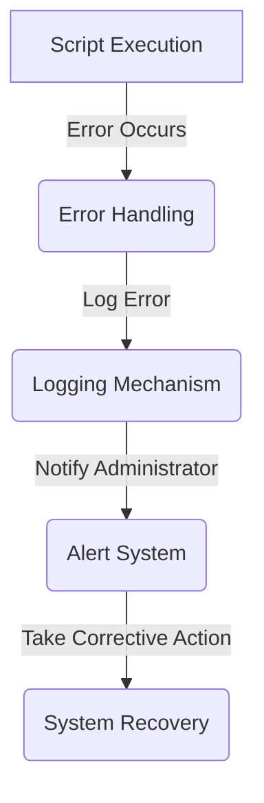

## Part 2: Advanced Edge Cases and Deeper Architecture in Minimalist Shell Automation
In the first part of this series, we explored the fundamentals of minimalist shell automation, its importance, and common mistakes to avoid. This article delves deeper into advanced edge cases and architectural considerations that can further enhance the efficiency and reliability of your automation scripts.

### Architecting Robust Automation Scripts
When designing automation scripts, it's essential to consider scalability, maintainability, and error handling. A well-structured script should be modular, allowing for easy modification and extension of its functionality.


### Handling Advanced Edge Cases
Advanced edge cases in shell automation often involve complex conditional logic, asynchronous task handling, and integration with external systems. To manage these scenarios effectively, it's crucial to leverage the full potential of shell scripting, including features like job control, signal handling, and process substitution.
```markdown
| Advanced Edge Case | Description |
| --- | --- |
| Asynchronous Task Handling | Managing tasks that run in the background |
| Conditional Logic | Implementing complex decision-making processes |
| External System Integration | Interacting with external services and applications |
```

### Deep Dive into Error Handling and Logging
Error handling and logging are critical components of any automation script. They provide valuable insights into script execution, help in debugging issues, and ensure that errors are properly managed to prevent data loss or system instability.


### Case Study: Automating Backup and Restore Processes
A real-world example of advanced shell automation is the creation of a backup and restore system. This involves scripting tasks to periodically backup critical data, store it securely, and provide a mechanism for restoring the data in case of loss or corruption.


### Leveraging External Tools and Services
To extend the capabilities of your shell automation scripts, you can integrate external tools and services. This might include version control systems like Git, cloud storage services like AWS S3, or monitoring tools like Nagios.
```markdown
| External Tool/Service | Description |
| --- | --- |
| Git | Version control for script management |
| AWS S3 | Cloud storage for backups and data archiving |
| Nagios | Monitoring and alerting for system health |
```

## Visual Insights Gallery
- [Image: Advanced Script Architecture](https://picsum.photos/seed/advanced-script/800/400)
- [Image: Error Handling and Logging](https://picsum.photos/seed/error-handling/800/400)
- [Image: Integration with External Services](https://picsum.photos/seed/external-services/800/400)