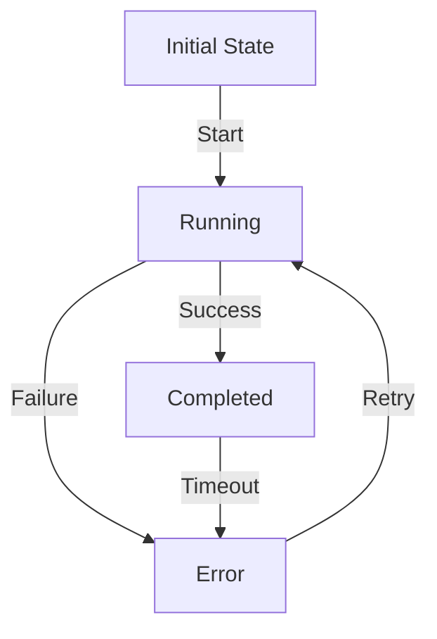

## Part 3: Expert-Level Shell Automation - Mastering Complex Workflows and Advanced Error Handling
In the previous parts of this series, we covered the fundamentals of minimalist shell automation, common mistakes to avoid, and delved into advanced edge cases and architectural considerations. This article takes a step further, exploring expert-level techniques for mastering complex workflows and advanced error handling in shell automation.

### Designing Complex Workflows with Finite State Machines
Finite State Machines (FSMs) can be used to model and manage complex workflows in shell automation. An FSM consists of a set of states, transitions, and actions, allowing for efficient and scalable workflow management.

This flowchart illustrates a basic FSM for managing a workflow with initial, running, completed, and error states.

### Advanced Error Handling with Try-Except Blocks and Logging
Error handling is critical in shell automation, and using try-except blocks can significantly improve the robustness of your scripts. Combining try-except blocks with logging mechanisms enables efficient error tracking and debugging.
```bash
try
  # Critical code section
  critical_code
except Exception as e
  # Log the error and perform recovery actions
  log_error "$e"
  recovery_actions
```
In this example, the `try` block contains the critical code section, while the `except` block handles any exceptions that occur and logs the error using the `log_error` function.

### Implementing Idempotent Scripts for Reliable Automation
Idempotent scripts are designed to produce the same output regardless of the number of times they are executed. This property is essential in automation, as it ensures that scripts can be safely re-run without causing unintended side effects.
```markdown
| Idempotent Script Characteristics | Description |
| --- | --- |
| No side effects | The script does not modify external state |
| Deterministic output | The script produces the same output given the same input |
| Re-runnable | The script can be safely re-run without causing issues |
```
By following these guidelines, you can create reliable and efficient idempotent scripts for your automation tasks.

### Case Study: Automating Deployment with Shell Scripts
A real-world example of expert-level shell automation is automating deployment processes for software applications. By leveraging advanced techniques like FSMs, try-except blocks, and idempotent scripts, you can create robust and reliable deployment scripts that minimize errors and downtime.


## Visual Insights Gallery
The following images provide additional insight into expert-level shell automation concepts:
* [Modular Script Architecture](https://picsum.photos/seed/modular-script-architecture/800/400)
* [Finite State Machine Example](https://picsum.photos/seed/finite-state-machine-example/800/400)
* [Error Handling and Logging](https://picsum.photos/seed/error-handling-and-logging/800/400)