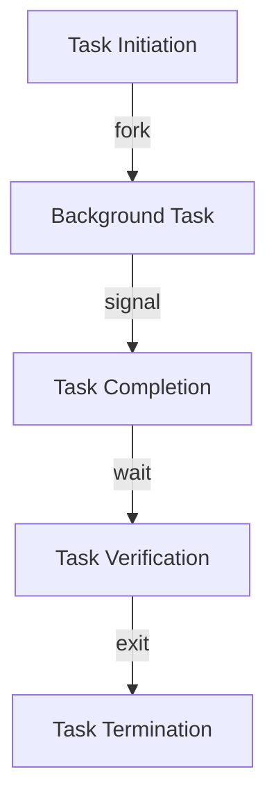

## Part 3: Mastering Advanced Edge Cases and Architectural Complexity in Minimalist Shell Automation
In the previous parts of this series, we examined the fundamentals of minimalist shell automation, common mistakes to avoid, and advanced edge cases. This article dives deeper into the complexities of architecting robust, scalable, and maintainable automation scripts, with a focus on real-world case studies and emerging trends.

### Advanced Modularization Techniques
To further enhance the modularity of automation scripts, it's essential to leverage advanced techniques such as functions, namespaces, and dependency management. By doing so, scripts become more flexible, reusable, and easier to maintain.


### Real-World Case Study: Automating Deployment Workflows
A common use case for minimalist shell automation is automating deployment workflows for web applications. This involves orchestrating tasks such as building, testing, and deploying code, as well as managing dependencies and configuring environments.
```markdown
| Task | Description |
| --- | --- |
| Build | Compiling and packaging code |
| Test | Running automated tests and validation |
| Deploy | Deploying code to production environments |
```
### Mastering Asynchronous Task Handling
Asynchronous task handling is critical in automation scripts, particularly when dealing with long-running tasks or external system integrations. To manage these scenarios effectively, it's essential to understand the nuances of job control, signal handling, and process substitution.

### Deep Dive into Security and Access Control
Security and access control are paramount in automation scripts, particularly when dealing with sensitive data or privileged operations. To ensure the integrity and confidentiality of automation workflows, it's crucial to implement robust security measures, such as encryption, authentication, and authorization.


### Emerging Trends in Minimalist Shell Automation
The landscape of minimalist shell automation is constantly evolving, with emerging trends such as containerization, serverless computing, and artificial intelligence. To stay ahead of the curve, it's essential to explore these trends and their potential applications in automation workflows.
```markdown
| Emerging Trend | Description |
| --- | --- |
| Containerization | Isolating automation workflows using containers |
| Serverless Computing | Executing automation tasks without managing infrastructure |
| Artificial Intelligence | Integrating AI and machine learning into automation workflows |
```

## Visual Insights Gallery
Here are some additional visual insights to further illustrate the concepts discussed in this article:
* [Advanced Modularization Techniques](https://picsum.photos/seed/advanced-modularization-techniques/800/400)
* [Real-World Case Study: Automating Deployment Workflows](https://picsum.photos/seed/real-world-case-study-automating-deployment-workflows/800/400)
* [Mastering Asynchronous Task Handling](https://picsum.photos/seed/mastering-asynchronous-task-handling/800/400)