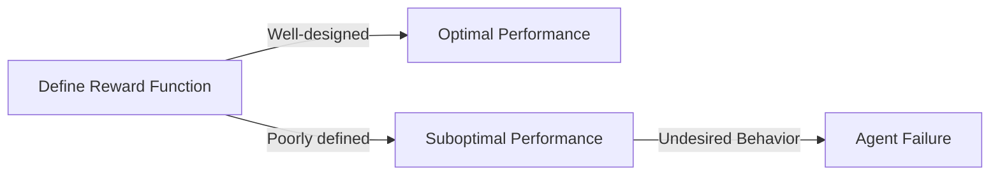
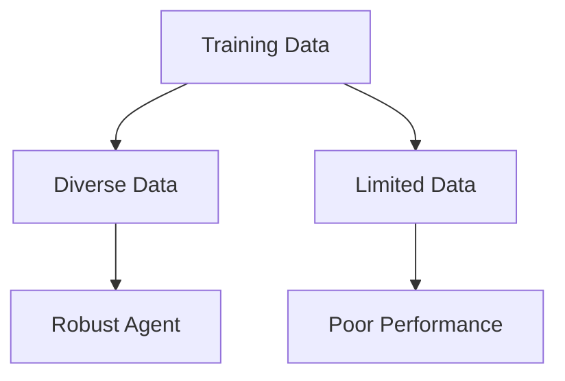

Creating an optimized AI agent is a complex task that requires careful consideration of various factors, including the agent's architecture, training data, and objectives. However, even with the best intentions, developers can fall into common pitfalls that hinder the performance and efficiency of their AI agents. In this article, we will explore some of the most common mistakes made in optimized AI agent development and provide actionable advice on how to avoid them.

## Understanding the Fundamentals of AI Agents
Before diving into the common mistakes, it's essential to understand the basics of AI agents and their optimization. An AI agent is a program that uses machine learning (ML) or other techniques to make decisions and take actions in a given environment. The goal of optimizing an AI agent is to improve its performance, efficiency, and adaptability in various scenarios.


## Overfitting and Underfitting: A Delicate Balance
One of the most common mistakes in AI agent development is overfitting or underfitting. Overfitting occurs when an agent is too closely fit to the training data, resulting in poor performance on new, unseen data. Underfitting, on the other hand, happens when an agent is too simple or lacks sufficient training data, leading to suboptimal performance.
```markdown
| **Overfitting** | **Underfitting** |
| --- | --- |
| Agent is too complex | Agent is too simple |
| Poor performance on new data | Suboptimal performance |
| High variance | High bias |
```
To avoid overfitting and underfitting, developers can use techniques such as regularization, early stopping, and cross-validation.

## Poor Exploration-Exploitation Trade-off
Another common mistake is failing to balance exploration and exploitation. Exploration refers to the agent's ability to discover new information and learn from its environment, while exploitation involves using existing knowledge to make decisions. A poor trade-off between these two aspects can lead to suboptimal performance and slow learning.
```python
# Example code snippet in Python
import numpy as np

def epsilon_greedy_policy(q_values, epsilon):
    if np.random.rand() < epsilon:
        # Explore: choose a random action
        return np.random.choice(len(q_values))
    else:
        # Exploit: choose the action with the highest Q-value
        return np.argmax(q_values)
```
> **Tip:** Use epsilon-greedy policies to balance exploration and exploitation.

## Inadequate Reward Function Design
A well-designed reward function is crucial for optimizing an AI agent. However, many developers make the mistake of using inadequate or poorly defined reward functions, which can lead to undesired behavior and suboptimal performance.

> **Warning:** A poorly designed reward function can lead to agent failure.

## Lack of Diversity in Training Data
Using diverse and representative training data is essential for developing a robust and adaptable AI agent. However, many developers fail to ensure diversity in their training data, leading to poor performance in real-world scenarios.

> **Note:** Use data augmentation techniques to increase diversity in training data.

## Visual Insights Gallery
## Visual Insights Gallery


## Summary and Conclusion
Developing an optimized AI agent requires careful consideration of various factors, including the agent's architecture, training data, and objectives. By avoiding common mistakes such as overfitting, underfitting, poor exploration-exploitation trade-off, inadequate reward function design, and lack of diversity in training data, developers can create robust and adaptable AI agents that perform well in real-world scenarios.

## FAQ
1. **Q:** What is the most common mistake in AI agent development?
**A:** Overfitting and underfitting are two of the most common mistakes in AI agent development.
2. **Q:** How can I balance exploration and exploitation in my AI agent?
**A:** Use epsilon-greedy policies to balance exploration and exploitation.
3. **Q:** What is the importance of diversity in training data?
**A:** Diversity in training data is essential for developing a robust and adaptable AI agent that performs well in real-world scenarios.