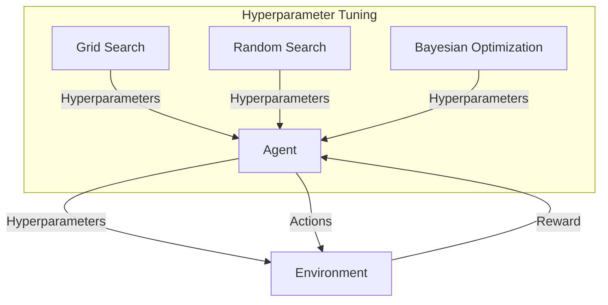
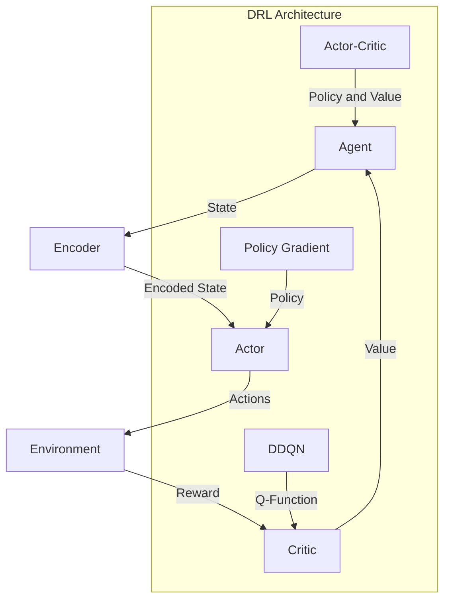
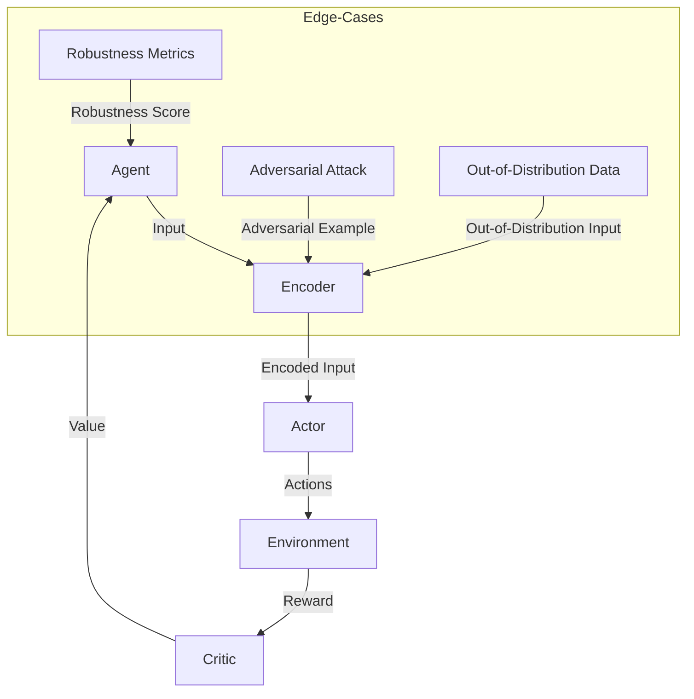

## Part 2: Advanced Optimization Techniques for AI Agents
As we explored in the previous article, creating an optimized AI agent is a complex task that requires careful consideration of various factors, including the agent's architecture, training data, and objectives. In this article, we will delve deeper into advanced optimization techniques for AI agents, exploring edge-cases and deeper architecture.


## Hyperparameter Tuning: A Crucial Step in AI Agent Optimization
Hyperparameter tuning is a critical step in AI agent optimization, as it can significantly impact the performance and efficiency of the agent. Hyperparameters are parameters that are set before training the agent, such as the learning rate, batch size, and number of hidden layers. To optimize hyperparameters, developers can use various techniques, including grid search, random search, and Bayesian optimization.
```markdown
| **Hyperparameter** | **Description** |
| --- | --- |
| Learning Rate | The rate at which the agent learns from the environment |
| Batch Size | The number of experiences used to update the agent's parameters |
| Number of Hidden Layers | The number of layers used to process the input data |
```
To illustrate the importance of hyperparameter tuning, let's consider a simple example using Mermaid.js:

In this example, the agent interacts with the environment, receiving rewards and taking actions. The hyperparameter tuning process involves using various techniques, such as grid search, random search, and Bayesian optimization, to optimize the hyperparameters and improve the agent's performance.

## Advanced Architectures: Deep Reinforcement Learning and Beyond
Deep reinforcement learning (DRL) is a type of machine learning that combines reinforcement learning with deep neural networks. DRL has been successfully applied to various domains, including robotics, game playing, and autonomous driving. To further improve the performance of DRL agents, developers can use various techniques, such as:
* **Double Deep Q-Networks (DDQN)**: A type of DRL algorithm that uses two separate networks to estimate the Q-function and the target Q-function.
* **Policy Gradient Methods**: A type of DRL algorithm that uses the policy gradient theorem to update the policy parameters.
* **Actor-Critic Methods**: A type of DRL algorithm that combines the benefits of policy gradient methods and value-based methods.


To illustrate the architecture of a DRL agent, let's consider the following Mermaid.js diagram:

In this example, the agent uses an encoder to encode the state, an actor to select actions, and a critic to estimate the value function. The DRL architecture involves using various techniques, such as DDQN, policy gradient methods, and actor-critic methods, to improve the agent's performance.

## Edge-Cases and Deep Architecture: Handling Adversarial Attacks and Out-of-Distribution Data
Adversarial attacks and out-of-distribution data are two common edge-cases that can significantly impact the performance and robustness of AI agents. To handle these edge-cases, developers can use various techniques, such as:
* **Adversarial Training**: A type of training that involves training the agent on adversarial examples to improve its robustness.
* **Out-of-Distribution Detection**: A type of technique that involves detecting out-of-distribution data to prevent the agent from making incorrect predictions.
* **Robustness Metrics**: A type of metric that involves evaluating the agent's robustness to adversarial attacks and out-of-distribution data.


To illustrate the importance of handling edge-cases, let's consider the following Mermaid.js diagram:

In this example, the agent uses an encoder to encode the input, an actor to select actions, and a critic to estimate the value function. The edge-cases involve handling adversarial attacks and out-of-distribution data to prevent the agent from making incorrect predictions.

## Visual Insights Gallery
Here are some additional visual insights that illustrate the concepts discussed in this article:
* [Advanced AI Agent Optimization](https://picsum.photos/seed/advanced-ai-agent-optimization/800/400)
* [DRL Architectures](https://picsum.photos/seed/drl-architectures/800/400)
* [Edge-Cases](https://picsum.photos/seed/edge-cases/800/400)
* [Hyperparameter Tuning](https://picsum.photos/seed/hyperparameter-tuning/800/400)
* [Robustness Metrics](https://picsum.photos/seed/robustness-metrics/800/400)