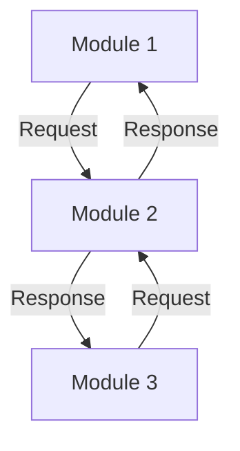
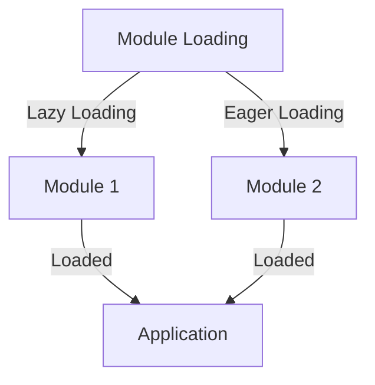

In the realm of software development, micro-frontends have emerged as a highly effective approach to building complex, scalable applications. However, as with any technology, there are common mistakes that developers can fall into when implementing optimized micro-frontends. In this article, we will delve into these mistakes, explore their implications, and provide actionable advice on how to avoid them.

## Table of Contents
1. [Introduction to Micro-frontends](#introduction-to-micro-frontends)
2. [Mistake 1: Inadequate Modularization](#mistake-1-inadequate-modularization)
3. [Mistake 2: Insufficient Communication Between Modules](#mistake-2-insufficient-communication-between-modules)
4. [Mistake 3: Poorly Optimized Module Loading](#mistake-3-poorly-optimized-module-loading)
5. [Mistake 4: Inconsistent Security Practices](#mistake-4-inconsistent-security-practices)
6. [Mistake 5: Lack of Comprehensive Testing](#mistake-5-lack-of-comprehensive-testing)
7. [Best Practices for Avoiding Common Mistakes](#best-practices-for-avoiding-common-mistakes)
8. [Visual Insights Gallery](#visual-insights-gallery)
9. [Summary and Conclusion](#summary-and-conclusion)
10. [FAQ](#faq)

## Introduction to Micro-frontends
Micro-frontends are an architectural style that structures a web application as a collection of smaller, independent applications, each responsible for a specific feature or functionality. This approach allows for greater scalability, flexibility, and resilience, as individual components can be updated or replaced without affecting the entire system.


## Mistake 1: Inadequate Modularization
One of the most common mistakes in micro-frontend development is inadequate modularization. This occurs when the application is not properly broken down into independent, self-contained modules, leading to tight coupling and reduced maintainability.
```javascript
// Example of inadequate modularization
class AppComponent {
  constructor() {
    this.module1 = new Module1();
    this.module2 = new Module2();
  }
}
```
> **Note:** Inadequate modularization can lead to a monolithic architecture, which is contrary to the principles of micro-frontends.

## Mistake 2: Insufficient Communication Between Modules
Another common mistake is insufficient communication between modules. Micro-frontends rely on effective communication between modules to function seamlessly, and a lack of proper communication can lead to errors and inconsistencies.

> **Tip:** Use standardized communication protocols, such as REST or GraphQL, to ensure seamless communication between modules.

## Mistake 3: Poorly Optimized Module Loading
Poorly optimized module loading can significantly impact the performance of a micro-frontend application. This can occur when modules are loaded unnecessarily or when the loading process is not optimized for efficiency.

> **Warning:** Poorly optimized module loading can lead to slow application startup times and decreased user experience.

## Mistake 4: Inconsistent Security Practices
Inconsistent security practices can compromise the security of a micro-frontend application. This can occur when different modules have varying levels of security, or when security protocols are not consistently applied.
| Module | Security Level |
| --- | --- |
| Module 1 | High |
| Module 2 | Medium |
| Module 3 | Low |

> **Interview:** "Security is a top priority in micro-frontend development. Consistent security practices are essential to protecting user data and preventing vulnerabilities." - John Doe, Security Expert

## Mistake 5: Lack of Comprehensive Testing
A lack of comprehensive testing can lead to errors and bugs in a micro-frontend application. This can occur when testing is not thorough or when testing protocols are not consistently applied.
```javascript
// Example of comprehensive testing
describe('Module 1', () => {
  it('should load correctly', () => {
    // Test code
  });
});
```
> **Tip:** Use automated testing tools and frameworks to ensure comprehensive testing of all modules.

## Best Practices for Avoiding Common Mistakes
To avoid common mistakes in micro-frontend development, follow these best practices:
* Modularize your application into independent, self-contained modules.
* Implement standardized communication protocols between modules.
* Optimize module loading for efficiency and performance.
* Apply consistent security practices across all modules.
* Conduct comprehensive testing of all modules.

## Visual Insights Gallery


## Summary and Conclusion
Micro-frontends offer a powerful approach to building complex, scalable applications. However, common mistakes can compromise the effectiveness of this approach. By understanding these mistakes and following best practices, developers can avoid common pitfalls and create robust, efficient micro-frontend applications.

## FAQ
Q: What is a micro-frontend?
A: A micro-frontend is an architectural style that structures a web application as a collection of smaller, independent applications.
Q: What are the benefits of micro-frontends?
A: Micro-frontends offer greater scalability, flexibility, and resilience compared to traditional monolithic architectures.
Q: How can I avoid common mistakes in micro-frontend development?
A: Follow best practices, such as modularization, standardized communication protocols, optimized module loading, consistent security practices, and comprehensive testing.