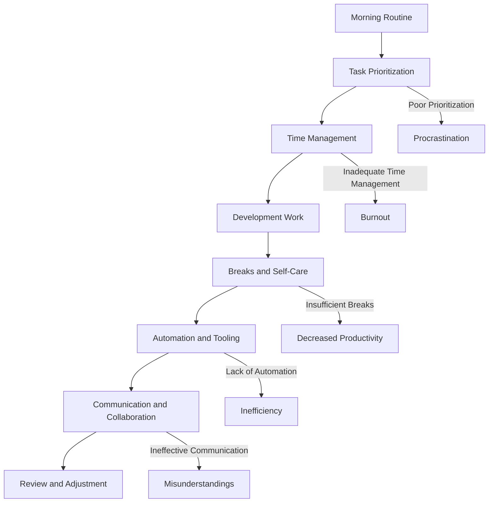
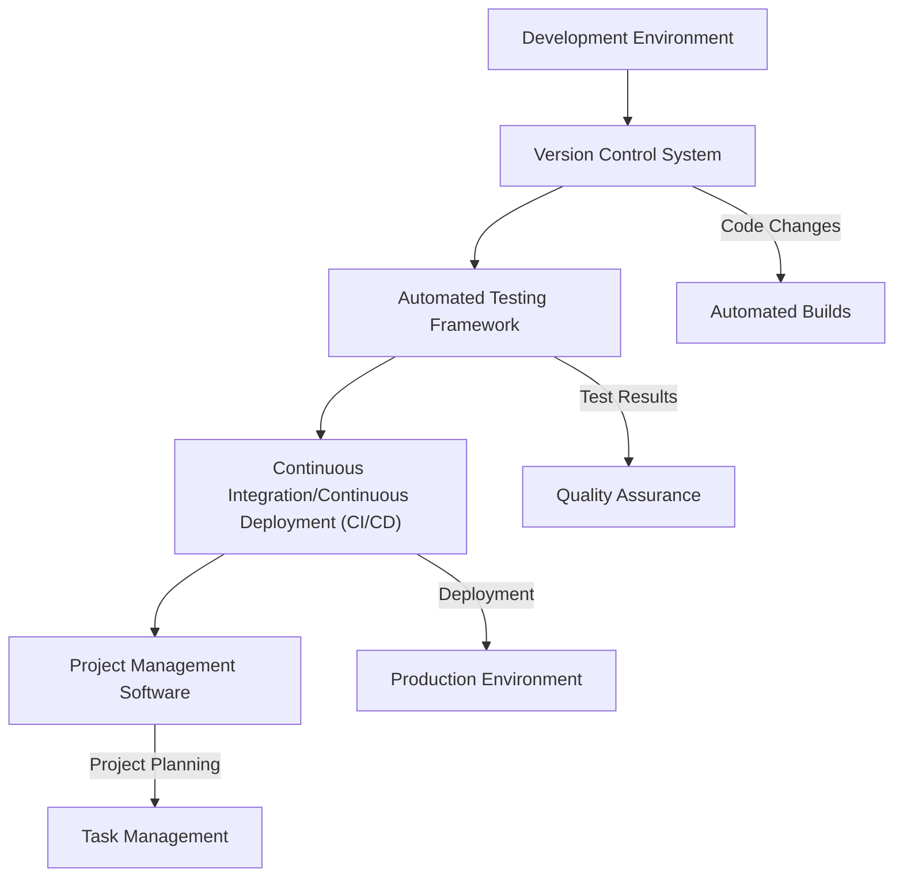

As developers, we strive to create efficient and effective code, but often overlook the importance of an organized routine in our daily work. A well-structured routine can significantly impact our productivity, job satisfaction, and overall well-being. However, there are common mistakes that can creep into our routines, hindering our progress and success. In this article, we will explore these mistakes and provide actionable advice on how to avoid them.

## Introduction to the Importance of Routine
A well-organized routine is essential for developers, as it helps us prioritize tasks, manage time, and maintain a healthy work-life balance. A good routine enables us to stay focused, avoid procrastination, and deliver high-quality results. However, establishing and maintaining a productive routine can be challenging, especially when faced with distractions, tight deadlines, and complex projects.

## Understanding Common Mistakes in Developer Routines
Before we dive into the solutions, let's identify some common mistakes that can derail our routines:
* Poor time management
* Inadequate task prioritization
* Insufficient breaks and self-care
* Lack of automation and tooling
* Ineffective communication and collaboration
To illustrate the flow of a typical developer's day and how these mistakes can occur, consider the following Mermaid.js diagram:

## Creating an Effective Routine
To avoid these mistakes, let's create a structured routine that incorporates best practices:
* **Time Management**: Use the Pomodoro Technique, which involves working in focused 25-minute increments, followed by a 5-minute break.
* **Task Prioritization**: Utilize the Eisenhower Matrix to categorize tasks into urgent vs. important, and focus on the most critical ones first.
* **Breaks and Self-Care**: Schedule regular breaks to recharge and engage in activities that promote physical and mental well-being.
* **Automation and Tooling**: Leverage tools like project management software, version control systems, and automated testing frameworks to streamline workflows.
* **Communication and Collaboration**: Establish clear channels of communication with team members and stakeholders, and use collaboration tools to facilitate teamwork.

## Implementing Automation and Tooling
Automation and tooling are essential components of a productive routine. By leveraging the right tools, we can:
* **Streamline workflows**: Automate repetitive tasks and focus on high-value activities.
* **Enhance collaboration**: Use collaboration tools to facilitate communication, feedback, and knowledge sharing.
* **Improve quality**: Utilize automated testing frameworks to ensure code quality and reduce errors.
To illustrate the architecture of a typical automation setup, consider the following Mermaid.js diagram:

## Conclusion
In conclusion, a well-organized routine is crucial for developers to maintain productivity, job satisfaction, and overall well-being. By understanding common mistakes and implementing best practices, such as effective time management, task prioritization, breaks and self-care, automation, and collaboration, we can create a structured routine that supports our success.

## Visual Insights Gallery

## Frequently Asked Questions
* Q: What is the most important aspect of a developer's routine?
A: Effective time management is crucial for prioritizing tasks, managing deadlines, and maintaining a healthy work-life balance.
* Q: How can I avoid burnout and maintain productivity?
A: Schedule regular breaks, engage in self-care activities, and prioritize tasks to avoid overwork and stress.
* Q: What tools can I use to automate my workflow?
A: Utilize project management software, version control systems, automated testing frameworks, and continuous integration/continuous deployment (CI/CD) pipelines to streamline your workflow.