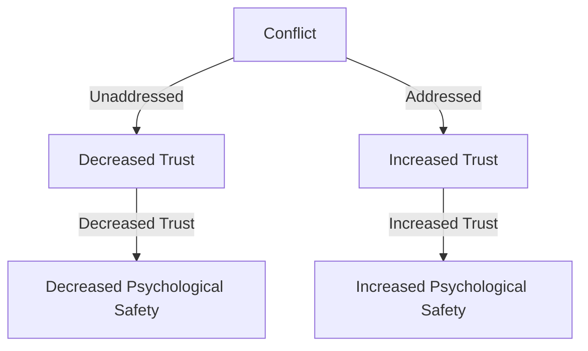
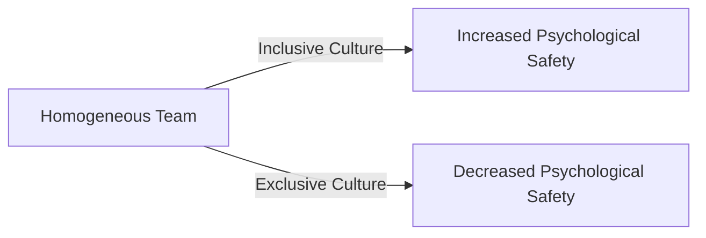

Productive psychological safety is a crucial aspect of any successful team or organization. It refers to the shared belief that the team is safe for interpersonal risk-taking, allowing team members to feel comfortable sharing their thoughts, ideas, and concerns without fear of reprisal or judgment. However, many teams and leaders unintentionally undermine psychological safety, leading to decreased productivity, morale, and overall performance. In this article, we will explore common mistakes that can compromise psychological safety and provide actionable strategies for avoiding them.

## Understanding Psychological Safety

Psychological safety is not just a "feel-good" concept; it has a direct impact on team performance. When team members feel safe to take risks, they are more likely to:
* Share innovative ideas
* Provide constructive feedback
* Admit mistakes and learn from them
* Collaborate effectively
* Be more resilient in the face of challenges

To achieve psychological safety, leaders must create an environment that fosters trust, respect, and open communication.

## Mistake 1: Lack of Clear Communication

One of the most common mistakes that can compromise psychological safety is a lack of clear communication. When team members are unsure about expectations, goals, or roles, they may feel uncertain or anxious, leading to decreased psychological safety.
```markdown
| Communication Element | Description |
| --- | --- |
| Clear Goals | Establish specific, measurable, achievable, relevant, and time-bound (SMART) goals |
| Defined Roles | Clearly define each team member's role and responsibilities |
| Regular Feedback | Provide regular, constructive feedback to team members |
```
To avoid this mistake, leaders should prioritize clear and transparent communication, ensuring that all team members understand what is expected of them and how their contributions fit into the larger picture.

## Mistake 2: Not Addressing Conflict

Conflict is inevitable in any team or organization. However, when conflict is not addressed in a constructive manner, it can quickly erode psychological safety.

To address conflict effectively, leaders should:
* Encourage open and respectful communication
* Foster a culture of empathy and understanding
* Address conflicts in a timely and constructive manner

## Mistake 3: Not Embracing Diversity and Inclusion

A lack of diversity and inclusion can significantly compromise psychological safety. When team members feel that their perspectives or experiences are not valued, they may feel marginalized or excluded.

To create a more inclusive environment, leaders should:
* Prioritize diversity in hiring and team composition
* Foster a culture of respect and empathy
* Encourage team members to share their perspectives and experiences

## Mistake 4: Not Leading by Example

Leaders set the tone for their teams, and their behavior has a significant impact on psychological safety. When leaders do not model the behaviors they expect from their team members, it can undermine trust and psychological safety.
> **Note:** Leaders should prioritize self-awareness, self-reflection, and self-regulation to model the behaviors they expect from their team members.

## Visual Insights Gallery
## Visual Insights Gallery


## Summary and Conclusion
Creating and maintaining psychological safety is an ongoing process that requires effort, commitment, and dedication from leaders and team members alike. By avoiding common mistakes such as a lack of clear communication, not addressing conflict, not embracing diversity and inclusion, and not leading by example, teams can foster a culture of trust, respect, and open communication, ultimately leading to increased productivity, morale, and overall performance.

## FAQ
* Q: What is psychological safety, and why is it important?
A: Psychological safety refers to the shared belief that the team is safe for interpersonal risk-taking, allowing team members to feel comfortable sharing their thoughts, ideas, and concerns without fear of reprisal or judgment. It is essential for team performance, innovation, and overall well-being.
* Q: How can leaders create a culture of psychological safety?
A: Leaders can create a culture of psychological safety by prioritizing clear communication, addressing conflict in a constructive manner, embracing diversity and inclusion, and leading by example.
* Q: What are the consequences of compromising psychological safety?
A: Compromising psychological safety can lead to decreased trust, morale, and overall performance, as well as increased turnover and absenteeism.